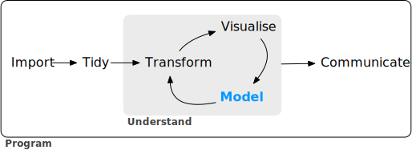
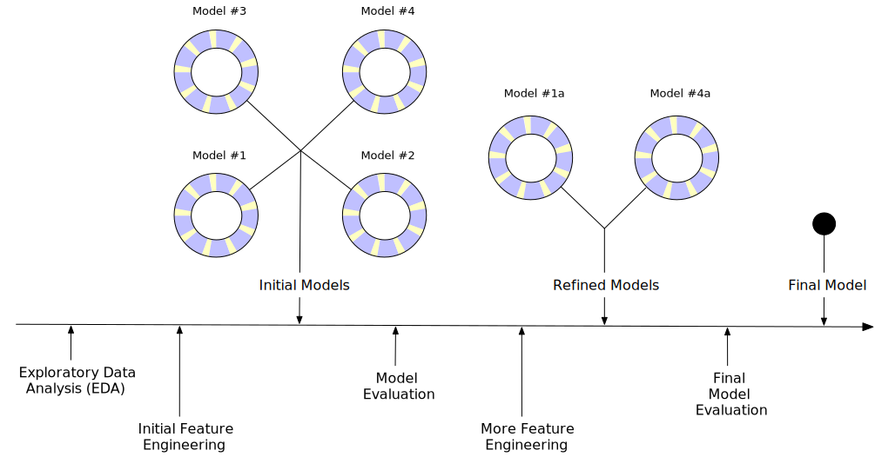

# Software for modeling {#software-modeling}

```{r software-setup, include = FALSE}
knitr::opts_chunk$set(fig.path = "figures/")
library(tidyverse)
library(gridExtra)
library(tibble)
library(kableExtra)

data(ames, package = "modeldata")
```


Models are mathematical tools that can describe a system and capture relationships in the data given to them. Models can be used for various purposes, including predicting future events, determining if there is a difference between several groups, aiding map-based visualization, discovering novel patterns in the data that could be further investigated, and more. The utility of a model hinges on its ability to be _reductive_. The primary influences in the data can be captured mathematically in a useful way, such as in a relationship that can be expressed as an equation. 

Since the beginning of the twenty-first century, mathematical models have become ubiquitous in our daily lives, in both obvious and subtle ways. A typical day for many people might involve checking the weather to see when might be a good time to walk the dog, ordering a product from a website, typing a text message to a friend and having it autocorrected, and checking email. In each of these instances, there is a good chance that some type of model was involved. In some cases, the contribution of the model might be easily perceived ("You might also be interested in purchasing product _X_") while in other cases, the impact could be the absence of something (e.g., spam email). Models are used to choose clothing that a customer might like, to identify a molecule that should be evaluated as a drug candidate, and might even be the mechanism that a nefarious company uses to avoid the discovery of cars that over-pollute.  For better or worse, models are here to stay.

:::rmdnote
There are two reasons that models permeate our lives today: an abundance of **software** exists to create models and it has become easier to record **data** and make it accessible. 
:::

This book focuses largely on software. It is obviously critical that software produces the correct relationships to represent the data. For the most part, determining mathematical correctness is possible, but the reliable creation of appropriate models requires more. 

First, it is important that it is easy to operate software in a proper way. The user interface should not be so poorly designed that the user would not know that they used it inappropriately. For example, @baggerly2009 report myriad problems in the data analyses from a high profile computational biology publication. One of the issues was related to how the users were required to add the names of the model inputs. The user interface of the software made it easy to offset the column names of the data from the actual data columns. This resulted in the wrong genes being identified as important for treating cancer patients and eventually contributed to the termination of several clinical trials [@Carlson2012]. 

If we need high quality models, software must facilitate proper usage. @abrams2003 describes an interesting principle to guide us: 

> The Pit of Success: in stark contrast to a summit, a peak, or a journey across a desert to find victory through many trials and surprises, we want our customers to simply fall into winning practices by using our platform and frameworks. 

Data analysis and modeling software should espouse this idea. 

The second important aspect of model building is related to scientific methodology. When working with complex predictive models, it can be easy to unknowingly commit errors related to logical fallacies or inappropriate assumptions. Many machine learning models are so adept at discovering patterns that they can effortlessly find empirical patterns in the data that fail to reproduce later. Some of these types of methodological errors are insidious in that the issue can go undetected until a later time when new data that contain the true result are obtained. 

:::rmdwarning
As our models have become more powerful and complex, it has also become easier to commit latent errors. 
:::

This same principle also applies to programming. Whenever possible, the software should be able to protect users from committing mistakes. Software should make it easy for users to **do the right thing**. 

These two aspects of model development are crucial. Since tools for creating models are easily obtained and models can have such a profound impact, many more people are creating them. In terms of technical expertise and training, their backgrounds will vary. It is important that their tools be _robust_ to the experience of the user. Tools should be powerful enough to create high-performance models, but, on the other hand, should be easy to use in an appropriate way.  This book describes a suite of software for modeling which has been designed with these characteristics in mind.

The software is based on the R programming language [@baseR]. R has been designed especially for data analysis and modeling. It is an implementation of the S language (with lexical scoping rules adapted from Scheme and Lisp) which was created in the 1970s to

> "turn ideas into software, quickly and faithfully" [@Chambers:1998]

R is open-source and free of charge. It is a powerful programming language that can be used for many different purposes but specializes in data analysis, modeling, visualization, and machine learning. R is easily _extensible_; it has a vast ecosystem of packages, mostly user-contributed modules that focus on a specific theme, such as modeling, visualization, and so on.

One collection of packages is called the ***tidyverse*** [@tidyverse]. The tidyverse is an opinionated collection of R packages designed for data science. All packages share an underlying design philosophy, grammar, and data structures. Several of these design philosophies are directly informed by the aspects of software described in this section. If you've never used the tidyverse packages, Chapter \@ref(tidyverse) contains a review of its basic concepts. Within the tidyverse, the subset of packages specifically focused on modeling are referred to as the ***tidymodels*** packages. This book is an extended software manual for conducting modeling using the tidyverse and tidymodels. It shows how to use a set of packages, each with its own specific purpose, together to create high-quality models.  

## Types of models

Before proceeding, let's describe a taxonomy for types of models, grouped by purpose. While not exhaustive,  most models fall into _at least_ one of these categories: 

### Descriptive models {-}

The purpose of a descriptive model is to describe or illustrate characteristics of some data. The analysis might have no other purpose than to visually emphasize some trend or artifact in the data. 

For example, large scale measurements of RNA have been possible for some time using _microarrays_. Early laboratory methods placed a biological sample on a small microchip. Very small locations on the chip can measure a signal based on the abundance of a specific RNA sequence. The chip would contain thousands (or more) outcomes, each a quantification of the RNA related to some biological process. However, there could be quality issues on the chip that might lead to poor results. A fingerprint accidentally left on a portion of the chip might cause inaccurate measurements when scanned. 

An early method for evaluating such issues were _probe-level models_, or PLM's [@bolstad2004]. A statistical model would be created that accounted for the _known_ differences in the data, such as the chip, the RNA sequence, the type of sequence, and so on. If there were other, unknown factors in the data, these effects would be captured in the model residuals. When the residuals were plotted by their location on the chip, a good quality chip would show no patterns. When a problem did occur, some sort of spatial pattern would be discernible. Often the type of pattern would suggest the underlying issue (e.g. a fingerprint) and a possible solution (wipe the chip off and rescan, repeat the sample, etc.). Figure \@ref(fig:software-descr-examples)(a) shows an application of this method for two microarrays taken from @Gentleman2005. The images show two different colors; red is where the signal intensity was larger than the model expects while the blue color shows lower than expected values. The left-hand panel demonstrates a fairly random pattern while the right-hand panel exhibits an undesirable artifact in the middle of the chip. 

```{r software-descr-examples, echo = FALSE, fig.cap = "Two examples of how descriptive models can be used to illustrate specific patterns.", out.width = '80%', dev = "png", fig.height = 8, warning = FALSE, message = FALSE}
load("RData/plm_resids.RData")

resid_cols <- RColorBrewer::brewer.pal(8, "Set1")[1:2]

# Red is where intensity is higher than expected
plm_plot <- 
  plm_resids %>% 
  mutate(sign = ifelse(Intensity < 0, "low", "high")) %>% 
  ggplot(aes(x = x, y = y, fill = sign))  + 
  geom_tile(show.legend = FALSE) + 
  facet_wrap(~Sample) + 
  theme(
    panel.grid.major = element_blank(),
    panel.grid.minor = element_blank(),
    panel.background = element_blank(),
    axis.text.x = element_blank(),
    axis.text.y = element_blank(),
    axis.ticks = element_blank()
  ) + 
  labs(x = "", y = "") + 
  scale_fill_manual(values = c("#377EB8", "#E41A1C")) + 
  coord_equal() + 
  ggtitle("(a) Evaluating the quality of two microarray chips using a model.") + 
  theme(plot.title = element_text(hjust = 0.5))


ames_plot <- 
  ggplot(ames, aes(x = Latitude, y = Sale_Price)) + 
  geom_point(alpha = .2) + 
  geom_smooth(se = FALSE, method = stats::loess, method.args = list(span = .3), col = "red") + 
  scale_y_log10() + 
  ylab("House Sale Price ($US)") + 
  ggtitle("(b) Using a model-based smoother to discover trends.")

grid.arrange(plm_plot, ames_plot, ncol = 1)
```

Another example of a descriptive model is the _locally estimated scatterplot smoothing_ model, more commonly known as LOESS [@cleveland1979]. Here, a smooth and flexible regression model is fit to a data set, usually with a single independent variable, and the fitted regression line is used to elucidate some trend in the data. These types of smoothers are used to discover potential ways to represent a variable in a model. This is demonstrated in Figure \@ref(fig:software-descr-examples)(b) where a nonlinear trend is illuminated by the flexible smoother. From this plot, it is clear that there is a highly nonlinear relationship between the sale price of a house and its latitude. 


### Inferential models {-}

The goal of an inferential model is to produce a decision for a research question or to test a specific hypothesis. The goal is to make some statement of truth regarding a predefined conjecture or idea. In many (but not all) cases, a qualitative statement is produced (e.g., that a difference was "statistically significant").

For example, in a clinical trial, the goal might be to provide confirmation that a new therapy does a better job in prolonging life than an alternative, like an existing therapy or no treatment. If the clinical endpoint was related to survival of a patient, the _null hypothesis_ might be that the two therapeutic groups have equal median survival times with the alternative hypothesis being that the new therapy has higher median survival.  If this trial were evaluated using traditional null hypothesis significance testing, a p-value would be produced using some pre-defined methodology based on a set of assumptions for the data. Small values of the p-value indicate that there is evidence that the new therapy does help patients live longer. If not, the trial would conclude that there is a failure to show such a difference, which could be due to a number of reasons. 

What are the important aspects of this type of analysis? Inferential techniques typically produce some type of probabilistic output, such as a p-value, confidence interval, or posterior probability. Generally, to compute such a quantity, formal probabilistic assumptions must be made about the data and the underlying processes that generated the data. The quality of the statistical results are highly dependent on these pre-defined assumptions as well as how much the observed data appear to agree with them. The most critical factors here are theoretical in nature: "If my data were independent and follow distribution _X_, then test statistic _Y_ can be used to produce a p-value. Otherwise, the resulting p-value might be inaccurate."

One aspect of inferential analyses is that there tends to be a delayed feedback loop in understanding how well the data matches the assumptions. In our clinical trial example, if statistical (and clinical) significance indicate that the new therapy should be available for patients to use, it still may be years before it is used in the field and enough data are generated for an independent assessment of whether the original statistical analysis led to the appropriate decision. 


### Predictive models {-}

Sometimes data are modeled to produce the most accurate prediction possible for new data. Here, the primary goal is that the predicted values have the highest possible fidelity to the true value of the new data. 

A simple example would be for a book buyer to predict how many copies of a particular book should be shipped to their store for the next month. An over-prediction wastes space and money due to excess books. If the prediction is smaller than it should be, there is opportunity loss and less profit. 

For this type of model, the problem type is one of _estimation_ rather than inference. For example, the buyer is usually not concerned with a question such as "Will I sell more than 100 copies of book _X_ next month?" but rather "How many copies of book _X_ will customers purchase next month?" Also, depending on the context, there may not be any interest in _why_ the predicted value is _X_. In other words, there is more interest in the value itself than evaluating a formal hypothesis related to the data. The prediction can also include measures of uncertainty. In the case of the book buyer, providing a forecasting error may be helpful in deciding how many to purchase. It can also serve as a metric to gauge how well the prediction method worked.  

What are the most important factors affecting predictive models? There are many different ways that a predictive model can be created, so the important factors depend on how the model was developed.

A **mechanistic model** could be derived using first principles to produce a model equation that is dependent on assumptions. For example, when predicting the amount of a drug that is in a person's body at a certain time, some formal assumptions are made on how the drug is administered, absorbed, metabolized, and eliminated. Based on this, a set of differential equations can be used to derive a specific model equation. Data are used to estimate the unknown parameters of this equation so that predictions can be generated. Like inferential models,  mechanistic predictive models greatly depend on the assumptions that define their model equations. However, unlike inferential models, it is easy to make data-driven statements about how well the model performs based on how well it predicts the existing data. Here the feedback loop for the modeling practitioner is much faster than it would be for a hypothesis test. 

**Empirically driven models** are created with more vague assumptions. These models tend to fall into the machine learning category. A good example is the _K_-nearest neighbor (KNN) model. Given a set of reference data, a new sample is predicted by using the values of the _K_ most similar data in the reference set. For example, if a book buyer needs a prediction for a new book, historical data from existing books may be available. A 5-nearest neighbor model would estimate the amount of the new books to purchase based on the sales numbers of the five books that are most similar to the new one (for some definition of "similar"). This model is only defined by the structure of the prediction (the average of five similar books). No theoretical or probabilistic assumptions are made about the sales numbers or the variables that are used to define similarity. In fact, the primary method of evaluating the appropriateness of the model is to assess its accuracy using existing data. If the structure of this type of model was a good choice, the predictions would be close to the actual values. 

Broader discussions of these distinctions can be found in @breiman2001 and @shmueli2010. 

:::rmdnote
Note that we have defined the type of a model by how it is used, rather than its mathematical qualities. 
:::

An ordinary linear regression model might fall into any of these three classes of model, depending on how it is used: 

* A descriptive smoother, similar to LOESS, called _restricted smoothing splines_ [@Durrleman1989] can be used to describe trends in data using ordinary linear regression with specialized terms. 

* An _analysis of variance_ (ANOVA) model is a popular method for producing the p-values used for inference. ANOVA models are a special case of linear regression. 

* If a simple linear regression model produces highly accurate predictions, it can be used as a predictive model. 

There are many examples of predictive models that cannot (or at least should not) be used for inference. Even if probabilistic assumptions were made for the data, the nature of the KNN model makes the math required for inference intractable. 

There is an additional connection between the types of models. While the primary purpose of descriptive and inferential models might not be related to prediction, the predictive capacity of the model should not be ignored. For example, logistic regression is a popular model for data where the outcome is qualitative with two possible values. It can model how variables are related to the probability of the outcomes. When used in an inferential manner, there is usually an abundance of attention paid to the _statistical qualities_ of the model. For example, analysts tend to strongly focus on the selection of which independent variables are contained in the model. Many iterations of model building are usually used to determine a minimal subset of independent variables that have a  "statistically significant" relationship to the outcome variable. This is usually achieved when all of the p-values for the independent variables are below some value (e.g. 0.05). From here, the analyst typically focuses on making qualitative statements about the relative influence that the variables have on the outcome (e.g., "There is a statistically significant relationship between age and the odds of heart disease.").  

This can be dangerous when statistical significance is used as the _only_ measure of model quality.  It is possible that this statistically optimized model has poor model accuracy, or performs poorly on some other measure of predictive capacity. While the model might not be used for prediction, how much should inferences be trusted from a model that has significant p-values but dismal accuracy? Predictive performance tends to be related to how close the model's fitted values are to the observed data. 

:::rmdwarning
If a model has limited fidelity to the data, the inferences generated by the model should be highly suspect. In other words, statistical significance may not be sufficient proof that a model is appropriate. 
:::

This may seem intuitively obvious, but is often ignored in real-world data analysis.

## Some terminology {#model-terminology}

Before proceeding, some additional terminology related to modeling, data, and other quantities should be outlined. These descriptions are intended to be helpful as you read this book but not exhaustive. 

First, many models can be categorized as being _supervised_ or _unsupervised_. Unsupervised models are those that learn patterns, clusters, or other characteristics of the data but lack an outcome variable, i.e., a dependent variable. Principal component analysis (PCA), clustering, and autoencoders are examples of unsupervised models; they are used to understand relationships between variables or sets of variables without an explicit relationship between variables and an outcome. Supervised models are those that have an outcome variable. Linear regression, neural networks, and numerous other methodologies fall into this category. 

Within supervised models, there are two main sub-categories: 

 * **Regression** predicts a numeric outcome.

 * **Classification** predicts an outcome that is an ordered or unordered set of qualitative values.  

These are imperfect definitions and do not account for all possible types of models. In Chapter \@ref(models), we refer to this characteristic of supervised techniques as the _model mode_. 

In terms of data, the two main species are quantitative and qualitative. Examples of the former are real numbers like `3.14159` and integers like `42`. Qualitative values, also known as nominal data, are those that represent some sort of discrete state that cannot be naturally placed on a numeric scale, like "red", "green", and "blue". 

Different variables can have different _roles_ in an analysis. Outcomes (otherwise known as the labels, endpoints, or dependent variables) are the value being predicted in supervised models. The independent variables, which are the substrate for making predictions of the outcome, are also referred to as predictors, features, or covariates (depending on the context). The terms _outcomes_ and _predictors_ are used most frequently in this book. 

## How does modeling fit into the data analysis process? {#model-phases}

In what circumstances are models created? Are there steps that precede such an undertaking? Is it the first step in data analysis? 

:::rmdnote
There are always a few critical phases of data analysis that come before modeling. 
:::

First, there is the chronically underestimated process of **cleaning the data**. No matter the circumstances, you should investigate the data to make sure that they are applicable to the project goals, accurate, and appropriate. These steps can easily take more time than the rest of the data analysis process (depending on the circumstances). 

Data cleaning can also overlap with the second phase of **understanding the data**, often referred to as exploratory data analysis (EDA). EDA brings to light how the different variables are related to one another, their distributions, typical ranges, and other attributes. A good question to ask at this phase is, "How did I come by _these_ data?" This question can help you understand how the data at hand have been sampled or filtered and if these operations were appropriate. For example, when merging database tables, a join may go awry that could accidentally eliminate one or more sub-populations. Another good idea is to ask if the data are _relevant_. For example, to predict whether patients have Alzheimer's disease or not, it would be unwise to have a data set containing subjects with the disease and a random sample of healthy adults from the general population. Given the progressive nature of the disease, the model may simply predict who are the _oldest patients_. 

Finally, before starting a data analysis process, there should be clear expectations of the goal of the model and how performance (and success) will be judged. At least one _performance metric_ should be identified with realistic goals of what can be achieved. Common statistical metrics, discussed in more detail in Chapter \@ref(performance), are classification accuracy, true and false positive rates, root mean squared error, and so on. The relative benefits and drawbacks of these metrics should be weighed. It is also important that the metric be germane; alignment with the broader data analysis goals is critical. 

```{r software-data-science-model, echo = FALSE, out.width = '80%', fig.cap = "The data science process (from R for Data Science).", warning = FALSE}

```

The process of investigating the data may not be simple. @wickham2016 contains an excellent illustration of the general data analysis process, reproduced with Figure \@ref(fig:software-data-science-model). Data ingestion and cleaning/tidying are shown as the initial steps. When the analytical steps for understanding commence, they are a heuristic process; we cannot pre-determine how long they may take. The cycle of analysis, modeling, and visualization often requires multiple iterations. 

```{r software-modeling-process, echo = FALSE, out.width = '100%', fig.width=8, fig.height=3, fig.cap = "A schematic for the typical modeling process.", warning = FALSE}

```

This iterative process is especially true for modeling. Figure \@ref(fig:software-modeling-process) is meant to emulate the typical path to determining an appropriate model. The general phases are:

 * **Exploratory data analysis (EDA):** Initially there is a back and forth between numerical analysis and visualization of the data (represented in Figure \@ref(fig:software-data-science-model)) where different discoveries lead to more questions and data analysis "side-quests" to gain more understanding. 
 
 * **Feature engineering:** The understanding gained from EDA results in the creation of specific model terms that make it easier to accurately model the observed data. This can include complex methodologies (e.g., PCA) or simpler features (using the ratio of two predictors). Chapter \@ref(recipes) focuses entirely on this important step.

 * **Model tuning and selection (circles with blue and yellow segments):** A variety of models are generated and their performance is compared. Some models require _parameter tuning_ where some structural parameters are required to be specified or optimized. The colored segments within the circles signify the repeated data splitting used during resampling (see Chapter \@ref(resampling)). 
 
* **Model evaluation:** During this phase of model development, we assess the model's performance metrics, examine residual plots, and conduct other EDA-like analyses to understand how well the models work. In some cases, formal between-model comparisons (Chapter \@ref(compare)) help you to understand whether any differences in models are within the experimental noise.   

After an initial sequence of these tasks, more understanding is gained regarding which types of models are superior as well as which sub-populations of the data are not being effectively estimated. This leads to additional EDA and feature engineering, another round of modeling, and so on. Once the data analysis goals are achieved, the last steps are typically to finalize, document, and communicate the model. For predictive models, it is common at the end to validate the model on an additional set of data reserved for this specific purpose. 

As an example, @fes use data to model the daily ridership of Chicago's public train system using predictors such as the date, the previous ridership results, the weather, and other factors. An approximation of these authors' "inner monologue" when analyzing these data is, in order:

```{r software-monolog, echo = FALSE, results = 'as-is'}
monolog <- 
  tribble(
    ~Activity, ~`Analysis Cycle`, ~Thoughts,
    "EDA", "1",
    "The daily ridership values between stations are extremely correlated.",
    "EDA", " ",
    "Weekday and weekend ridership look very different.",
    "EDA", " ",
    "One day in the summer of 2010 has an abnormally large number of riders.",
    "EDA", "1",
    "Which stations had the lowest daily ridership values?",
    "Feature Engineering", "1",
    "Dates should at least be encoded as day-of-the-week, and year. ",
    "Feature Engineering", " ",
    "Maybe PCA could be used on the correlated predictors to make it easier for the models to use them. ",
    "Feature Engineering", " ",
    "Hourly weather records should probably be summarized into daily measurements. ",
    "Model Fitting", "1",
    "Let’s start with simple linear regression, K-nearest neighbors, and a boosted decision tree. ",
    "Model Tuning", "1",
    "How many neighbors should be used?",
    "Model Tuning", " ",
    "Should we run a lot of boosting iterations or just a few?",
    "Model Tuning", "2",
    "How many neighbors seemed to be optimal for these data? ",
    "Model Evaluation", "2",
    "Which models have the lowest root mean squared errors? ",
    "EDA", "2",
    "Which days were poorly predicted? ",
    "Model Evaluation", "2",
    "Variable importance scores indicate that the weather information is not predictive. We’ll drop them from the next set of models. ",
    "Model Evaluation", " ",
    "It seems like we should focus on a lot boosting iterations for that model.",
    "Feature Engineering", "2", 
    "We need to encode holiday features to improve predictions on (and around) those dates.",
    "Model Evaluation", "2",
    "Let’s drop K-NN from the model list. "
  )
if (knitr::is_html_output()) {
  tab <- 
    monolog %>% 
    dplyr::select(Thoughts, Activity) %>% 
    kable() %>%
    kable_styling() %>% 
    column_spec(2, width = "25%") %>%
    column_spec(1, width = "75%", italic = TRUE)
} else {
  tab <- 
    monolog %>% 
    dplyr::select(Thoughts, Activity) %>% 
    kable() %>%
    kable_styling()
}
tab
```

and so on. Eventually, a model is selected that is able to achieve sufficient performance.

## Chapter summary {#software-summary}

This chapter focused on how models describe relationships in data, and different types of models such as descriptive models, inferential models, and predictive models. The predictive capacity of a model can be used to evaluate it, even when its main goal is not prediction. Modeling itself sits within the broader data analysis process, and exploratory data analysis is a key part of building high-quality models.

For all kinds of modeling, software for building models must support good scientific methodology and ease of use for practitioners from diverse backgrounds. The software we develop approaches this with the ideas and syntax of the tidyverse, which we introduce (or review) in Chapter \@ref(tidyverse). Chapter \@ref(base-r) is a quick tour of conventional base R modeling functions and summarize the unmet needs in that area. 

After that, this book is separated into parts, starting with the basics of modeling with tidy data principles. The first part introduces an example data set on house prices and demonstrates how to use the fundamental tidymodels packages: `r pkg(recipes)`, `r pkg(parsnip)`, `r pkg(workflows)`, `r pkg(yardstick)`, and others. 

The second part of the book moves forward with more details on the process of creating a good model. This includes creating good estimates of performance as well as tuning model parameters. 


