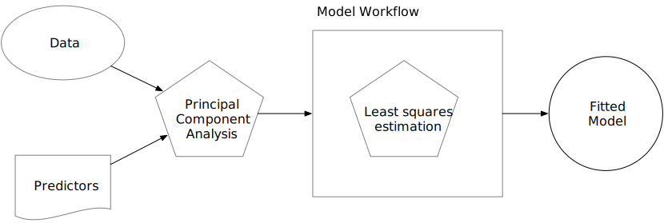

```{r workflow-setup, include = FALSE}
knitr::opts_chunk$set(fig.path = "figures/")
library(tidymodels)
library(workflowsets)
library(kableExtra)
library(censored)
library(survival)
tidymodels_prefer()
source("ames_snippets.R")
```

# A Model Workflow {#workflows}

In the previous chapter, we discussed the `r pkg(parsnip)` package, which can be used to define and fit the model. This chapter introduces a new concept called a _model workflow_. The purpose of this concept (and the corresponding tidymodels `workflow()` object) is to encapsulate the major pieces of the modeling process (discussed in Section \@ref(model-phases)). The workflow is important in two ways. First, using a workflow concept encourages good methodology since it is a single point of entry to the estimation components of a data analysis. Second, it enables the user to better organize projects. These two points are discussed in the following sections.  


## Where Does the Model Begin and End? {#begin-model-end}

So far, when we have used the term "the model," we have meant a structural equation that relates some predictors to one or more outcomes. Let's consider again linear regression as an example. The outcome data are denoted as $y_i$, where there are $i = 1 \ldots n$ samples in the training set. Suppose that there are $p$ predictors $x_{i1}, \ldots, x_{ip}$ that are used in the model. Linear regression produces a model equation of 

$$ \hat{y}_i = \hat{\beta}_0 + \hat{\beta}_1x_{i1} + \ldots + \hat{\beta}_px_{ip} $$

While this is a linear model, it is linear only in the parameters. The predictors could be nonlinear terms (such as the $\log(x_i)$). 

:::rmdwarning
The conventional way of thinking about the modeling process is that it only includes the model fit. 
:::

For some straightforward data sets, fitting the model itself may be the entire process. However, a variety of choices and additional steps often occur before the model is fit:

* While our example model has $p$ predictors, it is common to start with more than $p$ candidate predictors. Through exploratory data analysis or using domain knowledge, some of the predictors may be excluded from the analysis. In other cases, a feature selection algorithm may be used to make a data-driven choice for the minimum predictor set for the model. 
* There are times when the value of an important predictor is missing. Rather than eliminating this sample from the data set, the missing value could be imputed using other values in the data. For example, if $x_1$ were missing but was correlated with predictors $x_2$ and $x_3$, an imputation method could estimate the missing $x_1$ observation from the values of $x_2$ and $x_3$. 
* It may be beneficial to transform the scale of a predictor. If there is not _a priori_ information on what the new scale should be, we can estimate the proper scale using a statistical transformation technique, the existing data, and some optimization criterion. Other transformations, such as PCA, take groups of predictors and transform them into new features that are used as the predictors.

While these examples are related to steps that occur before the model fit, there may also be operations that occur after the model is created. When a classification model is created where the outcome is binary (e.g., `event` and `non-event`), it is customary to use a 50% probability cutoff to create a discrete class prediction, also known as a hard prediction. For example, a classification model might estimate that the probability of an event was 62%. Using the typical default, the hard prediction would be `event`. However, the model may need to be more focused on reducing false positive results (i.e., where true nonevents are classified as events). One way to do this is to raise the cutoff from 50% to some greater value. This increases the level of evidence required to call a new sample an event. While this reduces the true positive rate (which is bad), it may have a more dramatic effect on reducing false positives. The choice of the cutoff value should be optimized using data. This is an example of a post-processing step that has a significant effect on how well the model works, even though it is not contained in the model fitting step. 

It is important to focus on the broader _modeling process_, instead of only fitting the specific model used to estimate parameters. This broader process includes any preprocessing steps, the model fit itself, as well as potential post-processing activities. In this book, we will refer to this more comprehensive concept as the *model workflow* and highlight how to handle all its components to produce a final model equation. 

:::rmdnote
In other software, such as Python or Spark, similar collections of steps are called  _pipelines_. In tidymodels, the term "pipeline" already connotes a sequence of operations chained together with a pipe operator (such as `%>%` from `r pkg(magrittr)` or the newer native `|>`). Rather than using ambiguous terminology in this context, we call the sequence of computational operations related to modeling *workflows*. 
:::

Binding together the analytical components of data analysis is important for another reason. Future chapters will demonstrate how to accurately measure performance, as well as how to optimize structural parameters (i.e., model tuning). To correctly quantify model performance on the training set, Chapter \@ref(resampling) advocates using resampling methods. To do this properly, no data-driven parts of the analysis should be excluded from validation. To this end, the workflow must include all significant estimation steps.

To illustrate, consider principal component analysis (PCA) signal extraction. We'll talk about this more in Section \@ref(example-steps) as well as Chapter \@ref(dimensionality); PCA is a way to replace correlated predictors with new artificial features that are uncorrelated and capture most of the information in the original set. The new features could be used as the predictors, and least squares regression could be used to estimate the model parameters. 

There are two ways of thinking about the model workflow. Figure \@ref(fig:bad-workflow) illustrates the _incorrect_ method: to think of the PCA preprocessing step, as _not being part of the modeling workflow_.

```{r bad-workflow, echo = FALSE, out.width = '80%', warning = FALSE}
#| fig.cap = "Incorrect mental model of where model estimation occurs in the data analysis process",
#| fig.alt = "An incorrect mental model of where model estimation occurs in the data analysis process. The data and predictor set are substrates for an initial preprocessing step using PCA. These data are passed to the model fitting algorithm to produce a fitted model. The figure indicates that the model workflow only includes the model fitting process. This implies that the model fit is the only place where estimation occurs."

```

The fallacy here is that, although PCA does significant computations to produce the components, its operations are assumed to have no uncertainty associated with them. The PCA components are treated as _known_ and, if not included in the model workflow, the effect of PCA could not be adequately measured. 

Figure \@ref(fig:good-workflow) shows an _appropriate_ approach. 

```{r good-workflow, echo = FALSE, out.width = '80%', warning = FALSE}
#| fig.cap = "Correct mental model of where model estimation occurs in the data analysis process",
#| fig.alt = "A correct mental model of where model estimation occurs in the data analysis process. The data and predictor set are substrates for an initial preprocessing step using PCA. These data are passed to the model fitting algorithm to produce a fitted model. The figure indicates that the model workflow includes the model fitting process and the PCA step. This implies that both operations should be considered estimation steps."
knitr::include_graphics("premade/proper-workflow.svg")
```

In this way, the PCA preprocessing is considered part of the modeling process. 

## Workflow Basics

The `r pkg(workflows)` package allows the user to bind modeling and preprocessing objects together. Let's start again with the Ames data and a simple linear model:

```{r workflows-simple}
library(tidymodels)  # Includes the workflows package
tidymodels_prefer()

lm_model <- 
  linear_reg() %>% 
  set_engine("lm")
```

A workflow always requires a `r pkg(parsnip)` model object:

```{r workflows-model-only}
lm_wflow <- 
  workflow() %>% 
  add_model(lm_model)

lm_wflow
```

Notice that we have not yet specified how this workflow should preprocess the data: `Preprocessor: None`.

If our model is very simple, a standard R formula can be used as a preprocessor: 

```{r workflows-form}
lm_wflow <- 
  lm_wflow %>% 
  add_formula(Sale_Price ~ Longitude + Latitude)

lm_wflow
```

Workflows have a `fit()` method that can be used to create the model. Using the objects created in Section \@ref(models-summary):

```{r workflows-form-fit}
lm_fit <- fit(lm_wflow, ames_train)
lm_fit
```

We can also `predict()` on the fitted workflow:

```{r workflows-form-pred}
predict(lm_fit, ames_test %>% slice(1:3))
```

The `predict()` method follows all of the same rules and naming conventions that we described for the `r pkg(parsnip)` package in Section \@ref(parsnip-predictions). 

Both the model and preprocessor can be removed or updated:

```{r workflows-form-update}
lm_fit %>% update_formula(Sale_Price ~ Longitude)
```

Note that, in this new object, the output shows that the previous fitted model was removed since the new formula is inconsistent with the previous model fit. 


## Adding Raw Variables to the `workflow()`

There is another interface for passing data to the model, the `add_variables()` function, which uses a `r pkg(dplyr)`-like syntax for choosing variables. The function has two primary arguments: `outcomes` and `predictors`. These use a selection approach similar to the `r pkg(tidyselect)` backend of `r pkg(tidyverse)` packages to capture multiple selectors using `c()`. 

```{r workflows-add-variables}
lm_wflow <- 
  lm_wflow %>% 
  remove_formula() %>% 
  add_variables(outcome = Sale_Price, predictors = c(Longitude, Latitude))
lm_wflow
```

The predictors could also have been specified using a more general selector, such as 

```{r workflows-selector, eval = FALSE}
predictors = c(ends_with("tude"))
```

One nicety is that any outcome columns accidentally specified in the predictors argument will be quietly removed. This facilitates the use of:

```{r workflows-selector-all, eval = FALSE}
predictors = everything()
```

When the model is fit, the specification assembles these data, unaltered, into a data frame and passes it to the underlying function:

```{r workflows-add-variables-fit}
fit(lm_wflow, ames_train)
```

If you would like the underlying modeling method to do what it would normally do with the data, `add_variables()` can be a helpful interface. As we will see in Section \@ref(special-model-formulas), it also facilitates more complex modeling specifications. However, as we mention in the next section, models such as `glmnet` and `xgboost` expect the user to make indicator variables from factor predictors. In these cases, a recipe or formula interface will typically be a better choice. 

In the next chapter, we will look at a more powerful preprocessor (called a _recipe_) that can also be added to a workflow. 

## How Does a `workflow()` Use the Formula? {#workflow-encoding}

Recall from Section \@ref(formula) that the formula method in R has multiple purposes (we will discuss this further in Chapter \@ref(recipes)). One of these is to properly encode the original data into an analysis-ready format. This can involve executing inline transformations (e.g., `log(x)`), creating dummy variable columns, creating interactions or other column expansions, and so on. However, many statistical methods require different types of encodings: 

 * Most packages for tree-based models use the formula interface but *do not* encode the categorical predictors as dummy variables. 
 
 * Packages can use special inline functions that tell the model function how to treat the predictor in the analysis. For example, in survival analysis models, a formula term such as `strata(site)` would indicate that the column `site` is a stratification variable. This means it should not be treated as a regular predictor and does not have a corresponding location parameter estimate in the model. 

 * A few R packages have extended the formula in ways that base R functions cannot parse or execute. In multilevel models (e.g., mixed models or hierarchical Bayesian models), a model term such as `(week | subject)` indicates that the column `week` is a random effect that has different slope parameter estimates for each value of the `subject` column. 

A workflow is a general purpose interface. When `add_formula()` is used, how should the workflow preprocess the data? Since the preprocessing is model dependent, `r pkg(workflows)` attempts to emulate what the underlying model would do whenever possible. If it is not possible, the formula processing should not do anything to the columns used in the formula. Let's look at this in more detail.

### Tree-based models {-}

When we fit a tree to the data, the `r pkg(parsnip)` package understands what the modeling function would do. For example, if a random forest model is fit using the `r pkg(ranger)` or `r pkg(randomForest)` packages, the workflow knows predictors columns that are factors should be left as is. 

As a counterexample, a boosted tree created with the `r pkg(xgboost)` package requires the user to create dummy variables from factor predictors (since `xgboost::xgb.train()` will not). This requirement is embedded into the model specification object and a workflow using `r pkg(xgboost)` will create the indicator columns for this engine. Also note that a different engine for boosted trees, C5.0, does not require dummy variables so none are made by the workflow. 

This determination is made for each model and engine combination. 

### Special formulas and inline functions {#special-model-formulas}

A number of multilevel models have standardized on a formula specification devised in the `r pkg(lme4)` package. For example, to fit a regression model that has random effects for subjects, we would use the following formula: 

```r
library(lme4)
lmer(distance ~ Sex + (age | Subject), data = Orthodont)
```

The effect of this is that each subject will have an estimated intercept and slope parameter for `age`. 

The problem is that standard R methods can't properly process this formula: 

```{r echo=FALSE}
data(Orthodont, package = "nlme")
```

```{r workflows-rand-mm, error=TRUE}
model.matrix(distance ~ Sex + (age | Subject), data = Orthodont)
```

The result is a zero row data frame. 

:::rmdwarning
The issue is that the special formula has to be processed by the underlying package code, not the standard `model.matrix()` approach. 
:::

Even if this formula could be used with `model.matrix()`, this would still present a problem since the formula also specifies the statistical attributes of the model. 

The solution in `r pkg(workflows)` is an optional supplementary model formula that can be passed to `add_model()`. The `add_variables()` specification provides the bare column names, and then the actual formula given to the model is set within `add_model()`: 

```{r workflows-special-formula}
library(multilevelmod)

multilevel_spec <- linear_reg() %>% set_engine("lmer")

multilevel_workflow <- 
  workflow() %>% 
  # Pass the data along as-is: 
  add_variables(outcome = distance, predictors = c(Sex, age, Subject)) %>% 
  add_model(multilevel_spec, 
            # This formula is given to the model
            formula = distance ~ Sex + (age | Subject))

multilevel_fit <- fit(multilevel_workflow, data = Orthodont)
multilevel_fit
```

We can even use the previously mentioned `strata()` function from the `r pkg(survival)` package for survival analysis:  

```{r workflows-strata}
library(censored)

parametric_spec <- survival_reg()

parametric_workflow <- 
  workflow() %>% 
  add_variables(outcome = c(fustat, futime), predictors = c(age, rx)) %>% 
  add_model(parametric_spec, 
            formula = Surv(futime, fustat) ~ age + strata(rx))

parametric_fit <- fit(parametric_workflow, data = ovarian)
parametric_fit
```

Notice how in both of these calls the model-specific formula was used. 

## Creating Multiple Workflows at Once {#workflow-sets-intro}

In some situations, the data require numerous attempts to find an appropriate model. For example: 

* For predictive models, it is advisable to evaluate  a variety of different model types. This requires the user to create multiple model specifications. 

* Sequential testing of models typically starts with an expanded set of predictors. This "full model" is compared to a sequence of the same model that removes each predictor in turn. Using basic hypothesis testing methods or empirical validation, the effect of each predictor can be isolated and assessed. 

In these situations, as well as others, it can become tedious or onerous to create a lot of workflows from different sets of preprocessors and/or model specifications. To address this problem, the `r pkg(workflowset)` package creates combinations of workflow components. A list of preprocessors (e.g., formulas, `r pkg(dplyr)` selectors, or feature engineering recipe objects discussed in the next chapter) can be combined with a list of model specifications, resulting in a set of workflows. 

As an example, let's say that we want to focus on the different ways that house location is represented in the Ames data. We can create a set of formulas that capture these predictors: 

```{r workflows-location-location-location}
location <- list(
  longitude = Sale_Price ~ Longitude,
  latitude = Sale_Price ~ Latitude,
  coords = Sale_Price ~ Longitude + Latitude,
  neighborhood = Sale_Price ~ Neighborhood
)
```

These representations can be crossed with one or more models using the `workflow_set()` function. We'll just use the previous linear model specification to demonstrate:  

```{r workflows-set-location}
library(workflowsets)
location_models <- workflow_set(preproc = location, models = list(lm = lm_model))
location_models
location_models$info[[1]]
extract_workflow(location_models, id = "coords_lm")
```

Workflow sets are mostly designed to work with resampling, which is discussed in Chapter \@ref(resampling). The columns `option` and `result` must be populated with specific types of objects that result from resampling. We will demonstrate this in more detail in Chapters \@ref(compare) and  \@ref(workflow-sets).  

In the meantime, let's create model fits for each formula and save them in a new column called `fit`. We'll use basic `r pkg(dplyr)` and `r pkg(purrr)` operations: 

```{r workflows-set-fit}
location_models <-
   location_models %>%
   mutate(fit = map(info, ~ fit(.x$workflow[[1]], ames_train)))
location_models
location_models$fit[[1]]
```

We use a `r pkg(purrr)` function here to map through our models, but there is an easier, better approach to fit workflow sets that will be introduced in Section \@ref(workflow-set). 

:::rmdnote
In general, there's a lot more to workflow sets! While we've covered the basics here, the nuances and advantages of workflow sets won't be illustrated until Chapter \@ref(workflow-sets). 
:::

## Evaluating the Test Set

Let's say that we've concluded our model development and have settled on a final model. There is a convenience function called `last_fit()` that will _fit_ the model to the entire training set and _evaluate_ it with the testing set. 

Using `lm_wflow` as an example, we can pass the model and the initial training/testing split to the function:

```{r lm-last-fit}
final_lm_res <- last_fit(lm_wflow, ames_split)
final_lm_res
```

:::rmdnote
Notice that `last_fit()` takes a data split as an input, not a dataframe. This function uses the split to generate the training and test sets for the final fitting and evaluation.
:::

The `.workflow` column contains the fitted workflow and can be pulled out of the results using:

```{r extract-last-fit, eval = FALSE}
fitted_lm_wflow <- extract_workflow(final_lm_res)
```

Similarly, `collect_metrics()` and `collect_predictions()` provide access to the performance metrics and predictions, respectively. 

```{r collect-last-fit, eval = FALSE}
collect_metrics(final_lm_res)
collect_predictions(final_lm_res) %>% slice(1:5)
```

We'll see more about `last_fit()` in action and how to use it again in Section \@ref(bean-models).

:::rmdnote
When using validation sets, `last_fit()` has an argument called `add_validation_set` to specify if we should train the final model solely on the training set (the default) or the combination of the training and validation sets. 
:::

## Chapter Summary {#workflows-summary}

In this chapter, you learned that the modeling process encompasses more than just estimating the parameters of an algorithm that connects predictors to an outcome. This process also includes preprocessing steps and operations taken after a model is fit. We introduced a concept called a *model workflow* that can capture the important components of the modeling process. Multiple workflows can also be created inside of a *workflow set*. The `last_fit()` function is convenient for fitting a final model to the training set and evaluating with the test set. 

For the Ames data, the related code that we'll see used again is:

```{r workflows-summary, eval = FALSE}
library(tidymodels)
data(ames)

ames <- mutate(ames, Sale_Price = log10(Sale_Price))

set.seed(502)
ames_split <- initial_split(ames, prop = 0.80, strata = Sale_Price)
ames_train <- training(ames_split)
ames_test  <-  testing(ames_split)

lm_model <- linear_reg() %>% set_engine("lm")

lm_wflow <- 
  workflow() %>% 
  add_model(lm_model) %>% 
  add_variables(outcome = Sale_Price, predictors = c(Longitude, Latitude))

lm_fit <- fit(lm_wflow, ames_train)
```


