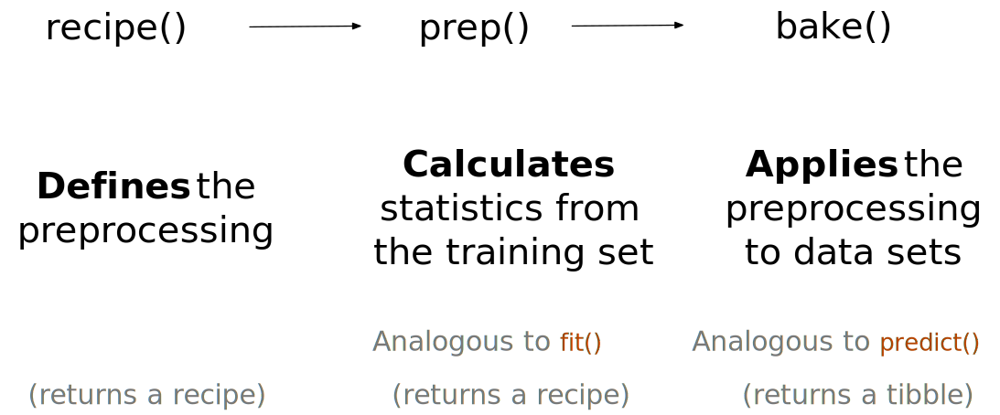

```{r dimensionality-setup, include = FALSE}
library(tidymodels)
library(ggforce)
library(embed)
library(corrplot)
library(learntidymodels)
library(baguette)
library(discrim)
library(uwot)
library(doMC)
library(patchwork)

registerDoMC(cores = parallel::detectCores())
tidymodels_prefer()
load("RData/dry_beans.RData")
```

# Dimensionality reduction {#dimensionality}

Dimensionality reduction is a nice tool for situations when there is suspicion that there are "too many" variables. An excess of variables, usually predictors, can be problematic since it may be difficult to understand or visualize data in higher dimensions. For example, in high dimensional biology experiments, one of the first tasks is to determine if there are any unwanted trends on the data (e.g., effects not related to the question of interest, such as lab-to-lab differences). Debugging the data is difficult when there are hundreds of thousands dimensions. Dimensionality reduction can be a great aid for exploratory data analysis.

Another potential consequence of having a multitude of predictors is the potential harm that it can have on a model. The simplest example is a method like ordinary linear regression where the number of predictors should be less than the number of data points used to fit the model. Another issue is multicollinearity, where between-predictor correlations can negatively impact the mathematical operations used to estimate a model. If there are an extremely large number of predictors, it is fairly unlikely that there are an equal number of underlying effects. Many predictors may be measuring the same latent effect(s) and the result is a high degree of correlation. Many dimensionality reduction techniques thrive on this situation. In fact, most can only be effective when there are relationships between predictors that can be exploited.

When starting a new project, reducing the dimensions of the data may also provide some intuition on how hard the modeling problem may be. For example, principal component analysis (PCA) is one of the simplest methods for reducing the number of columns in the data set because it relies on linear methods and it is unsupervised (i.e., does not consider the outcome data). For a high dimensional classification problem, an initial plot of the main PCA components might show a clear separation between the classes. If this is the case, then it is fairly safe to assume that a linear classifier might be enough to do a good job on the data. However, the converse is not true; a lack of separation does not mean that the problem is insurmountable.

Finally, the dimensionality reduction methods discussed here are generally not feature selection methods. Methods such as PCA represent the original predictors using a smaller subset of new features. All of the original predictors are required to compute these new features. The exception to this are sparse methods that have the ability to completely remove the impact of predictors when creating the new features.

This chapter has two goals: 

 * Demonstrate how recipes can be useful tools for creating a small set of features that capture the main aspects of the original predictor set.
 
 * Describe how recipes can be used on their own (as opposed to being used in a workflow object). 
 
The latter is helpful when testing or debugging a recipe. However, as described in Section \@ref(using-recipes), the best way to use a recipe is from within a workflow object. 

In addition to the `r pkg(tidymodels)` package, this chapter uses the following packages: `r pkg(baguette)`, `r pkg(bestNormalize)`, `r pkg(corrplot)`, `r pkg(discrim)`, `r pkg(embed)`, `r pkg(ggforce)`, `r pkg(klaR)`, `r pkg(learntidymodels)`, `r pkg(mixOmics)`, and `r pkg(uwot)`. `r pkg(learntidymodels)` can be found at its [GitHub site](https://github.com/tidymodels/learntidymodels).

To get started, we'll consider a data set that might benefit from dimension reduction.

## A picture is worth a thousand... beans {#beans}

@beans describe methods for determining the varieties of dried beans in an image. From their manuscript:

> The primary objective of this study is to provide a method for obtaining uniform seed varieties from crop production, which is in the form of population, so the seeds are not certified as a sole variety. Thus, a computer vision system was developed to distinguish seven different registered varieties of dry beans with similar features in order to obtain uniform seed classification. For the classification model, images of 13,611 grains of 7 different registered dry beans were taken with a high-resolution camera.

Each image contains multiple beans. The process of determining which pixels correspond to a particular bean is called _image segmentation_. These pixels can be analyzed in a way that produces features for each bean. A set of images are manually labeled and these are used to create a predictive model that can distinguish between seven varieties: Cali, Horoz, Dermason, Seker, Bombay, Barbunya, and Sira. Producing an effective model can help manufacturers quantify the homogeneity of a batch of beans. 

For image data, there are a multitude of analysis methods available for use. One is the use image analysis to segment the individual beans and then quantify them using features related to color and morphology (i.e., shape). These features are then used to model the outcome with the idea that different bean varieties look different.

For example, there are numerous methods to quantify aspects of shapes of objects [@Mingqiang08]. Many are related to the boundaries or regions of the object of interest. Example of features include:

-   The *area* (or size) can be estimated using the number of pixels in the object or the size of the convex hull around the object.

-   We can measure the *perimeter* using the number of pixels in the boundary as well as the area of the bounding box (the smallest rectangle enclosing an object).

-   The major axis quantifies the longest line connecting the most extreme parts of the object. The minor axis uses to the shortest line.

-   We can measure the *compactness* of an object using the ratio of the object's area to the area of a circle with the same perimeter. For example, the symbols "`r cli::symbol$bullet`" and "`r cli::symbol$times`" have very different compactness.

-   There are also different measures of how oblong or *elongated* an object is. For example, the *eccentricity* statistic is the ratio of the major and minor axes. There are also related estimates for roundness and convexity.

As an example, here are different shapes and their corresponding eccentricity:

```{r dimensionality-eccentricity, echo = FALSE, out.width="95%"}
knitr::include_graphics("premade/morphology.svg")
```

Note that shapes such as circles and squares have low eccentricity while oblong shapes have high values. Also, the metric is unaffected by the rotation of the object.

Many of these image features have high correlations; objects with large areas are more likely to have very low eccentricity. As noted above, there are often multiple methods to quantify the same underlying characteristics (e.g. size). Many of these image features have high correlation; objects with large areas are more likely to have very low eccentricity. As noted above, there are often multiple methods to quantify the same underlying characteristics (e.g. size).

In the bean data, `r ncol(dry_beans) - 1` morphology features were computed: `r knitr::combine_words(gsub("_", " ", names(dry_beans)[-ncol(dry_beans)]))`. The latter four are described in @symons1988211. While the dimensionality of these data is not large, it does provide a nice working example to demonstrate how to reduce the number of features.

The data are loaded using

```{r dimensionality-import}
library(tidymodels)
tidymodels_prefer()
load("RData/dry_beans.RData")
```

It is important to maintain good data discipline when evaluating dimensionality reduction techniques (especially for their use within a model). For our analyses, a test set is created. The remaining data are split into training and validation sets:

```{r dimensionality-split}
set.seed(1701)
bean_split <- initial_split(dry_beans, strata = class, prop = 3/4)

bean_train <- training(bean_split)
bean_test  <- testing(bean_split)

set.seed(1702)
bean_val <- validation_split(bean_train, strata = class, prop = 4/5)
bean_val$splits[[1]]
```

To assess how well different methods perform (visually), the methods are estimated on the training set (n = `r analysis(bean_val$splits[[1]]) %>% nrow()` beans) and displayed using the validation set (n = `r assessment(bean_val$splits[[1]]) %>% nrow()`).

We should probably spend some time investigating our data. For example, since we know that features are probably measuring similar concepts, let's take a look at the correlation structure of the data:

```{r dimensionality-corr-plot, fig.height=6, fig.width=6, out.width="70%"}
library(corrplot)
bean_train %>% 
  select(-class) %>% 
  cor() %>% 
  corrplot()
```

While we don't take the time to do it here, it is also important to see if this structure significantly changes across the outcome categories. This can be insightful and help create better models.

## A starter recipe

We'll focus on looking at the data in a smaller space. We can create a basic recipe to preprocess the data prior to the addition of dimensionality reduction steps. Several predictors are ratios and these are likely to have skewed distributions. Such distributions might wreak havoc on variance calculations (such as the ones used in PCA). The `r pkg(bestNormalize)` package has a step that can enforce a symmetric distribution for the predictors. We'll use this to mitigate the issue of skewed distributions.

```{r dimensionality-initial-rec}
library(bestNormalize)
bean_rec <-
  # Use the training data from the bean_val split object
  recipe(class ~ ., data = analysis(bean_val$splits[[1]])) %>%
  step_zv(all_numeric_predictors()) %>%
  step_orderNorm(all_numeric_predictors()) %>% 
  step_normalize(all_numeric_predictors())
```

:::rmdnote
Remember that when invoking the `recipe()` function, the steps are not estimated or executed in any way. 
:::

This recipe will be supplemented with additional steps for the dimensionality reduction analyses. Before doing so, let's go over how a recipe can be used _outside_ of a workflow. 

## Recipes in the wild

As mentioned in Section \@ref(using-recipes), a workflow containing a recipe uses `fit()` to estimate the recipe and model, then `predict()` to process the data and make model predictions. There are analogous functions in the `r pkg(recipes)` package that can be used for the same purpose: 

* `prep(recipe, training)` fits the recipe to the training set. 
* `bake(recipe, new_data)` applies the recipe operations to `new_data`. 

In summary:

```{r dimensionality-recipe-process, echo = FALSE, out.width = '80%', warning = FALSE}

```

Let's look at each of these functions in more detail. 

### Preparing a recipe {#prep}

Let's estimate `bean_rec` using the training set data:


```{r dimensionality-prep-rec}
bean_rec_trained <- prep(bean_rec)
bean_rec_trained
```

Note in the output that the steps have been trained and that the selectors are no longer general (i.e., `all_numeric_predictors()`); they now show the actual columns that were selected. Also, `prep(bean_rec)` does not use the `training` argument. You can pass any data into that argument. Omitting it means that the data used to the initial call to `recipe()` should be used. In our case, this was the training set data. 

One important argument to `prep()` is `retain`. When `retain = TRUE` (the default), the estimated version of the training set is kept within the recipe. This data set has been pre-processed using all of the steps listed in the recipe. Since `prep()` has to execute the recipe as it proceeds, it may be advantageous to keep this version of the training set so that, if that data set is to be used later, redundant calculations can be avoided. However, if the training set is big, it may be problematic to keep such a large amount of data in memory. Use `retain = FALSE` to avoid this. 

An interesting aspect of recipes is that, once new steps are added to this estimated recipe, re-applying `prep()` will only estimate the untrained steps. This will come in handy when we try different feature extraction methods below. 

If you encounter errors when working with a recipe, `prep()` can be used with its `verbose` option to troubleshoot: 

```{r dimensionality-prep-fail, error=TRUE}
bean_rec_trained %>% 
  step_dummy(cornbread) %>%  # <- not a real predictor
  prep(verbose = TRUE)
```

Another option that can help understand what happens in the analysis is `log_changes`:

```{r dimensionality-prep-log}
show_variables <- 
  bean_rec %>% 
  prep(log_changes = TRUE)
```

### Baking the recipe {#bake}

Again, this is much like `predict()`; the operations estimated from the training set are applied to any data given via the `bake()` function. For example, the validation set samples can be processed: 

```{r dimensionality-bake}
bean_validation <- bean_val$splits %>% pluck(1) %>% assessment()
bean_val_processed <- bake(bean_rec_trained, new_data = bean_validation)
```

Here are histograms of the `area` predictor before and after the recipe was prepared: 

```{r dimensionality-bake-off, echo = FALSE, fig.height=4}
library(patchwork)
p1 <- 
  bean_validation %>% 
  ggplot(aes(x = area)) + 
  geom_histogram(bins = 30, col = "white", fill = "blue", alpha = 1/3) + 
  ggtitle("Original validation set data")

p2 <- 
  bean_val_processed %>% 
  ggplot(aes(x = area)) + 
  geom_histogram(bins = 30, col = "white", fill = "red", alpha = 1/3) + 
  ggtitle("Processed validation set data")

p1 + p2
```

There are two important aspects of `bake()` that are worth noting. 

First, as previously mentioned, using `prep(recipe, retain = TRUE)` keeps the existing processed version of the training set in the recipe. This enables the user to use `bake(recipe, new_data = NULL)`, which returns that data set without further computations. For example: 

```{r dimensionality-new-data-null}
bake(bean_rec_trained, new_data = NULL) %>% nrow()
bean_val$splits %>% pluck(1) %>% analysis() %>% nrow()
```

If the training set is not pathologically large, using this value of `retain` can save a lot of computational time. 

One other helpful feature of `bake()` is that additional selectors can be used in the call to specify which columns to return. The default selector is `everything()`, but more specific directives can be used. 

`prep()` and `bake()` will be used in the code below to illustrate some of these options. 

## Feature extraction techniques

Since recipes are the primary route in tidymodels to use dimensionality reduction, let's write a function that will estimate the transformation and plot the resulting data in a scatter plot matrix via the `r pkg(ggforce)` package:

```{r dimensionality-function}
library(ggforce)
plot_validation_results <- function(recipe, dat = assessment(bean_val$splits[[1]])) {
  recipe %>%
    # Estimate any additional steps
    prep() %>%
    # Process the data (the validation set by default)
    bake(new_data = dat) %>%
    # Create the scatterplot matrix
    ggplot(aes(x = .panel_x, y = .panel_y, col = class, fill = class)) +
    geom_point(alpha = 0.4, size = 0.5) +
    geom_autodensity(alpha = .3) +
    facet_matrix(vars(-class), layer.diag = 2) + 
    scale_color_brewer(palette = "Dark2") + 
    scale_fill_brewer(palette = "Dark2")
}
```

This will be reused several times below.

A series of several feature extraction methodologies are used here. An overview of most can be found in [Section 6.3.1](https://bookdown.org/max/FES/numeric-many-to-many.html#linear-projection-methods) of @fes and the references therein. The UMAP method is described in @mcinnes2020umap.

### Principal component analysis

As previously mentioned, PCA is an unsupervised method that uses linear combinations of the predictors to define new features. These features attempt to account for as much variation as possible in the original data. We add `step_pca()` to the original recipe and use our function to visualize the results on the validation set:

```{r dimensionality-pca, dev = "png", fig.height=7}
bean_rec_trained %>%
  step_pca(all_numeric_predictors(), num_comp = 4) %>%
  plot_validation_results() + 
  ggtitle("Principal Component Analysis")
```

We see that the first two components, especially when used together, can do an effective job separating the classes. This may lead us to believe that the overall problem of classifying these beans will not be especially difficult.

Recall that PCA is unsupervised. For these data, it turns out that the PCA components that explain the most variation in the predictors also happen to be predictive of the classes. What features are driving performance? The `r pkg(learntidymodels)` package, found on GitHub, has functions that can help visualize the top features for each component. We'll need the prepared recipe; the PCA step is added below along with a call to `prep()`:

```{r dimensionality-pca-loadings}
library(learntidymodels)
bean_rec_trained %>%
  step_pca(all_numeric_predictors(), num_comp = 4) %>% 
  prep() %>% 
  plot_top_loadings(component_number <= 4, n = 5) + 
  ggtitle("Principal Component Analysis")
```

The top loadings are mostly related to the cluster of correlated predictors shown in the top left portion of the previous correlation plot: perimeter, area, major axis length, and convex area. These are all related to bean size. Shape factor 2, from @symons1988211, is the area over the cube of the major axis length and is therefore also related to bean size. Measure of elongation appear to dominate the second PCA component.

### Partial least squares

PLS is a supervised version of PCA. It tries to find components that simultaneously maximize the variation in the predictors while also maximizing the relationship between those components and the outcome.

```{r dimensionality-pls, dev = "png", fig.height=7}
bean_rec_trained %>%
  step_pls(all_numeric_predictors(), outcome = "class", num_comp = 4) %>%
  plot_validation_results() + 
  ggtitle("Partial Least Squares")
```

Interestingly, the first two PLS components are identical to the first two PCA components (due to their effectiveness at separating the varieties of beans). The remaining components are different.

```{r }
library(learntidymodels)
bean_rec_trained %>%
  step_pls(all_numeric_predictors(), outcome = "class", num_comp = 4) %>%
  prep() %>% 
  plot_top_loadings(component_number <= 4, n = 5, type = "pls") + 
  ggtitle("Partial Least Squares")
```

Solidity (i.e., the density of the bean) drives the third PLS component, along with roundness. Solidity may be capturing bean features related to "bumpiness" of the bean surface since it can measure irregularity of the bean boundaries. Extent is the largest effect in the fourth component; it is an image texture measure similar to solidity.

### Independent component analysis

ICA is slightly different than PCA in that it finds components that are as statistically independent from one another as possible (as opposed to being uncorrelated). It can be thought of as maximizing the "non-Gaussianity" of the ICA components.

```{r dimensionality-ica, dev = "png", fig.height=7}
bean_rec_trained %>%
  step_ica(all_numeric_predictors(), num_comp = 4) %>%
  plot_validation_results() + 
  ggtitle("Independent Component Analysis")
```

To the bare eye, there does not appear to be any separation between the classes when using ICA.

### Uniform manifold approximation and projection

UMAP is similar to the popular t-SNE method for nonlinear dimension reduction. In the original high-dimensional space, UMAP uses a distance-based nearest neighbor method to find local areas of the data where the data points are more likely to be related. The relationship between data points is saved as a directed graph model where most points are not connected.

From there, UMAP translates points in the graph to the reduced dimensional space. To do this, the algorithm has an optimization process that uses cross-entropy to map data points to the smaller set of features so that the graph is well approximated.

To create the mapping, the `r pkg(embed)` package contains a step function for this method:

```{r dimensionality-umap, dev = "png", fig.height=7}
library(embed)
bean_rec_trained %>%
  step_umap(all_numeric_predictors(), num_comp = 4) %>%
  plot_validation_results() +
  ggtitle("Uniform Manifold Approximation and Projection")
```

While the between-cluster space is pronounced, the clusters can contain a heterogeneous mixture of classes.

There is also a supervised version of UMAP:

```{r dimensionality-umap-supervised, dev = "png", fig.height=7}
bean_rec_trained %>%
  step_umap(all_numeric_predictors(), outcome = "class", num_comp = 4) %>%
  plot_validation_results() +
  ggtitle("Uniform Manifold Approximation and Projection (supervised)")
```

The supervised method shows promise for modeling the data.

UMAP is a powerful method to reduce the feature space. However, it can be very sensitive to tuning parameters (e.g. the number of neighbors and so on). For this reason, it would help to experiment with a few of the parameters to assess how robust the results are for these data.

## Modeling {#bean-models}

Both the PLS and UMAP methods are worth investigating in conjunction with different models. A variety of different models are explored with these dimensionality reduction techniques (along with no transformation): a single layer neural network, bagged trees, flexible discriminant analysis (FDA), naive Bayes, and regularized discriminant analysis (RDA).

Now that we are back in "modeling mode", we'll create a series of model specifications and then use a workflow set to tune the models. Note that the model parameters are tuned in conjunction with the recipe parameters (e.g. size of the reduced dimension, UMAP parameters).

```{r dimensionality-models}
library(baguette)
library(discrim)

mlp_spec <-
  mlp(hidden_units = tune(), penalty = tune(), epochs = tune()) %>%
  set_engine('nnet') %>%
  set_mode('classification')

bagging_pec <-
  bag_tree() %>%
  set_engine('rpart') %>%
  set_mode('classification')

fda_spec <-
  discrim_flexible(
    prod_degree = tune()
  ) %>%
  set_engine('earth')

rda_spec <-
  discrim_regularized(frac_common_cov = tune(), frac_identity = tune()) %>%
  set_engine('klaR')

bayes_spec <-
  naive_Bayes() %>%
  set_engine('klaR')
```

```{r dimensionality-recipes}
bean_rec <-
  recipe(class ~ ., data = bean_train) %>%
  step_zv(all_numeric_predictors()) %>%
  step_orderNorm(all_numeric_predictors()) %>%
  step_normalize(all_numeric_predictors())

pls_rec <- 
  bean_rec %>% 
  step_pls(all_numeric_predictors(), outcome = "class", num_comp = tune())

umap_rec <-
  bean_rec_trained %>%
  step_umap(
    all_numeric_predictors(),
    outcome = "class",
    num_comp = tune(),
    neighbors = tune(),
    min_dist = tune()
  )
```

Once again, `r pkg(workflowsets)` take the preprocessors and models and cross them. The `control` option `parallel_over` is set so that the parallel processing can work simultaneously across tuning parameter combinations. `workflow_map()` applies grid search to optimize the model/preprocessing parameters (if any) across 10 parameter combinations. The multi-class area under the ROC curve is estimated on the validation set.

```{r dimensionality-workflows}
ctrl <- control_grid(parallel_over = "everything")
bean_res <- 
  workflow_set(
    preproc = list(basic = class ~., pls = pls_rec, umap = umap_rec), 
    models = list(bayes = bayes_spec, fda = fda_spec,
                  rda = rda_spec, bag = bagging_pec,
                  mlp = mlp_spec)
  ) %>% 
  workflow_map(
    verbose = TRUE,
    seed = 1703,
    resamples = bean_val,
    grid = 10,
    metrics = metric_set(roc_auc)
  )
```

The models are ranked by their validation set estimates of the area under the ROC curve:

```{r dimensionality-rankings}
rankings <- 
  rank_results(bean_res, select_best = TRUE) %>% 
  mutate(method = map_chr(wflow_id, ~ str_split(.x, "_", simplify = TRUE)[1])) 

tidymodels_prefer()
filter(rankings, rank <= 5) %>% dplyr::select(rank, mean, model, method)

rankings %>% 
  ggplot(aes(x = rank, y = mean, pch = method, col = model)) + 
  geom_point(cex = 3) + 
  theme(legend.position = "right") +
  labs(y = "ROC AUC")
```

It is clear from these results that most models give very good performance; there are few bad choices here. For demonstration, the RDA model with PLS features is used as the final model. We'll finalize the workflow with the numerically best parameters, fit it to the training set, then evaluate the test set:

```{r dimensionality-final}
rda_res <- 
  bean_res %>% 
  pull_workflow("pls_rda") %>% 
  finalize_workflow(
    bean_res %>% 
      pull_workflow_set_result("pls_rda") %>% 
      select_best(metric = "roc_auc")
  ) %>% 
  last_fit(split = bean_split, metrics = metric_set(roc_auc))

rda_wflow_fit <- rda_res$.workflow[[1]]
```

```{r dimensionality-test}
collect_metrics(rda_res)
```

Pretty good! We'll use this model in the next chapter to demonstrate variable importance methods.

```{r dimensionality-save, include = FALSE}
save(rda_wflow_fit, bean_train, file = "RData/rda_fit.RData", version = 2, compress = "xz")
```

## Chapter summary {#dimensionality-summary}

Dimensionality reduction can be a helpful tool for exploratory data analysis as well as modeling. The `r pkg(recipes)` and `r pkg(embed)` packages contain steps for a variety of different methods and `r pkg(workflowsets)` facilitates choosing an appropriate method for a data set.

This chapter also discussed how recipes can be used on their own for debugging or visualization. 
