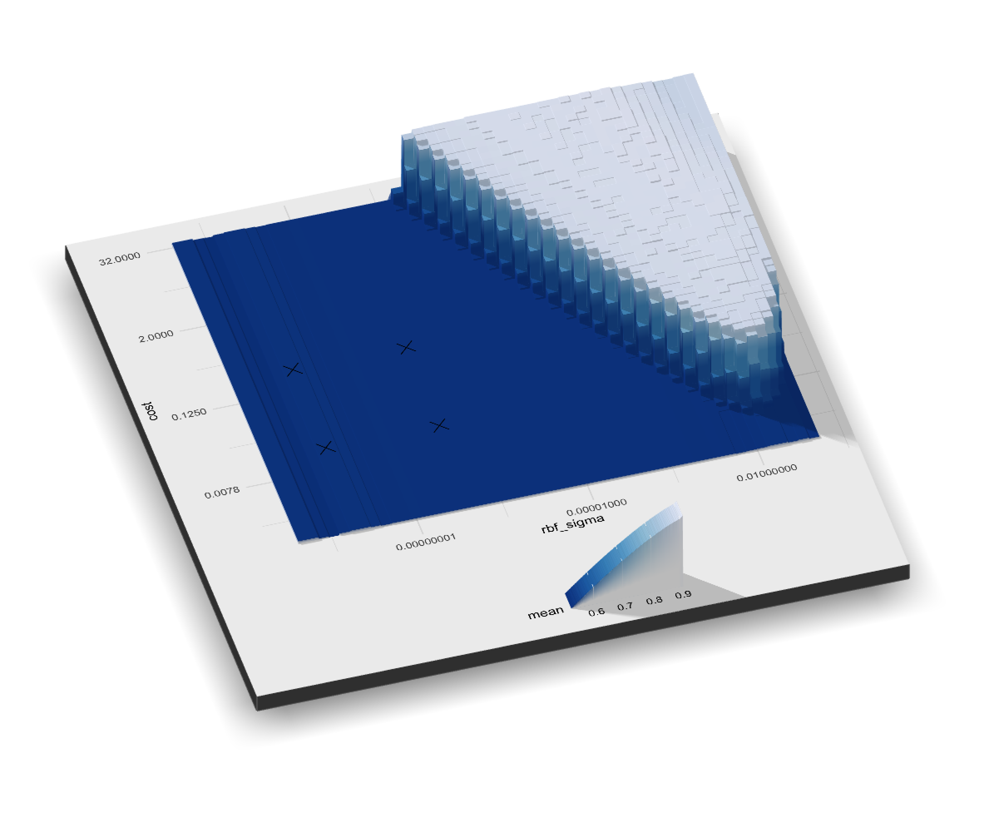

```{r iterative-setup, include = FALSE}
knitr::opts_chunk$set(fig.path = "figures/")
library(tidymodels)
library(finetune)
library(patchwork)
library(av)
library(doMC)
registerDoMC(cores = parallel::detectCores(logical = TRUE))

## -----------------------------------------------------------------------------

source("extras/sa_2d_plot.R")
source("extras/bo_3panel_plot.R")
load(file.path("RData", "svm_large.RData"))

## -----------------------------------------------------------------------------

data(cells)
cells <- cells %>% select(-case)
set.seed(33)
cell_folds <- vfold_cv(cells)
roc_res <- metric_set(roc_auc)
```

# Iterative search {#iterative-search}


## A support vector machine model

The cell data, used in the previous chapter, are also used here. We will use a support vector machine (SVM) model to demonstrate sequential tuning methods. See @apm for model information on this model. The two tuning parameters that will be optimized are the SVM cost value as well has the radial basis function kernel parameter $\sigma$. Both parameters can have a profound effect on the model complexity and performance. 

Like the  multilayer perceptron model,  this model would benefit from the use of the PCA feature extraction. However, this operation is not used in this chapter so that we can visualize the search process in two dimensions. The support vector machine model uses a dot-product and, for this reason, centering and scaling is applied to the predictors. 

Along with the previously used objects (shown in Section \@ref(grid-summary)), the following tidymodels objects define the model process: 

```{r iterative-svm-defs}
svm_rec <- 
  recipe(class ~ ., data = cells) %>%
  step_YeoJohnson(all_predictors()) %>%
  step_normalize(all_predictors())

svm_spec <- 
 svm_rbf(cost = tune(), rbf_sigma = tune()) %>% 
 set_engine("kernlab") %>% 
 set_mode("classification")

svm_wflow <- 
  workflow() %>% 
  add_model(svm_spec) %>% 
  add_recipe(svm_rec)
```

The default parameter ranges for these two tuning parameters are: 

```{r iterative-svm-param}
cost()
rbf_sigma()
```

For illustration, the parameter ranges are slightly changed (to improve the visualizations of the search): 

```{r iterative-svm-param-set}
svm_param <- 
 svm_wflow %>% 
 parameters() %>% 
  update(
    cost = cost(c(-10, 5)),
    rbf_sigma = rbf_sigma(c(-7, -1))
  )
```

Before discussing the search procedures, it is helpful to understand what the relationship is between the tuning parameters and the area under the ROC curve. A very large regular grid, comprised of 2,500 candidate values, was constructed and evaluated using resampling. This is obviously impractical in regular data analysis and tremendously inefficient. However, it elucidates the path that the search process _should take_ and where the numerically optimal value(s) occur. 

The plot below shows the results. There is a large swath in the lower diagonal of the parameter space that is relatively flat with poor performance. A ridge of best performance occurs in the upper right portion of the space. The transition from the plateau of poor results to the ridge of best performance is very sharp. The is also a sharp drop in the area under the ROC curve just to the right of the ridge. A black dot points to the numerically best results found in the grid. 

```{r iterative-roc-surface, out.width = "80%", echo = FALSE, warning = FALSE}
# See file extras/cells_svm_large.R
res <- file.copy("premade/roc_surface.png", "_book/premade/roc_surface.png")

```

The search procedures described below require at least one tuning parameter result before proceeding. For this purpose, the code below creates a small regular grid that resides in the flat portion of the parameter space. The `tune_grid()` function resamples these values:  

```{r iterative-svm-initial, cache = TRUE}
set.seed(234)
start_grid <- 
 svm_param %>% 
 update(
  cost = cost(c(-6, 1)),
  rbf_sigma = rbf_sigma(c(-6, -4))
 ) %>% 
 grid_regular(levels = 2)

set.seed(2)
svm_initial <- 
  svm_wflow %>% 
  tune_grid(resamples = cell_folds, grid = start_grid, metrics = roc_res)

collect_metrics(svm_initial)
```
As shown in the following sections, these results can be ingested by the iterative tuning functions to use as initial values. 

## Bayesian  optimization

Bayesian optimization techniques analyze the current resampling results and create a predictive model to predict tuning parameter values that have yet to be evaluated. The tuning parameter combination estimated to be most advantageous is then resampled. These results are then used in another predictive model that predicts more candidate values for testing. The process proceeds for a set number of iterations or until no further improvements occur. @Shahriari @frazier2018tutorial are good introductions to this procedure. 

The main questions in this tuning scheme are how to create the model and how to select parameters predicted by that model. 

### A Gaussian process model

@RaWi06 @SCHULZ20181


### Acquisition functions


### The `tune_bayes()` function

```{r iterative-cells-bo-calcs, echo = FALSE, cache = TRUE}
# We will do the calculations here but use some non-standard options. First, 
# purrr is used to capture the output in a vector so that we can show the 
# results piecemeal. Also, a hidden option is used to save the grid of candidate 
# values for each iteration of the search. These will be used to make an 
# animation in a later chunk. 
# 
# This means that any changes to this chunk have to be made to the next chunk 
# (where the code is shown and not executed).

ctrl <- control_bayes(verbose = TRUE)
ctrl$save_gp_results <- TRUE

tune_bayes_sssshhh <- purrr::quietly(tune_bayes)

set.seed(1234)
svm_bo_sshh <-
  svm_wflow %>%
  tune_bayes_sssshhh(
    resamples = cell_folds,
    metrics = roc_res,
    initial = svm_initial,
    param_info = svm_param,
    iter = 25,
    control = ctrl
  )

svm_bo <- svm_bo_sshh$result
svm_bo_output <- svm_bo_sshh$messages

gp_candidates <- collect_gp_results(svm_bo)
save(gp_candidates, file = "RData/gp_candidates.RData")
```

```{r iterative-cells-bo, eval = FALSE}
ctrl <- control_bayes(verbose = TRUE)

set.seed(1234)
svm_bo <-
 svm_wflow %>%
 tune_bayes(
  resamples = cell_folds,
  metrics = roc_res,
  initial = svm_initial,
  param_info = svm_param,
  iter = 25,
  control = ctrl
 )
```


```{r iterative-cells-info, include = FALSE}
bo_res <- collect_metrics(svm_bo) %>% mutate(current_best = FALSE)
for(i in 1:nrow(bo_res)) {
  bo_res$current_best[i] <- bo_res$mean[i] > max(bo_res$mean[1:(i-1)])
}
init_vals <- bo_res %>% dplyr::filter(.iter == 0)
best_init <- max(bo_res$mean[bo_res$.iter == 0])
best_bo <- max(bo_res$mean)
best_bo_iter <- bo_res$.iter[which.max(bo_res$mean)]
new_best_iter <- bo_res$.iter[which(bo_res$current_best)]
new_best_iter <- new_best_iter[new_best_iter > 0]
num_improve <- length(new_best_iter)
last_iter <- max(collect_metrics(svm_bo)$.iter)

iter_1_roc <- bo_res$mean[bo_res$.iter == 1]
iter_1_imp <- iter_1_roc > best_init
iter_1_text <- 
  paste0(
    ifelse(iter_1_imp, "showed an improvement, resulting in an ROC value of ",
                        "failed to improve the outcome with an ROC value of "),
    round(iter_1_roc, 5), "."
  )

iter_2_roc <- bo_res$mean[bo_res$.iter == 2]
iter_2_imp <- iter_2_roc > max(bo_res$mean[bo_res$.iter < 2])
iter_2_text <- 
  dplyr::case_when(
    !iter_1_imp &  !iter_2_imp ~ 
      paste0("the second iteration also failed to yield an improvement."),
    !iter_1_imp &   iter_2_imp ~ 
      paste0("the second iteration did yield a better result with an area under the ROC curve of ", 
             round(iter_2_roc, 5), "."),
     iter_1_imp &  !iter_2_imp ~ 
      paste0("the second iteration did not continue the trend with a sub-optimal ROC value of ",
             round(iter_2_roc, 5), "."),
      iter_1_imp &  !iter_2_imp ~ 
      paste0("the second iteration further increased the outcome value (ROC = ",
             round(iter_2_roc, 5), ").") 
  )

if (num_improve > 1) {
  improve_text <-
    paste0(
      "There were a total of ",
      num_improve,
      " improvements in the outcome along the way at iterations ",
      knitr::combine_words(new_best_iter),
      "."
    )
} else {
  improve_text <-
    paste0("There was only a single improvement in the outcome at iteration ",
           new_best_iter,
           ".")
}

if (last_iter < 25) {
  last_bo_text <-
    paste0(
      "Since the best result occurred at iteration ",
      max(new_best_iter),
      ", there were no more improvements and the default option is to stop if no improvements are found after ",
      ctrl$no_improve,
      " more steps. The last step was:"
    )
} else {
    last_bo_text <- "The last step was:"
}
```

The search process starts with an initial value of `r round(best_init, 5)` for the area under the ROC curve. A Gaussian process model uses these `r nrow(init_vals)` statistics to create a model. The large candidate set is automatically generated and scored using the expected improvement acquisition function. The first iteration `r iter_1_text` After fitting another Gaussian process model with the new outcome value, `r iter_2_text`

The log of the first two iterations, produced by the `verbose` option, was: 

```{r iterative-cells-bo-print-first, echo = FALSE}
so_stop_index <- grep("Iteration 3", svm_bo_output) 
if (length(so_stop_index) > 0) {
  cat(svm_bo_output[1:(so_stop_index - 2)], sep = "")
}
```
The search continues. `r improve_text` The best result occurred at iteration `r max(new_best_iter)` with an area under the ROC curve of `r round(best_bo, 5)`. 

```{r iterative-cells-bo-print-impr, echo = FALSE}
all_imp_index <- grep("♥", svm_bo_output)
so_stop_index <- all_imp_index[length(all_imp_index)]
if (length(all_imp_index) > 0) {
  so_start_index <- so_stop_index - 10
  cat(svm_bo_output[so_start_index:(so_stop_index + 1)], sep = "")
}
```
`r last_bo_text` 

```{r iterative-cells-bo-print-last, echo = FALSE}
so_start <- paste("Iteration", last_iter)
so_start_index <- grep(so_start, svm_bo_output)
if (length(so_start_index) > 0) {
  cat(svm_bo_output[so_start_index:length(svm_bo_output)], sep = "")
}
```

The `autoplot()` function has several options for iterative search methods. One shows how the outcome changed over the search: 

```{r iterative-bo-iter, fig.height = 4}
autoplot(svm_bo, type = "performance")
```

The animation below visualizes the results of the search. The black X values show the starting values contained in `svm_initial`. The top-left blue panel shows the _predicted_ mean value of the area under the ROC curve. The red panel on the top-right displays the _predicted_ variation in the ROC values while the bottom plot visualizes the expected improvement. In each panel, darker colors indicate less attractive values (e.g., small mean values, large variation, and small improvements).  

```{r iterative-bo-progress, include = FALSE}
# If caching was turned on for the 'iterative-cells-bo-calcs' chunk, the version
# of the GP results in tempdir will not be available so we use the last copy in 
# the 'RData' path. 

if (!exists("gp_candidates")) {
  load("RData/gp_candidates.RData")
}
av_capture_graphics(
  make_bo_animation(gp_candidates, svm_bo),
  output = "_book/premade/bo_search.mp4",
  width = 720,
  height = 720,
  res = 100,
  vfilter = 'framerate=fps=10', 
  framerate = 1/3
)
```

<video width="720" height="720" controls>
  <source src="_book/premade/bo_search.mp4" type="video/mp4">
</video>


The surface of the predicted mean is very inaccurate in the first few iterations of the search. Despite this, it does help guide the process to the region of good performance.  In other words, the Gaussian process model is wrong but shows itself to be very useful. Within the first ten iterations the search is sampling near the optimum location. 

While the best tuning parameter combination is on the boundary of the parameter space, Bayesian optimization will often choose new points on other parts of the boundary). While we can adjust the ratio of exploration and exploitation, the search tends to sample boundary points.

If the search is seeded with an initial grid, a space-filling design would probably be a better choice than a regular design.  It samples more unique values of the parameter space and would improve the predictions of the standard deviation in the early iterations. 

`tune_bayes()` also has a somewhat non-standard option in its control function. In cases where the search is no exploring the space enough, it take an _uncertainty sample_ if there have been too few improvements in the outcome. This type of sample would ignore the predicted mean and choose a new candidate that has the largest uncertainty. The result is that the search might explore a location where there are no existing points. This idea comes from the field of active learning, where new training set points are chosen based on their ability to improve the model fit. To use this feature, the `uncertain` argument in `control_bayes()` specifies how many steps with no improvement must occur before taking an uncertainty sample. The default is to never take one. 

Finally, if the user interrupts the `tune_bayes()` computations, the function returns the current results (instead of resulting in an error).  


## Simulated annealing 

Simulated annealing (SA) is a general nonlinear search routine inspired by the process in which metal cools. It is a global search method that can effectively navigate many different types of search landscapes, including discontinuous functions. Unlike most gradient-based optimization routines, simulated annealing can reassess previous solutions. 

The process starts with an initial value and creates a bias random walk thought the parameter space. Each new candidate parameter value is a small perturbation of the previous value that keeps the new point within a _local neighborhood_. 

The candidate point is resampled to obtain its corresponding performance value. If this achieves in better results than the previous parameters, it is accepted as the new best and the process continues. If the results are worse than the previous value the search procedure _may_ still use its parameter to define further steps. This depends on two factors. First, the likelihood of accepting a bad result decreases as performance becomes worse. In other words, a slightly worse results has a better change of acceptance than one with a large drop in performance. The other factor is the number of search iterations. Simulated annealing wants to accept fewer suboptimal values as the search proceeds. From these two factors, the _acceptance probability_  for a bad results can be formalized as

$$Pr[\text{accept suboptimal parameters at iteration } i] = \exp(c\times D_i \times i)$$

where $i$ is the iteration number, $c$ is a user-specified constant, and $D_i$ is the percent different between the old and new values (where negative values implies worse results). For a bad result, we determine the acceptance probability and compare it to a random uniform number. If the random number is less than the probability value, the search _discards_ the current parameters and the next iteration creates  its candidate based on the previous value. Otherwise, the next iteration forms the next set of parameters based on the current (suboptimal) values. 

This feature of the algorithm allows the search to proceed in the wrong direction, at least for the short term, with the potential to find a much better region of the parameter space. 

How are the acceptance probabilities influenced? This heatmap shows how the acceptance probability can change over iterations, performance, and the user-specified coefficient: 

```{r iterative-acceptance, echo = FALSE, dev = "png", fig.height = 4.5}
get_accept_probs <- function(coef, pct_diff) {
  # pct loss to abs value
  candidate <- .8 - (pct_diff  * .8 /100) 
  
  x <- finetune:::acceptance_prob(0.8, candidate, 1:50, coef = coef, maximize = TRUE)
  tibble(
    `Acceptance Probability` = x,
    iteration = 1:50,
    pct_diff = pct_diff, 
    coefficient = coef
  )
}

prob_settings <- crossing(pct_diff = 1:10, coefficient = c(10, 20, 30)/1000)
prob_res <- purrr::map2_dfr(prob_settings$coefficient, prob_settings$pct_diff, get_accept_probs)

ggplot(prob_res, aes(x = iteration, y = pct_diff, fill = `Acceptance Probability`)) +
  geom_raster() +
  facet_wrap( ~ coefficient, labeller = label_both) +
  scale_fill_gradientn(
    colours = scales::brewer_pal(palette = "Greens")(8),
    limits = 0:1
  ) +
  labs(y = "Percent Loss", x = "Iteration")
```

The user can adjust the coefficients to find a probability profile that suits their needs. In `finetune::control_sim_anneal()`, the default for this `cooling_coef` argument is `r control_sim_anneal()$cooling_coef`. 

This process continues for a set amount of iterations but can halt if no globally best results occur within a pre-determined number of iterations. However, it can be very helpful to set a _restart threshold_. This feature finds the last globally best parameter settings and starts anew. 

The main important detail is to define how to perturb the tuning parameters from iteration-to-iteration. There are a variety of methods in the literature for this. We follow the simple method given in @gsa called _generalized simulated annealing_. For continuous tuning parameters, we define a small radius to define the local "neighborhood". For example, suppose there are two tuning parameters and each is bounded by zero and one. The simulated annealing process generates random values on the surrounding radius and randomly chooses one to be the current candidate value.

In our implementation, the neighborhood is determined by scaling the current candidate to be between zero and one based on the range of the parameter object. For this reason, radius values between 0.05 and 0.1 seem reasonable. For these values, fastest that the the search could go from one since of the parameters space to the other is 20 and 10 iterations, respectively. The size of the radius controls how quickly the search explores the parameter space. 


To illustrate, we'll use the two main glmnet tuning parameters: 

 * The amount of total regularization (`penalty`). The default range for this parameter is $10^{`r penalty()$range[[1]]`}$ to $10^{`r penalty()$range[[2]]`}$. It is typical to use a log (base 10) transformation for this parameter.  

 * The proportion of the lasso penalty (`mixture`). This is bounded at zero and one with no transformation

```{r iterative-neighborhood-calcs, echo = FALSE}
glmn_param <- parameters(penalty(), mixture())
pen_rng <- unlist(range_get(penalty(), original = TRUE))
mix_rng <- 0:1

iter_1 <- tibble(penalty = 0.025, mixture = .1)
next_neighbors <- 
  finetune:::random_neighbor(iter_1, glmn_param, r = .1, retain = 100) %>% 
  mutate(Iteration = 1)

set.seed(1)
neighbors_values <- next_neighbors
best_values <- iter_1 %>% mutate(Iteration = 1)

scoring <- function(x) {
  - log10(x$penalty) * .1 + x$mixture * 2 + rnorm(nrow(x), sd = .5)
}

path <- best_values

for (i in 2:6) {
  set.seed(i)
  next_scores <- scoring(next_neighbors)
  next_ind <- which.max(next_scores)
  next_value <- next_neighbors %>% slice(next_ind) %>% mutate(Iteration = i)
  
  best_values <- 
    bind_rows(
      best_values,
      next_value
    )
  path <- bind_rows(path, best_values %>% mutate(Iteration = i))
  
  next_neighbors <- 
    finetune:::random_neighbor(next_value %>% select(-Iteration), glmn_param, r = .1, retain = 50) %>% 
    mutate(Iteration = i)
  neighbors_values <- 
    bind_rows(
      neighbors_values,
      next_neighbors
    )  
}
```

The process starts with initial values of `penalty = 0.025` and `mixture = 0.100`. Using a radius of 0.1, the data are appropriately scaled, random values are generated on this radius around the initial point, then one is chosen as the candidate. For illustration, we will assume that all candidate values are improvements. Using this new value, a set of new random neighbors are generated, one is chosen, and so on. This figure shows `r max(best_values$Iteration)` iterations as the search proceeds toward the upper left corner: 

```{r iterative-neighborhood, echo = FALSE, message = FALSE, warning = FALSE}
ggplot(neighbors_values, aes(x = penalty, y = mixture)) + 
  geom_point(alpha = .3, size = 3/4, aes(col = factor(Iteration)), show.legend = FALSE) + 
  scale_x_continuous(trans = "log10", limits = pen_rng) + 
  scale_y_continuous(limits = mix_rng) + 
  geom_point(data = best_values) + 
  geom_path(data = path) + 
  geom_point(data = path) + 
  facet_wrap(~ Iteration, labeller = label_both) + 
  labs(
    x = paste(penalty()$label, "(penalty)"),
    y = paste(mixture()$label, "(mixture)")
  )
```

For non-numeric parameters, we assign a probability for how often the parameter value changes. 


```{r iterative-cells-sa-calcs, include = FALSE, cache = TRUE}
# As we did above, this chunk executes the code with some extra options that
# capture the output and save some internal objects for plotting. 

# This means that any changes to this chunk have to be made to the next chunk 
# (where the code is shown and not executed).

ctrl_sa <- control_sim_anneal(no_improve = Inf)
ctrl_sa$sa_history <- TRUE

tune_sim_anneal_sssshhh <- purrr::quietly(tune_sim_anneal)

set.seed(1234)
svm_sa_sshh <-
  svm_wflow %>%
  tune_sim_anneal_sssshhh(
    resamples = cell_folds,
    metrics = roc_res,
    initial = svm_initial,
    param_info = svm_param,
    iter = 50,
    control = ctrl_sa
  )

svm_sa <- svm_sa_sshh$result
svm_sa_output <- svm_sa_sshh$messages

# We set tune_sim_anneal() to save a file to the temp directory. If the results
# are cached, this file won't be there:
try(
  file.copy(
    file.path(tempdir(), "sa_history.RData"),
    "RData/sa_history.RData"
  ),
  silent = TRUE
)
```
```{r iterative-cells-sa, eval = FALSE}
ctrl_sa <- control_sim_anneal(no_improve = Inf)

set.seed(1234)
svm_sa <-
  svm_wflow %>%
  tune_sim_anneal(
    resamples = cell_folds,
    metrics = roc_res,
    initial = svm_initial,
    param_info = svm_param,
    iter = 50,
    control = ctrl_sa
  )
```


```{r iterative-sa-history, include = FALSE}
if (file.exists(file.path(tempdir(), "sa_history.RData"))) {
  load(file.path(tempdir(), "sa_history.RData"))
} else {
  load("RData/sa_history.RData")
}

## -----------------------------------------------------------------------------

restart_iter <- result_history$.iter[result_history$results == "restart from best"]
restart_num <- length(restart_iter)
sa_iter_list <- knitr::combine_words(restart_iter)
restart_txt <- 
  dplyr::case_when(
    restart_num == 0 ~ paste0("There were no restarts during the search."),
    restart_num == 1 ~ paste0("There was a single restart at iteration ", restart_iter)[1],
    TRUE ~ paste0("There were ", restart_num, " restarts at iterations ", sa_iter_list)[1]
  )
discard_num<- length(result_history$.iter[result_history$results == "discard suboptimal"])
if (discard_num > 0) {
  restart_txt <-
    paste0(
      restart_txt, 
      " as well as ", 
      discard_num, 
      " discarded ", 
      ifelse(discard_num > 1, "candidates ", "candidate "),
      "during the process."
    )
} else {
  restart_txt <- paste0(restart_txt, ".")
}

## -----------------------------------------------------------------------------

best_iters <- result_history$.iter[result_history$results == "new best"]
best_init <- max(result_history$mean[result_history$.iter == 0])
best_sa_res <- max(result_history$mean[result_history$.iter > 0])
best_sa_inds <- result_history$.iter[which.max(result_history$mean)]
best_txt <-
  dplyr::case_when(
    restart_num == 1 ~ paste0("a new global optimum once at iteration ", best_iters, "."),
    TRUE ~ paste0("new global optimums at ", length(best_iters), " different iterations.")[1]
  )
best_txt <- best_txt[1]
if (length(best_iters) > 1) {
  best_txt <-
    paste0(
      best_txt,
      " The earliest improvement was at iteration ",
      min(best_iters),
      " and the final optimum occured at iteration ",
      max(best_iters),
      ". The best overall results occured at iteration ", 
      best_sa_inds, " with a mean area under the ROC curve of ",
      round(best_sa_res, 4), " (compared to an initial best of ",
      round(best_init, 4), ")."
    )
}
```

The simulated annealing process discovered `r best_txt` `r restart_txt`

The `verbose` option prints details of the search process. The output for the first five iterations was: 

```{r iterative-cells-sa-print-start, echo = FALSE}
so_stop_index <- grep("^ 5", svm_sa_output)
if (length(so_stop_index) > 0) {
  cat(svm_sa_output[1:so_stop_index], sep = "")
}
```


The last ten iterations: 

```{r iterative-cells-sa-print-end, echo = FALSE}
so_start_index <- grep("^40", svm_sa_output)
so_stop_index <- grep("^50", svm_sa_output)
if (length(so_stop_index) > 0) {
  cat(svm_sa_output[so_start_index:so_stop_index], sep = "")
}
```

As with the other `tune_*()` functions, the corresponding `autoplot()` function produces visual assessments of the results: 

```{r interative-sa-performance, fig.height = 4.25}
autoplot(svm_sa, type = "performance")
```

```{r interative-sa-parameters, fig.height = 4.25}
autoplot(svm_sa)
```

A visualization of the search path helps understand where the search process did well and and where it went astray:  

```{r iterative-sa-plot, include = FALSE}
av_capture_graphics(
  sa_2d_plot(svm_sa, result_history, svm_large),
  output = "_book/premade/sa_search.mp4",
  width = 720,
  height = 720,
  res = 120,
  vfilter = 'framerate=fps=10', 
  framerate = 1/3
)
```

<video width="720" height="720" controls>
  <source src="_book/premade/sa_search.mp4" type="video/mp4">
</video>

## Chapter summary {#iterative-summary}
