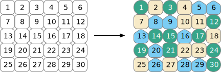

```{r include=FALSE, cache=FALSE}
options(digits = 4, width = 80)
options(dplyr.print_min = 6, dplyr.print_max = 6)

knitr::opts_chunk$set(
  comment = "#>",
  collapse = TRUE,
  fig.align = 'center',
  tidy = FALSE
)

transparent_theme <- function() {
  library(ggplot2)
  thm <- 
    theme_bw() + 
    theme(
      panel.background = element_rect(fill = "transparent", colour = NA), 
      plot.background = element_rect(fill = "transparent", colour = NA),
      legend.position = "top",
      legend.background = element_rect(fill = "transparent", colour = NA),
      legend.key = element_rect(fill = "transparent", colour = NA)
    )
  theme_set(thm)
}

transparent_theme()

tmwr_version <- function() {
  dt <- Sys.Date()
  ver <- read.dcf("DESCRIPTION")[1, "Version"]
  paste0("Version ", ver, " (", dt, ")")
}

```
```{r resampling-setup, include = FALSE}
knitr::opts_chunk$set(fig.path = "figures/")
library(tidymodels)
```

# Resampling for evaluating performance  {#resampling}

```{r resampling-scheme, echo = FALSE, out.width = '65%'}
if (knitr:::is_html_output()) {
  file.copy("premade/resampling.svg", "_book/premade/resampling.svg")
  knitr::include_graphics("premade/resampling.svg")
} else {
  file.copy("premade/resampling.pdf", "_book/premade/resampling.pdf")
  knitr::include_graphics("premade/resampling.pdf")
}
```

## Cross-validation

```{r resampling-three-cv, echo = FALSE, out.width = '25%'}

if (knitr:::is_html_output()) {
  file.copy("premade/three-CV.svg", "_book/premade/three-CV.svg")
  
} else {
  file.copy("premade/three-CV.pdf", "_book/premade/three-CV.pdf")
  knitr::include_graphics("premade/three-CV.pdf")
}
```


```{r resampling-three-cv-iter, echo = FALSE, out.width = '55%'}
if (knitr:::is_html_output()) {
  file.copy("premade/three-CV-iter.svg", "_book/premade/three-CV-iter.svg")
  knitr::include_graphics("premade/three-CV-iter.svg")
} else {
  file.copy("premade/three-CV-iter.pdf", "_book/premade/three-CV-iter.pdf")
  knitr::include_graphics("premade/three-CV-iter.pdf")
}
```


## Bootstrapping


## Rolling origin forcasting


## Estimating performance


Maybe inlcude some simple examples of comparing models using resampling (perhaps go full `tidyposterior`?)

