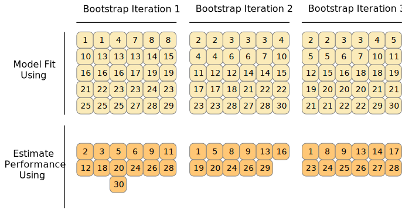
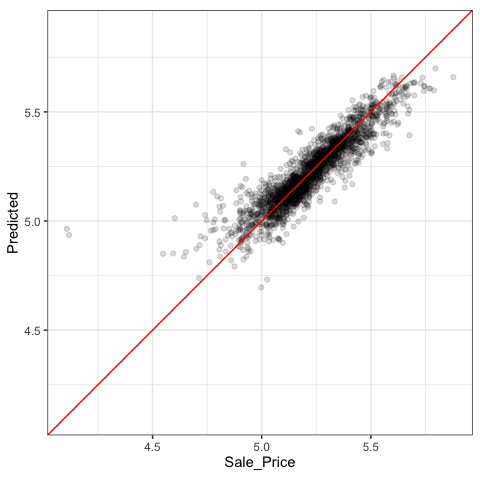

# (PART\*) Tools for Creating Effective Models {-} 

# Resampling for Evaluating Performance  {#resampling}

We have already covered several pieces that must be put together to evaluate the performance of a model. Chapter \@ref(performance) described statistics for measuring model performance, and Chapter \@ref(splitting) introduced the idea of data spending where we recommended the test set for obtaining an unbiased estimate of performance. However, we usually need to understand the performance of a model or even multiple models _before using the test set_. 

:::rmdwarning
Typically we can't decide on which final model to use with the test set before first assessing model performance. There is a gap between our need to measure performance reliably and the data splits (training and testing) we have available.
:::

In this chapter, we describe an approach called resampling that can fill this gap. Resampling estimates of performance can generalize to new data in a similar way as estimates from a test set. The next chapter complements this one by demonstrating statistical methods that compare resampling results. 

In order to fully appreciate the value of resampling, let's first take a look the resubstitution approach, which can often fail. 

## The Resubstitution Approach {#resampling-resubstition}

When we measure performance on the same data that we used for training (as opposed to new data or testing data), we say we have "resubstituted" the data. Let's again use the Ames data to demonstrate these concepts. The end of Chapter \@ref(recipes) summarizes the current state of our Ames analysis. It includes a recipe object named `ames_rec`, a linear model, and a workflow using that recipe and model called `lm_wflow`. This workflow was fit on the training set, resulting in `lm_fit`. 

For a comparison to this linear model, we can also fit a different type of model. _Random forests_ are a tree ensemble method that operates by creating a large number of decision trees from slightly different versions of the training set [@breiman2001random]. This collection of trees makes up the ensemble. When predicting a new sample, each ensemble member makes a separate prediction. These are averaged to create the final ensemble prediction for the new data point. 

Random forest models are very powerful and they can emulate the underlying data patterns very closely. While this model can be computationally intensive, it is very low-maintenance; very little preprocessing is required (as documented in Appendix \@ref(pre-proc-table)).

Using the same predictor set as the linear model (without the extra preprocessing steps), we can fit a random forest model to the training set via the `"ranger"` engine (which uses the <span class="pkg">ranger</span> R package for computation). This model requires no preprocessing, so a simple formula can be used:


```r
rf_model <- 
  rand_forest(trees = 1000) %>% 
  set_engine("ranger") %>% 
  set_mode("regression")

rf_wflow <- 
  workflow() %>% 
  add_formula(
    Sale_Price ~ Neighborhood + Gr_Liv_Area + Year_Built + Bldg_Type + 
      Latitude + Longitude) %>% 
  add_model(rf_model) 

rf_fit <- rf_wflow %>% fit(data = ames_train)
```

How should we compare the linear and random forest models? For demonstration, we will predict the training set to produce what is known as an "apparent metric" or "resubstitution metric". This function creates predictions and formats the results: 


```r
estimate_perf <- function(model, dat) {
  # Capture the names of the `model` and `dat` objects
  cl <- match.call()
  obj_name <- as.character(cl$model)
  data_name <- as.character(cl$dat)
  data_name <- gsub("ames_", "", data_name)
  
  # Estimate these metrics:
  reg_metrics <- metric_set(rmse, rsq)
  
  model %>%
    predict(dat) %>%
    bind_cols(dat %>% select(Sale_Price)) %>%
    reg_metrics(Sale_Price, .pred) %>%
    select(-.estimator) %>%
    mutate(object = obj_name, data = data_name)
}
```

Both RMSE and R<sup>2</sup> are computed. The resubstitution statistics are: 


```r
estimate_perf(rf_fit, ames_train)
#> # A tibble: 2 × 4
#>   .metric .estimate object data 
#>   <chr>       <dbl> <chr>  <chr>
#> 1 rmse       0.0367 rf_fit train
#> 2 rsq        0.959  rf_fit train
estimate_perf(lm_fit, ames_train)
#> # A tibble: 2 × 4
#>   .metric .estimate object data 
#>   <chr>       <dbl> <chr>  <chr>
#> 1 rmse       0.0754 lm_fit train
#> 2 rsq        0.816  lm_fit train
```


Based on these results, the random forest is much more capable of predicting the sale prices; the RMSE estimate is 2-fold better than linear regression. If we needed to choose between these two models for this price prediction problem, we would probably chose the random forest because, on the log scale we are using, its RMSE is about half as large. The next step applies the random forest model to the test set for final verification:


```r
estimate_perf(rf_fit, ames_test)
#> # A tibble: 2 × 4
#>   .metric .estimate object data 
#>   <chr>       <dbl> <chr>  <chr>
#> 1 rmse       0.0704 rf_fit test 
#> 2 rsq        0.852  rf_fit test
```

The test set RMSE estimate, 0.0704, is *much worse than the training set*  value of 0.0367! Why did this happen? 

Many predictive models are capable of learning complex trends from the data. In statistics, these are commonly referred to as _low bias models_. 

:::rmdnote
In this context, _bias_ is the difference between the true pattern or relationships in data and the types of patterns that the model can emulate. Many black-box machine learning models have low bias, meaning they can reproduce complex relationships. Other models (such as linear/logistic regression, discriminant analysis, and others) are not as adaptable and are considered _high bias_ models.^[See Section 1.2.5 of @fes for a discussion: <https://bookdown.org/max/FES/important-concepts.html#model-bias-and-variance>].
:::

For a low-bias model, the high degree of predictive capacity can sometimes result in the model nearly memorizing the training set data. As an obvious example, consider a 1-nearest neighbor model. It will always provide perfect predictions for the training set no matter how well it truly works for other data sets. Random forest models are similar; re-predicting the training set will always result in an artificially optimistic estimate of performance.  

For both models, Table \@ref(tab:rmse-results) summarizes the RMSE estimate for the training and test sets: 


Table: (\#tab:rmse-results)Performance statistics for training and test sets.

|object |  train|   test|
|:------|------:|------:|
|lm_fit | 0.0754| 0.0736|
|rf_fit | 0.0367| 0.0704|

Notice that the linear regression model is consistent between training and testing, because of its limited complexity.^[It is possible for a linear model to nearly memorize the training set, like the random forest model did. In the `ames_rec` object, change the number of spline terms for `longitude` and `latitude` to a large number (say 1000). This would produce a model fit with a very small resubstitution RMSE and a test set RMSE that is much larger.] 

:::rmdwarning
The main take-away from this example is that re-predicting the training set will result in an artificially optimistic estimate of performance. It is a bad idea for most models. 
:::

If the test set should not be used immediately, and re-predicting the training set is a bad idea, what should be done?  Resampling methods, such as cross-validation or validation sets, are the solution.


## Resampling Methods

Resampling methods are empirical simulation systems that emulate the process of using some data for modeling and different data for evaluation. Most resampling methods are iterative, meaning that this process is repeated multiple times. The diagram in Figure \@ref(fig:resampling-scheme) illustrates how resampling methods generally operate.

<div class="figure" style="text-align: center">

<p class="caption">(\#fig:resampling-scheme)Data splitting scheme from the initial data split to resampling.</p>
</div>

Resampling is only conducted on the training set, as you see in Figure \@ref(fig:resampling-scheme). The test set is not involved. For each iteration of resampling, the data are partitioned into two subsamples: 

* The model is fit with the *analysis set*. 
  
* The model is evaluated with the *assessment set*. 

These two subsamples are somewhat analogous to training and test sets. Our language of _analysis_ and _assessment_ avoids confusion with initial split of the data. These data sets are mutually exclusive. The partitioning scheme used to create the analysis and assessment sets is usually the defining characteristic of the method.

Suppose twenty iterations of resampling are conducted. This means that twenty separate models are fit on the analysis sets and the corresponding assessment sets produce twenty sets of performance statistics. The final estimate of performance for a model is the average of the twenty replicates of the statistics. This average has very good generalization properties and is far better than the resubstituion estimates. 

The next section defines several commonly used resampling methods and discusses their pros and cons. 

### Cross-validation {#cv}

Cross-validation is a well established resampling method. While there are a number of variations, the most common cross-validation method is _V_-fold cross-validation. The data are randomly partitioned into _V_ sets of roughly equal size (called the "folds"). For illustration, _V_ = 3 is shown in Figure \@ref(fig:cross-validation-allocation) for a data set of thirty training set points with random fold allocations. The number inside the symbols is the sample number.

<div class="figure" style="text-align: center">

<p class="caption">(\#fig:cross-validation-allocation)V-fold cross-validation randomly assigns data to folds. </p>
</div>

The color of the symbols in Figure \@ref(fig:cross-validation-allocation) represent their randomly assigned folds. Stratified sampling is also an option for assigning folds (previously discussed in Chapter \@ref(splitting)). 

For 3-fold cross-validation, the three iterations of resampling are illustrated in Figure \@ref(fig:cross-validation). For each iteration, one fold is held out for assessment statistics and the remaining folds are substrate for the model. This process continues for each fold so that three models produce three sets of performance statistics. 

<div class="figure" style="text-align: center">

<p class="caption">(\#fig:cross-validation)V-fold cross-validation data usage.</p>
</div>

When _V_ = 3, the analysis sets are 2/3 of the training set and each assessment set is a distinct 1/3. The final resampling estimate of performance averages each of the _V_ replicates. 

Using _V_ = 3 is a good choice to illustrate cross-validation but is a poor choice in practice because it is too low to generate reliable estimates. In practice, values of _V_ are most often 5 or 10; we generally prefer 10-fold cross-validation as a default because it is large enough for good results in most situations. 

:::rmdnote
What are the effects of changing _V_? Larger values result in resampling estimates with small bias but substantial variance. Smaller values of _V_ have large bias but low variance. We prefer 10-fold since noise is reduced by replication, but bias is not.^[See Section 3.4 of @fes for a longer description of the results of change _V_: <https://bookdown.org/max/FES/resampling.html>]. 
:::

The primary input is the training set data frame as well as the number of folds (defaulting to 10): 


```r
set.seed(1001)
ames_folds <- vfold_cv(ames_train, v = 10)
ames_folds
#> #  10-fold cross-validation 
#> # A tibble: 10 × 2
#>   splits             id    
#>   <list>             <chr> 
#> 1 <split [2107/235]> Fold01
#> 2 <split [2107/235]> Fold02
#> 3 <split [2108/234]> Fold03
#> 4 <split [2108/234]> Fold04
#> 5 <split [2108/234]> Fold05
#> 6 <split [2108/234]> Fold06
#> # … with 4 more rows
```

The column named `splits` contains the information on how to split the data (similar to the object used to create the initial training/test partition). While each row of `splits` has an embedded copy of the entire training set, R is smart enough not to make copies of the data in memory.^[To see this for yourself, try executing `lobstr::obj_size(ames_folds)` and `lobstr::obj_size(ames_train)`. The size of the resample object is much less than ten times the size of the original data.] The print method inside of the tibble shows the frequency of each: `[2K/220]` indicates that roughly two thousand samples are in the analysis set and 220 are in that particular assessment set. 

These objects also always contain a character column called `id` that labels the partition.^[Some resampling methods require multiple `id` fields.]  

To manually retrieve the partitioned data, the `analysis()` and `assessment()` functions return the corresponding data frames: 


```r
# For the first fold:
ames_folds$splits[[1]] %>% analysis() %>% dim()
#> [1] 2107   74
```

The <span class="pkg">tidymodels</span> packages, such as [<span class="pkg">tune</span>](https://tune.tidymodels.org/), contain high-level user interfaces so that functions like `analysis()` are not generally needed for day-to-day work. Chapter \@ref(resampling) demonstrates functions to fit a model over these resamples. 

There are a variety of variations on cross-validation; we'll go through the most important ones.

### Repeated cross-validation {-}

The most important variation on cross-validation is repeated _V_-fold cross-validation. Depending on the size or other characteristics of the data, the resampling estimate produced by _V_-fold cross-validation may be excessively noisy.^[For more details, see Section 3.4.6 of @fes: <https://bookdown.org/max/FES/resampling.html#resample-var-bias>] As with many statistical problems, one way to reduce noise is to gather more data. For cross-validation, this means averaging more than _V_ statistics. 

To create _R_ repeats of _V_-fold cross-validation, the same fold generation process is done _R_ times to generate _R_ collections of _V_ partitions. Now, instead of averaging _V_ statistics, $V \times R$ statistics produce the final resampling estimate. Due to the Central Limit Theorem, the summary statistics from each model tend toward a normal distribution, as long as we have a lot of data relative to $V \times R$. 

Consider the Ames data. On average, 10-fold cross-validation uses assessment sets that contain roughly 234 properties. If RMSE is the statistic of choice, we can denote that estimate's standard deviation as $\sigma$. With simple 10-fold cross-validation, the standard error of the mean RMSE is $\sigma/\sqrt{10}$. If this is too noisy, repeats reduce the standard error to $\sigma/\sqrt{10R}$. For 10-fold cross-validation with $R$ replicates, the plot in Figure \@ref(fig:variance-reduction) shows how quickly the standard error^[These are _approximate_ standard errors. As will be discussed in the next chapter, there is a within-replicate correlation that is typical of resampled results. By ignoring this extra component of variation, the simple calculations shown in this plot are overestimates of the reduction in noise in the standard errors.] decreases with replicates.

<div class="figure" style="text-align: center">

<p class="caption">(\#fig:variance-reduction)Relationship between the relative variance in performance estimates versus the number of cross-validation repeats.</p>
</div>

Larger number of replicates tend to have less impact on the standard error. However, if the baseline value of $\sigma$ is impractically large, the diminishing returns on replication may still be worth the extra computational costs. 

To create repeats, invoke `vfold_cv()` with an additional argument `repeats`: 


```r
vfold_cv(ames_train, v = 10, repeats = 5)
#> #  10-fold cross-validation repeated 5 times 
#> # A tibble: 50 × 3
#>   splits             id      id2   
#>   <list>             <chr>   <chr> 
#> 1 <split [2107/235]> Repeat1 Fold01
#> 2 <split [2107/235]> Repeat1 Fold02
#> 3 <split [2108/234]> Repeat1 Fold03
#> 4 <split [2108/234]> Repeat1 Fold04
#> 5 <split [2108/234]> Repeat1 Fold05
#> 6 <split [2108/234]> Repeat1 Fold06
#> # … with 44 more rows
```

### Leave-one-out cross-validation {-}

One variation of cross-validation is leave-one-out (LOO) cross-validation where _V_ is the number of data points in the training set. If there are $n$ training set samples, $n$ models are fit using $n-1$ rows of the training set. Each model predicts the single excluded data point. At the end of resampling, the $n$ predictions are pooled to produce a single performance statistic. 

Leave-one-out methods are deficient compared to almost any other method. For anything but pathologically small samples, LOO is computationally excessive and it may not have good statistical properties. Although the <span class="pkg">rsample</span> package contains a `loo_cv()` function, these objects are not generally integrated into the broader tidymodels frameworks.  

### Monte Carlo cross-validation {-}

Another variant of _V_-fold cross-validation is Monte Carlo cross-validation (MCCV, @xu2001monte). Like _V_-fold cross-validation, it allocates a fixed proportion of data to the assessment sets. The difference between MCCV and regular cross-validation is that, for MCCV, this proportion of the data is randomly selected each time. This results in assessment sets that are not mutually exclusive. To create these resampling objects: 


```r
mc_cv(ames_train, prop = 9/10, times = 20)
#> # Monte Carlo cross-validation (0.9/0.1) with 20 resamples  
#> # A tibble: 20 × 2
#>   splits             id        
#>   <list>             <chr>     
#> 1 <split [2107/235]> Resample01
#> 2 <split [2107/235]> Resample02
#> 3 <split [2107/235]> Resample03
#> 4 <split [2107/235]> Resample04
#> 5 <split [2107/235]> Resample05
#> 6 <split [2107/235]> Resample06
#> # … with 14 more rows
```

### Validation sets {#validation}

In Chapter \@ref(splitting), we briefly discussed the use of a validation set, a single partition that is set aside to estimate performance separate from the test set. When using a validation set, the initial available data set is split into a training set, a validation set, and a test set (see Figure \@ref(fig:three-way-split)).

<div class="figure" style="text-align: center">

<p class="caption">(\#fig:three-way-split)A three-way initial split into training, testing, and validation sets.</p>
</div>

Validation sets are often used when the original pool of data is very large. In this case, a single large partition may be adequate to characterize model performance without having to do multiple iterations of resampling. 

With the <span class="pkg">rsample</span> package, a validation set is like any other resampling object; this type is different only in that it has a single iteration.^[In essence, a validation set can be considered a single iteration of Monte Carlo cross-validation.] Figure \@ref(fig:validation-split) shows this scheme.


<div class="figure" style="text-align: center">

<p class="caption">(\#fig:validation-split)A two-way initial split into training and testing with an additional validation set split on the training set.</p>
</div>

To create a validation set object that uses 3/4 of the data for model fitting: 


```r
set.seed(1002)
val_set <- validation_split(ames_train, prop = 3/4)
val_set
#> # Validation Set Split (0.75/0.25)  
#> # A tibble: 1 × 2
#>   splits             id        
#>   <list>             <chr>     
#> 1 <split [1756/586]> validation
```


### Bootstrapping {#bootstrap}

Bootstrap resampling was originally invented as a method for approximating the sampling distribution of statistics whose theoretical properties are intractable [@davison1997bootstrap]. Using it to estimate model performance is a secondary application of the method. 

A bootstrap sample of the training set is a sample that is the same size as the training set but is drawn _with replacement_. This means that some training set data points are selected multiple times for the analysis set. Each data point has a 63.2% chance of inclusion in the training set at least once. The assessment set contains all of the training set samples that were not selected for the analysis set (on average, with 36.8% of the training set). When bootstrapping, the assessment set is often called the "out-of-bag" sample. 

For a training set of 30 samples, a schematic of three bootstrap samples is shown in Figure\@ref(fig:bootstrapping).

<div class="figure" style="text-align: center">

<p class="caption">(\#fig:bootstrapping)Bootstrapping data usage.</p>
</div>

Note that the sizes of the assessment sets vary. 

Using the <span class="pkg">rsample</span> package, we can create such bootstrap resamples: 


```r
bootstraps(ames_train, times = 5)
#> # Bootstrap sampling 
#> # A tibble: 5 × 2
#>   splits             id        
#>   <list>             <chr>     
#> 1 <split [2342/858]> Bootstrap1
#> 2 <split [2342/855]> Bootstrap2
#> 3 <split [2342/852]> Bootstrap3
#> 4 <split [2342/851]> Bootstrap4
#> 5 <split [2342/867]> Bootstrap5
```

Bootstrap samples produce performance estimates that have very low variance (unlike cross-validation) but have significant pessimistic bias. This means that, if the true accuracy of a model is 90%, the bootstrap would tend to estimate the value to be less than 90%. The amount of bias cannot be empirically determined with sufficient accuracy. Additionally, the amount of bias changes over the scale of the performance metric. For example, the bias is likely to be different when the accuracy is 90% versus when it is 70%. 

The bootstrap is also used inside of many models. For example, the random forest model mentioned earlier contained 1,000 individual decision trees. Each tree was the product of a different bootstrap sample of the training set. 

### Rolling forecasting origin resampling {#rolling}

When the data have a strong time component, a resampling method should support modeling to estimate seasonal and other temporal trends within the data. A technique that randomly samples values from the training set can disrupt the model's ability to estimate these patterns. 

Rolling forecast origin resampling [@hyndman2018forecasting] provides a method that emulates how time series data is often partitioned in practice, estimating the model with historical data and evaluating it with the most recent data. For this type of resampling, the size of the initial analysis and assessment sets are specified. The first iteration of resampling uses these sizes, starting from the beginning of the series. The second iteration uses the same data sizes but shifts over by a set number of  samples. 

To illustrate, a training set of fifteen samples was resampled with an analysis size of eight samples and an assessment set size of three. The second iteration discards the first training set sample and both data sets shift forward by one. This configuration results in five resamples, as shown in Figure\@ref(fig:rolling).

<div class="figure" style="text-align: center">

<p class="caption">(\#fig:rolling)Data usage for rolling forecasting origin resampling.</p>
</div>

There are a few different configurations of this method: 

* The analysis set can cumulatively grow (as opposed to remaining the same size). After the first initial analysis set, new samples can accrue without discarding the earlier data. 

* The resamples need not increment by one. For example, for large data sets, the incremental block could be a week or month instead of a day. 

For a year's worth of data, suppose that six sets of 30-day blocks define the analysis set. For assessment sets of 30 days with a 29-day skip, we can use the <span class="pkg">rsample</span> package to specify: 


```r
time_slices <- 
  tibble(x = 1:365) %>% 
  rolling_origin(initial = 6 * 30, assess = 30, skip = 29, cumulative = FALSE)

data_range <- function(x) {
  summarize(x, first = min(x), last = max(x))
}

map_dfr(time_slices$splits, ~   analysis(.x) %>% data_range())
#> # A tibble: 6 × 2
#>   first  last
#>   <int> <int>
#> 1     1   180
#> 2    31   210
#> 3    61   240
#> 4    91   270
#> 5   121   300
#> 6   151   330
map_dfr(time_slices$splits, ~ assessment(.x) %>% data_range())
#> # A tibble: 6 × 2
#>   first  last
#>   <int> <int>
#> 1   181   210
#> 2   211   240
#> 3   241   270
#> 4   271   300
#> 5   301   330
#> 6   331   360
```


## Estimating Performance {#resampling-performance}

Any of the resampling methods discussed in this chapter can be used to evaluate the modeling process (including preprocessing, model fitting, etc). These methods are effective because different groups of data are used to train the model and assess the  model. To reiterate, the process to use resampling is as follows: 

1. During resampling, the analysis set is used to preprocess the data, apply the preprocessing to itself, and use these processed data to fit the model. 

2. The preprocessing statistics produced by the analysis set are applied to the assessment set. The predictions from the assessment set estimate performance on new data.  

This sequence repeats for every resample. If there are _B_ resamples, there are _B_ replicates of each of the performance metrics. The final resampling estimate is the average of these _B_ statistics. If _B_ = 1, as with a validation set, the individual statistics represent overall performance. 

Let's reconsider the previous random forest model contained in the `rf_wflow` object. The `fit_resamples()` function is analogous to `fit()`, but instead of having a `data` argument, `fit_resamples()` has `resamples` which expects an `rset` object like the ones shown in this chapter. The possible interfaces to the function are:  


```r
model_spec %>% fit_resamples(formula,  resamples, ...)
model_spec %>% fit_resamples(recipe,   resamples, ...)
workflow   %>% fit_resamples(          resamples, ...)
```

There are a number of other optional arguments, such as: 

* `metrics`: A metric set of performance statistics to compute. By default, regression models use RMSE and R<sup>2</sup> while classification models compute the area under the ROC curve and overall accuracy. Note that this choice also defines what predictions are produced during the evaluation of the model. For classification, if only accuracy is requested, class probability estimates are not generated for the assessment set (since they are not needed).

* `control`: A list created by `control_resamples()` with various options. 

The control arguments include: 

* `verbose`: A logical for printing logging. 

* `extract`: A function for retaining objects from each model iteration (discussed later in this chapter). 

* `save_pred`: A logical for saving the assessment set predictions. 

For our example, let's save the predictions in order to visualize the model fit and residuals: 


```r
keep_pred <- control_resamples(save_pred = TRUE, save_workflow = TRUE)

set.seed(1003)
rf_res <- 
  rf_wflow %>% 
  fit_resamples(resamples = ames_folds, control = keep_pred)
rf_res
#> # Resampling results
#> # 10-fold cross-validation 
#> # A tibble: 10 × 5
#>   splits             id     .metrics         .notes           .predictions      
#>   <list>             <chr>  <list>           <list>           <list>            
#> 1 <split [2107/235]> Fold01 <tibble [2 × 4]> <tibble [0 × 3]> <tibble [235 × 4]>
#> 2 <split [2107/235]> Fold02 <tibble [2 × 4]> <tibble [0 × 3]> <tibble [235 × 4]>
#> 3 <split [2108/234]> Fold03 <tibble [2 × 4]> <tibble [0 × 3]> <tibble [234 × 4]>
#> 4 <split [2108/234]> Fold04 <tibble [2 × 4]> <tibble [0 × 3]> <tibble [234 × 4]>
#> 5 <split [2108/234]> Fold05 <tibble [2 × 4]> <tibble [0 × 3]> <tibble [234 × 4]>
#> 6 <split [2108/234]> Fold06 <tibble [2 × 4]> <tibble [0 × 3]> <tibble [234 × 4]>
#> # … with 4 more rows
```


The return value is a tibble similar to the input resamples, along with some extra columns: 

* `.metrics` is a list column of tibbles containing the assessment set performance statistics. 

* `.notes` is another list column of tibbles cataloging any warnings or errors generated during resampling. Note that errors will not stop subsequent execution of resampling. 

* `.predictions` is present when `save_pred = TRUE`. This list column contains tibbles with the out-of-sample predictions. 

While these list columns may look daunting, they can be easily reconfigured using <span class="pkg">tidyr</span> or with  convenience functions that tidymodels provides. For example, to return the performance metrics in a more usable format: 


```r
collect_metrics(rf_res)
#> # A tibble: 2 × 6
#>   .metric .estimator   mean     n std_err .config             
#>   <chr>   <chr>       <dbl> <int>   <dbl> <chr>               
#> 1 rmse    standard   0.0721    10 0.00306 Preprocessor1_Model1
#> 2 rsq     standard   0.832     10 0.0108  Preprocessor1_Model1
```

These are the resampling estimates averaged over the individual replicates. To get the metrics for each resample, use the option `summarize = FALSE` 

Notice how much more realistic the performance estimates are than the resubstitution estimates from earlier in the chapter!

To obtain the assessment set predictions: 


```r
assess_res <- collect_predictions(rf_res)
assess_res
#> # A tibble: 2,342 × 5
#>   id     .pred  .row Sale_Price .config             
#>   <chr>  <dbl> <int>      <dbl> <chr>               
#> 1 Fold01  5.10    10       5.09 Preprocessor1_Model1
#> 2 Fold01  4.92    27       4.90 Preprocessor1_Model1
#> 3 Fold01  5.20    47       5.08 Preprocessor1_Model1
#> 4 Fold01  5.13    52       5.10 Preprocessor1_Model1
#> 5 Fold01  5.13    59       5.10 Preprocessor1_Model1
#> 6 Fold01  5.13    63       5.11 Preprocessor1_Model1
#> # … with 2,336 more rows
```

The prediction column names follow the conventions discussed for <span class="pkg">parsnip</span> models in Chapter \@ref(models), for consistency and ease of use. The observed outcome column always uses the original column name from the source data. The `.row` column is an integer that matches the row of the original training set so that these results can be properly arranged and joined with the original data. 

:::rmdnote
For some resampling methods, such as the bootstrap or repeated cross-validation, there will be multiple predictions per row of the original training set. To obtain summarized values (averages of the replicate predictions) use `collect_predictions(object, summarize = TRUE)`. 
:::

Since this analysis used 10-fold cross-validation, there is one unique prediction for each training set sample. These data can generate helpful plots of the model to understand where it potentially failed. For example, Figure \@ref(fig:ames-resampled-performance) compares the observed and held-out predicted values (analogous to Figure \@ref(fig:ames-performance-plot)):


```r
assess_res %>% 
  ggplot(aes(x = Sale_Price, y = .pred)) + 
  geom_point(alpha = .15) +
  geom_abline(color = "red") + 
  coord_obs_pred() + 
  ylab("Predicted")
```

<div class="figure" style="text-align: center">

<p class="caption">(\#fig:ames-resampled-performance)Out-of-sample observed versus predicted values for an Ames regression model, using log-10 units on both axes.</p>
</div>

There are two houses in the training set with a low observed sale price that are significantly overpredicted by the model. Which houses are these? Let's find out from the `assess_res` result:


```r
over_predicted <- 
  assess_res %>% 
  mutate(residual = Sale_Price - .pred) %>% 
  arrange(desc(abs(residual))) %>% 
  slice(1:2)
over_predicted
#> # A tibble: 2 × 6
#>   id     .pred  .row Sale_Price .config              residual
#>   <chr>  <dbl> <int>      <dbl> <chr>                   <dbl>
#> 1 Fold09  4.96    32       4.11 Preprocessor1_Model1   -0.857
#> 2 Fold08  4.94   317       4.12 Preprocessor1_Model1   -0.819

ames_train %>% 
  slice(over_predicted$.row) %>% 
  select(Gr_Liv_Area, Neighborhood, Year_Built, Bedroom_AbvGr, Full_Bath)
#> # A tibble: 2 × 5
#>   Gr_Liv_Area Neighborhood           Year_Built Bedroom_AbvGr Full_Bath
#>         <int> <fct>                       <int>         <int>     <int>
#> 1         832 Old_Town                     1923             2         1
#> 2         733 Iowa_DOT_and_Rail_Road       1952             2         1
```

Identifying examples like these with especially poor performance can help us follow up and investigate why these specific predictions are so poor. 

Let's move back to the homes overall. How can we use a validation set instead of cross-validation? From our previous <span class="pkg">rsample</span> object:


```r
val_res <- rf_wflow %>% fit_resamples(resamples = val_set)
val_res
#> # Resampling results
#> # Validation Set Split (0.75/0.25)  
#> # A tibble: 1 × 4
#>   splits             id         .metrics         .notes          
#>   <list>             <chr>      <list>           <list>          
#> 1 <split [1756/586]> validation <tibble [2 × 4]> <tibble [0 × 3]>

collect_metrics(val_res)
#> # A tibble: 2 × 6
#>   .metric .estimator   mean     n std_err .config             
#>   <chr>   <chr>       <dbl> <int>   <dbl> <chr>               
#> 1 rmse    standard   0.0694     1      NA Preprocessor1_Model1
#> 2 rsq     standard   0.843      1      NA Preprocessor1_Model1
```

These results are also much closer to the test set results than the resubstitution estimates of performance. 

:::rmdnote
In these analyses, the resampling results are very close to the test set results. The two types of estimates tend to be well correlated. However, this could be from random chance. A seed value of `55` fixed the random numbers before creating the resamples. Try changing this value and re-running the analyses to investigate whether the resampled estimates match the test set results as well.
:::

## Parallel Processing {#parallel}

The models created during resampling are independent of one another. Computations of this kind are sometimes called "embarrassingly parallel"; each model could be fit simultaneously without issues.^[@parallel gives a technical overview of these technologies.] The <span class="pkg">tune</span> package uses the [<span class="pkg">foreach</span>](https://CRAN.R-project.org/package=foreach) package to facilitate parallel computations. These computations could be split across processors on the same computer or across different computers, depending on the chosen technology. 

For computations conducted on a single computer, the number of possible "worker processes" is  determined by the <span class="pkg">parallel</span> package: 


```r
# The number of physical cores in the hardware:
parallel::detectCores(logical = FALSE)
#> [1] 10

# The number of possible independent processes that can 
# be simultaneously used:  
parallel::detectCores(logical = TRUE)
#> [1] 20
```

The difference between these two values is related to the computer's processor. For example, most Intel processors use hyper-threading which creates two virtual cores for each physical core. While these extra resources can improve performance, most of the speed-ups produced by parallel processing occur when processing uses fewer than the number of physical cores. 

For `fit_resamples()` and other functions in <span class="pkg">tune</span>, parallel processing occurs when the user registers a parallel backend package. These R packages define how to execute parallel processing. On Unix and macOS operating systems, one method of splitting computations is by forking threads. To enable this, load the <span class="pkg">doMC</span> package and register the number of parallel cores with <span class="pkg">foreach</span>: 


```r
# Unix and macOS only
library(doMC)
registerDoMC(cores = 2)

# Now run fit_resamples()...
```

This instructs `fit_resamples()` to run half of the computations on each of two cores. To reset the computations to  sequential processing: 


```r
registerDoSEQ()
```

Alternatively, a different approach to parallelizing computations uses network sockets. The <span class="pkg">doParallel</span> package enables this method (usable by all operating systems): 


```r
# All operating systems
library(doParallel)

# Create a cluster object and then register: 
cl <- makePSOCKcluster(2)
registerDoParallel(cl)

# Now run fit_resamples()`...

stopCluster(cl)
```

Another R package that facilitates parallel processing is the [<span class="pkg">future</span>](https://future.futureverse.org/) package. Like <span class="pkg">foreach</span>, it provides a framework for parallelism. It is used in conjunction with <span class="pkg">foreach</span> via the <span class="pkg">doFuture</span> package. 

:::rmdnote
The R packages with parallel backends for <span class="pkg">foreach</span> start with the prefix `"do"`. 
:::

Parallel processing with the <span class="pkg">tune</span> package tends to provide linear speed-ups for the first few cores. This means that, with two cores, the computations are twice as fast. Depending on the data and type of model, the linear speedup deteriorates after 4-5 cores. Using more cores will still reduce the time it takes to complete the task; there are just diminishing returns for the additional cores. 

Let's wrap up with one final note about parallelism. For each of these technologies, the memory requirements multiply for each additional core used. For example, if the current data set is 2 GB in memory and three cores are used, the total memory requirement is 8 GB (2 for each worker process plus the original). Using too many cores might cause the computations (and the computer) to slow considerably.


## Saving the Resampled Objects {#extract}

The models created during resampling are not retained. These models are trained for the purpose of evaluating performance, and we typically do not need them after we have computed performance statistics. If a particular modeling approach does turn out to be the best option for our data set, then the best choice is to fit again to the whole training set so the model parameters can be estimated with more data.

While these models created during resampling are not preserved, there is a method for keeping them or some of their components. The `extract` option of `control_resamples()` specifies a function that takes a single argument; we'll use `x`. When executed, `x` results in a fitted workflow object, regardless of whether you provided `fit_resamples()` with a workflow. Recall that the <span class="pkg">workflows</span> package has functions that can pull the different components of the objects (e.g. the model, recipe, etc.). 

Let's fit a linear regression model using the recipe we developed in Chapter \@ref(recipes):


```r
ames_rec <- 
  recipe(Sale_Price ~ Neighborhood + Gr_Liv_Area + Year_Built + Bldg_Type + 
           Latitude + Longitude, data = ames_train) %>%
  step_other(Neighborhood, threshold = 0.01) %>% 
  step_dummy(all_nominal_predictors()) %>% 
  step_interact( ~ Gr_Liv_Area:starts_with("Bldg_Type_") ) %>% 
  step_ns(Latitude, Longitude, deg_free = 20)

lm_wflow <-  
  workflow() %>% 
  add_recipe(ames_rec) %>% 
  add_model(linear_reg() %>% set_engine("lm")) 

lm_fit <- lm_wflow %>% fit(data = ames_train)

# Select the recipe: 
extract_recipe(lm_fit, estimated = TRUE)
#> Recipe
#> 
#> Inputs:
#> 
#>       role #variables
#>    outcome          1
#>  predictor          6
#> 
#> Training data contained 2342 data points and no missing data.
#> 
#> Operations:
#> 
#> Collapsing factor levels for Neighborhood [trained]
#> Dummy variables from Neighborhood, Bldg_Type [trained]
#> Interactions with Gr_Liv_Area:(Bldg_Type_TwoFmCon + Bldg_Type_Duplex + B... [trained]
#> Natural splines on Latitude, Longitude [trained]
```

We can save the linear model coefficients for a fitted model object from a workflow: 


```r
get_model <- function(x) {
  extract_fit_parsnip(x) %>% tidy()
}

# Test it using: 
# get_model(lm_fit)
```

Now let's apply this function to the ten resampled fits. The results of the extraction function is wrapped in a list object and returned in a tibble:


```r
ctrl <- control_resamples(extract = get_model)

lm_res <- lm_wflow %>%  fit_resamples(resamples = ames_folds, control = ctrl)
lm_res
#> # Resampling results
#> # 10-fold cross-validation 
#> # A tibble: 10 × 5
#>   splits             id     .metrics         .notes           .extracts       
#>   <list>             <chr>  <list>           <list>           <list>          
#> 1 <split [2107/235]> Fold01 <tibble [2 × 4]> <tibble [0 × 3]> <tibble [1 × 2]>
#> 2 <split [2107/235]> Fold02 <tibble [2 × 4]> <tibble [0 × 3]> <tibble [1 × 2]>
#> 3 <split [2108/234]> Fold03 <tibble [2 × 4]> <tibble [0 × 3]> <tibble [1 × 2]>
#> 4 <split [2108/234]> Fold04 <tibble [2 × 4]> <tibble [0 × 3]> <tibble [1 × 2]>
#> 5 <split [2108/234]> Fold05 <tibble [2 × 4]> <tibble [0 × 3]> <tibble [1 × 2]>
#> 6 <split [2108/234]> Fold06 <tibble [2 × 4]> <tibble [0 × 3]> <tibble [1 × 2]>
#> # … with 4 more rows
```

Now there is a `.extracts` column with nested tibbles. What do these contain? Let's find out by subsetting.


```r
lm_res$.extracts[[1]]
#> # A tibble: 1 × 2
#>   .extracts         .config             
#>   <list>            <chr>               
#> 1 <tibble [73 × 5]> Preprocessor1_Model1

# To get the results
lm_res$.extracts[[1]][[1]]
#> [[1]]
#> # A tibble: 73 × 5
#>   term                        estimate  std.error statistic   p.value
#>   <chr>                          <dbl>      <dbl>     <dbl>     <dbl>
#> 1 (Intercept)                 1.48     0.320         4.62   4.11e-  6
#> 2 Gr_Liv_Area                 0.000158 0.00000476   33.2    9.72e-194
#> 3 Year_Built                  0.00180  0.000149     12.1    1.57e- 32
#> 4 Neighborhood_College_Creek -0.00163  0.0373       -0.0438 9.65e-  1
#> 5 Neighborhood_Old_Town      -0.0757   0.0138       -5.47   4.92e-  8
#> 6 Neighborhood_Edwards       -0.109    0.0310       -3.53   4.21e-  4
#> # … with 67 more rows
```

This might appear to be a convoluted method for saving the model results. However, `extract` is flexible and does not assume that the user will only save a single tibble per resample. For example, the `tidy()` method might be run on the recipe as well as the model. In this case, a list of two tibbles will be returned. 

For our more simple example, all of the results can be flattened and collected using:


```r
all_coef <- map_dfr(lm_res$.extracts, ~ .x[[1]][[1]])
# Show the replicates for a single predictor:
filter(all_coef, term == "Year_Built")
#> # A tibble: 10 × 5
#>   term       estimate std.error statistic  p.value
#>   <chr>         <dbl>     <dbl>     <dbl>    <dbl>
#> 1 Year_Built  0.00180  0.000149      12.1 1.57e-32
#> 2 Year_Built  0.00180  0.000151      12.0 6.45e-32
#> 3 Year_Built  0.00185  0.000150      12.3 1.00e-33
#> 4 Year_Built  0.00183  0.000147      12.5 1.90e-34
#> 5 Year_Built  0.00184  0.000150      12.2 2.47e-33
#> 6 Year_Built  0.00180  0.000150      12.0 3.35e-32
#> # … with 4 more rows
```

Chapters \@ref(grid-search) and \@ref(iterative-search) discuss a suite of functions for tuning models. Their interfaces are similar to `fit_resamples()` and many of the features described here apply to those functions.  

## Chapter Summary {#resampling-summary}

This chapter describes one of the fundamental tools of data analysis, the ability to measure the performance and variation in model results. Resampling enables us to determine how well the model works without using the test set. 

An important function from the <span class="pkg">tune</span> package, called `fit_resamples()`, was introduced. The interface for this function is also used in future chapters that describe model tuning tools. 

The data analysis code, so far, for the Ames data is:


```r
library(tidymodels)
data(ames)
ames <- mutate(ames, Sale_Price = log10(Sale_Price))

set.seed(502)
ames_split <- initial_split(ames, prop = 0.80, strata = Sale_Price)
ames_train <- training(ames_split)
ames_test  <-  testing(ames_split)

ames_rec <- 
  recipe(Sale_Price ~ Neighborhood + Gr_Liv_Area + Year_Built + Bldg_Type + 
           Latitude + Longitude, data = ames_train) %>%
  step_log(Gr_Liv_Area, base = 10) %>% 
  step_other(Neighborhood, threshold = 0.01) %>% 
  step_dummy(all_nominal_predictors()) %>% 
  step_interact( ~ Gr_Liv_Area:starts_with("Bldg_Type_") ) %>% 
  step_ns(Latitude, Longitude, deg_free = 20)

lm_model <- linear_reg() %>% set_engine("lm")

lm_wflow <- 
  workflow() %>% 
  add_model(lm_model) %>% 
  add_recipe(ames_rec)

lm_fit <- fit(lm_wflow, ames_train)

rf_model <- 
  rand_forest(trees = 1000) %>% 
  set_engine("ranger") %>% 
  set_mode("regression")

rf_wflow <- 
  workflow() %>% 
  add_formula(
    Sale_Price ~ Neighborhood + Gr_Liv_Area + Year_Built + Bldg_Type + 
      Latitude + Longitude) %>% 
  add_model(rf_model) 

set.seed(1001)
ames_folds <- vfold_cv(ames_train, v = 10)

keep_pred <- control_resamples(save_pred = TRUE, save_workflow = TRUE)

set.seed(1003)
rf_res <- rf_wflow %>% fit_resamples(resamples = ames_folds, control = keep_pred)
```

