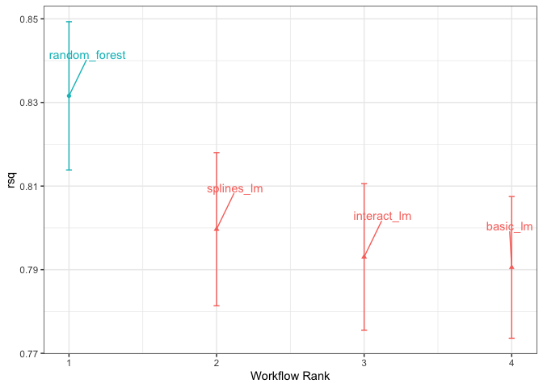
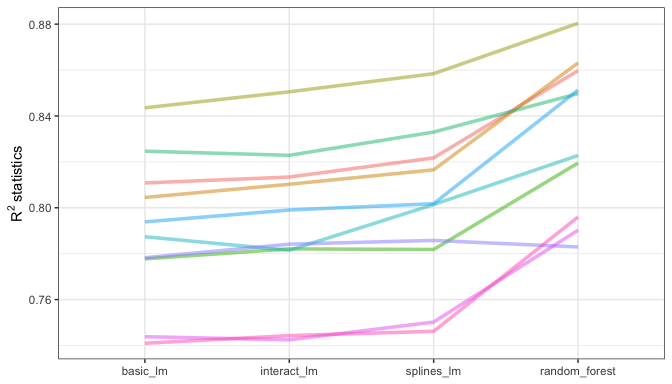
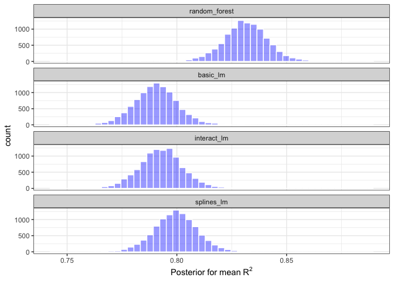
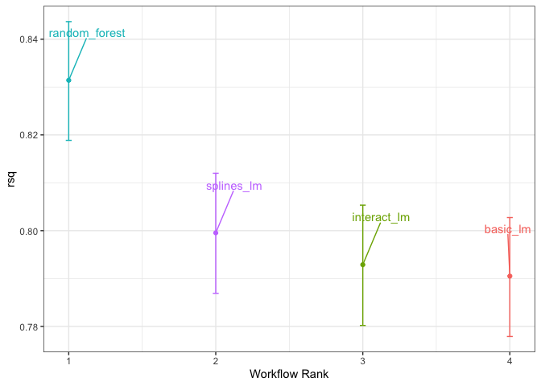
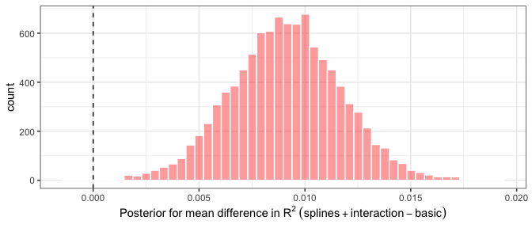
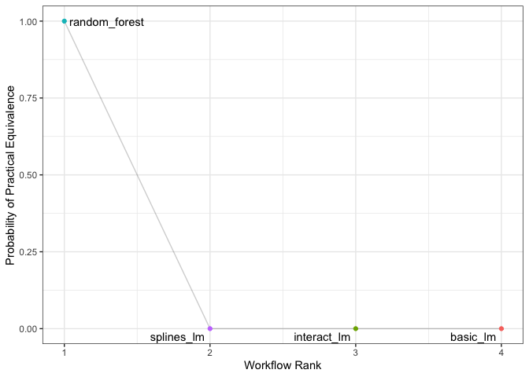
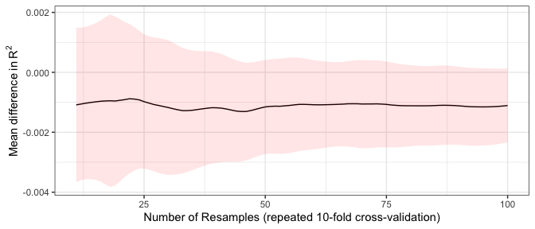

# Comparing Models with Resampling {#compare}

Once we create two or more models, the next step is to compare them to understand which one is best. In some cases, comparisons might be _within-model_, where the same model might be evaluated with different features or preprocessing methods. Alternatively, _between-model_ comparisons, such as when we compared linear regression and random forest models in Chapter \@ref(resampling), are the more common scenario.

In either case, the result is a collection of resampled summary statistics (e.g. RMSE, accuracy, etc.) for each model. In this chapter, we'll first demonstrate how workflow sets can be used to fit multiple models. Then, we'll discuss important aspects of resampling statistics. Finally, we'll look at how to formally compare models (using either hypothesis testing or a Bayesian approach).

## Creating Multiple Models with Workflow Sets {#workflow-set}

In Chapter \@ref(workflows) we described the idea of a workflow set where different preprocessors and/or models can be combinatorially generated. In Chapter \@ref(resampling), we used a recipe for the Ames data that included an interaction term as well as spline functions for longitude and latitude. To demonstrate more with workflow sets, let's create three different linear models that add these preprocessing steps incrementally; we can test whether these additional terms improve the model results. We'll create three recipes then combine them into a workflow set: 


```r
library(tidymodels)
tidymodels_prefer()

basic_rec <- 
  recipe(Sale_Price ~ Neighborhood + Gr_Liv_Area + Year_Built + Bldg_Type + 
           Latitude + Longitude, data = ames_train) %>%
  step_log(Gr_Liv_Area, base = 10) %>% 
  step_other(Neighborhood, threshold = 0.01) %>% 
  step_dummy(all_nominal_predictors())

interaction_rec <- 
  basic_rec %>% 
  step_interact( ~ Gr_Liv_Area:starts_with("Bldg_Type_") ) 

spline_rec <- 
  interaction_rec %>% 
  step_ns(Latitude, Longitude, deg_free = 50)

preproc <- 
  list(basic = basic_rec, 
       interact = interaction_rec, 
       splines = spline_rec
  )

lm_models <- workflow_set(preproc, list(lm = lm_model), cross = FALSE)
lm_models
#> # A workflow set/tibble: 3 × 4
#>   wflow_id    info             option    result    
#>   <chr>       <list>           <list>    <list>    
#> 1 basic_lm    <tibble [1 × 4]> <opts[0]> <list [0]>
#> 2 interact_lm <tibble [1 × 4]> <opts[0]> <list [0]>
#> 3 splines_lm  <tibble [1 × 4]> <opts[0]> <list [0]>
```

We'd like to resample each of these models in turn. To do so, we will use a <span class="pkg">purrr</span>-like function called `workflow_map()`. This function takes an initial argument of the function to apply to the workflows, followed by options to that function. We also set a `verbose` argument that will print the progress as well as a `seed` argument that makes sure that each model uses the same random number stream as the others. 


```r
lm_models <- 
  lm_models %>% 
  workflow_map("fit_resamples", 
               # Options to `workflow_map()`: 
               seed = 1101, verbose = TRUE,
               # Options to `fit_resamples()`: 
               resamples = ames_folds, control = keep_pred)
#> i 1 of 3 resampling: basic_lm
#> ✓ 1 of 3 resampling: basic_lm (733ms)
#> i 2 of 3 resampling: interact_lm
#> ✓ 2 of 3 resampling: interact_lm (775ms)
#> i 3 of 3 resampling: splines_lm
#> ✓ 3 of 3 resampling: splines_lm (869ms)
lm_models
#> # A workflow set/tibble: 3 × 4
#>   wflow_id    info             option    result   
#>   <chr>       <list>           <list>    <list>   
#> 1 basic_lm    <tibble [1 × 4]> <opts[2]> <rsmp[+]>
#> 2 interact_lm <tibble [1 × 4]> <opts[2]> <rsmp[+]>
#> 3 splines_lm  <tibble [1 × 4]> <opts[2]> <rsmp[+]>
```

Notice that the `option` and `result` columns are now populated. The former includes the options to `fit_resamples()` that were given (for reproducibility) and the latter column contains the results produced by `fit_resamples()`.  

There are few convenience functions for workflow sets, including `collect_metrics()` to collate the performance statistics. We can `filter()` to any specific metric we are interested in:


```r
collect_metrics(lm_models) %>% 
  filter(.metric == "rmse")
#> # A tibble: 3 × 9
#>   wflow_id    .config          preproc model .metric .estimator   mean     n std_err
#>   <chr>       <chr>            <chr>   <chr> <chr>   <chr>       <dbl> <int>   <dbl>
#> 1 basic_lm    Preprocessor1_M… recipe  line… rmse    standard   0.0803    10 0.00264
#> 2 interact_lm Preprocessor1_M… recipe  line… rmse    standard   0.0799    10 0.00272
#> 3 splines_lm  Preprocessor1_M… recipe  line… rmse    standard   0.0785    10 0.00282
```

What about the random forest model from the previous chapter? We can add it to the set by first converting it to its own workflow set then binding rows. This requires that, when the model was resampled, the `save_workflow = TRUE` option was set in the control function.


```r
four_models <- 
  as_workflow_set(random_forest = rf_res) %>% 
  bind_rows(lm_models)
four_models
#> # A workflow set/tibble: 4 × 4
#>   wflow_id      info             option    result   
#>   <chr>         <list>           <list>    <list>   
#> 1 random_forest <tibble [1 × 4]> <opts[0]> <rsmp[+]>
#> 2 basic_lm      <tibble [1 × 4]> <opts[2]> <rsmp[+]>
#> 3 interact_lm   <tibble [1 × 4]> <opts[2]> <rsmp[+]>
#> 4 splines_lm    <tibble [1 × 4]> <opts[2]> <rsmp[+]>
```


The `autoplot()` method, with output in Figure \@ref(fig:workflow-set-r-squared), shows confidence intervals for each model in order of best-to-worst. In this chapter, we'll focus on the coefficient of determination (a.k.a. R<sup>2</sup>) and use `metric = "rsq"` in the call to set up our plot: 


```r
library(ggrepel)
autoplot(four_models, metric = "rsq") +
  geom_text_repel(aes(label = wflow_id), nudge_x = 1/8, nudge_y = 1/100) +
  theme(legend.position = "none")
```

<div class="figure" style="text-align: center">

<p class="caption">(\#fig:workflow-set-r-squared)Confidence intervals for the coefficient of determination using four different models.</p>
</div>

From this plot of R<sup>2</sup> confidence intervals, we can see that the random forest method is doing the best job and there are minor improvements in the linear models as we add more recipe steps.

Now that we have 10 resampled performance estimates for each of four models, these summary statistics can be used to make between-model comparisons.

## Comparing Resampled Performance Statistics {#resampled-stats}

Considering the preceding results for the three linear models, it appears that the additional terms do not profoundly improve the mean RMSE or R<sup>2</sup> statistics for the linear models. The difference is small, but it might be larger than the experimental noise in the system, i.e., considered statistically significant. We can formally test the hypothesis that the additional terms increase R<sup>2</sup>. 

:::rmdnote
Before making between-model comparisons, it is important for us to discuss the within-resample correlation for resampling statistics. Each model was measured with the same cross-validation folds, and results for the same resample tend to be similar. 
:::

In other words, there are some resamples where performance across models tends to be low and others where it tends to be high. In statistics, this is called a _resample-to-resample_ component of variation. 

To illustrate, let's gather the individual resampling statistics for the linear models and the random forest. We will focus on the R<sup>2</sup> statistic for each model, which measures correlation between the observed and predicted sale prices for each house. Let's `filter()` to keep only the R<sup>2</sup> metrics, reshape the results, and compute how the metrics are correlated with each other.


```r
rsq_indiv_estimates <- 
  collect_metrics(four_models, summarize = FALSE) %>% 
  filter(.metric == "rsq") 

rsq_wider <- 
  rsq_indiv_estimates %>% 
  select(wflow_id, .estimate, id) %>% 
  pivot_wider(id_cols = "id", names_from = "wflow_id", values_from = ".estimate")

corrr::correlate(rsq_wider %>% select(-id), quiet = TRUE)
#> # A tibble: 4 × 5
#>   term          random_forest basic_lm interact_lm splines_lm
#>   <chr>                 <dbl>    <dbl>       <dbl>      <dbl>
#> 1 random_forest        NA        0.876       0.878      0.879
#> 2 basic_lm              0.876   NA           0.993      0.997
#> 3 interact_lm           0.878    0.993      NA          0.987
#> 4 splines_lm            0.879    0.997       0.987     NA
```

These correlations are high, and indicate that, across models, there are large within-resample correlations. To see this visually in Figure \@ref(fig:rsquared-resamples), the R<sup>2</sup> statistics are shown for each model with lines connecting the resamples: 


```r
rsq_indiv_estimates %>% 
  mutate(wflow_id = reorder(wflow_id, .estimate)) %>% 
  ggplot(aes(x = wflow_id, y = .estimate, group = id, color = id, lty = id)) + 
  geom_line(alpha = .8, lwd = 1.25) + 
  theme(legend.position = "none")
```

<div class="figure" style="text-align: center">

<p class="caption">(\#fig:rsquared-resamples)Resample statistics across models.</p>
</div>

If the resample-to-resample effect was not real, there would not be any parallel lines. A statistical test for the correlations evaluates whether the magnitudes of these correlations are not simply noise. For the linear models: 


```r
rsq_wider %>% 
  with( cor.test(basic_lm, splines_lm) ) %>% 
  tidy() %>% 
  select(estimate, starts_with("conf"))
#> # A tibble: 1 × 3
#>   estimate conf.low conf.high
#>      <dbl>    <dbl>     <dbl>
#> 1    0.997    0.987     0.999
```

The results of the correlation test (the `estimate` of the correlation and the confidence intervals) show us that the within-resample correlation appears to be real. 

What effect does the extra correlation have on our analysis? Consider the variance of a difference of two variables: 

$$\operatorname{Var}[X - Y] = \operatorname{Var}[X] + \operatorname{Var}[Y]  - 2 \operatorname{Cov}[X, Y]$$

The last term is the covariance between two items. If there is a significant positive covariance, then any statistical test of this difference would be critically under-powered comparing the difference in two models. In other words, ignoring the resample-to-resample effect would bias our model comparisons towards finding no differences between models. 

:::rmdwarning
This characteristic of resampling statistics will come into play in the next two sections. 
:::

Before making model comparisons or looking at the resampling results, it can be helpful to define a relevant _practical effect size_. Since these analyses focus on the R<sup>2</sup> statistics, the practical effect size is the change in R<sup>2</sup> that we would consider to be a realistic difference that matters. For example, we might think that two models are not practically different if their R<sup>2</sup> values are within $\pm 2$%. If this were the case, differences smaller than 2% are not deemed important even if they are statistically significant. 

Practical significance is subjective; two people can have very different ideas on the threshold for importance. However, we'll show later that this consideration can be very helpful when deciding between models.  

## Simple Hypothesis Testing Methods

We can use simple hypothesis testing to make formal comparisons between models. Consider the familiar linear statistical model: 

$$y_{ij} = \beta_0 + \beta_1x_{i1} + \ldots + \beta_px_{ip} + \epsilon_{ij}$$

This versatile model is used to create regression models as well as being the basis for the popular analysis of variance (ANOVA) technique for comparing groups. With the ANOVA model, the predictors ($x_{ij}$) are binary dummy variables for different groups. From this, the $\beta$ parameters estimate whether two or more groups are different from one another using hypothesis testing techniques.  

In our specific situation, the ANOVA can also make model comparisons. Suppose the individual resampled R<sup>2</sup> statistics serve as the _outcome data_ (i.e., the $y_{ij}$) and the models as the _predictors_ in the ANOVA model. A sampling of this data structure is shown in Table \@ref(tab:model-anova-data).


Table: (\#tab:model-anova-data)Model performance statistics as a data set for analysis.

| Y = rsq|model         | X1| X2| X3|id     |
|-------:|:-------------|--:|--:|--:|:------|
|  0.8108|basic_lm      |  0|  0|  0|Fold01 |
|  0.8134|interact_lm   |  1|  0|  0|Fold01 |
|  0.8598|random_forest |  0|  1|  0|Fold01 |
|  0.8217|splines_lm    |  0|  0|  1|Fold01 |
|  0.8045|basic_lm      |  0|  0|  0|Fold02 |
|  0.8103|interact_lm   |  1|  0|  0|Fold02 |

The `X1`, `X2`, and `X3` columns in the table are indicators for the values in the `model` column. Their order was defined in the same way that R would define them, alphabetically ordered by `model`.  

For our model comparison, the specific ANOVA model is: 

$$y_{ij} = \beta_0 + \beta_1x_{i1} + \beta_2x_{i2} + \beta_3x_{i3} + \epsilon_{ij}$$

where

 * $\beta_0$ is the estimate of the mean R<sup>2</sup> statistic for the basic linear models (i.e., without splines or interactions),
 
 * $\beta_1$ is the change in mean R<sup>2</sup> when interactions are added to the basic linear model,
 
 * $\beta_2$ is the change in mean R<sup>2</sup> between the basic linear model and the random forest model. 

 * $\beta_3$ is the change in mean R<sup>2</sup> between the basic linear model and one with interactions and splines. 

From these model parameters, hypothesis tests and p-values are generated to statistically compare models, but we must contend with how to handle the resample-to-resample effect. Historically, the resample groups would be considered a _block effect_ and an appropriate term was added to the model. Alternatively, the resample effect could be considered a _random effect_ where these particular resamples were drawn at random from a larger population of possible resamples. However, we aren't really interested in these effects; we only want to adjust for them in the model so that the variances of the interesting differences are properly estimated. 

Treating the resamples as random effects is theoretically appealing. Methods for fitting an ANOVA model with this type of random effect could include the linear mixed model [@faraway2016extending] or a Bayesian hierarchical model (shown in the next section). 

A simple and fast method for comparing two models at a time is to use the differences in R<sup>2</sup> values as the outcome data in the ANOVA model. Since the outcomes are matched by resample, the differences do not contain the resample-to-resample effect and, for this reason, the standard ANOVA model is appropriate. To illustrate, this call to `lm()` tests the difference between two of the linear regression models: 


```r
compare_lm <- 
  rsq_wider %>% 
  mutate(difference = splines_lm - basic_lm)

lm(difference ~ 1, data = compare_lm) %>% 
  tidy(conf.int = TRUE) %>% 
  select(estimate, p.value, starts_with("conf"))
#> # A tibble: 1 × 4
#>   estimate   p.value conf.low conf.high
#>      <dbl>     <dbl>    <dbl>     <dbl>
#> 1  0.00913 0.0000256  0.00650    0.0118

# Alternatively, a paired t-test could also be used: 
rsq_wider %>% 
  with( t.test(splines_lm, basic_lm, paired = TRUE) ) %>%
  tidy() %>% 
  select(estimate, p.value, starts_with("conf"))
#> # A tibble: 1 × 4
#>   estimate   p.value conf.low conf.high
#>      <dbl>     <dbl>    <dbl>     <dbl>
#> 1  0.00913 0.0000256  0.00650    0.0118
```


We could evaluate each pair-wise difference in this way. Note that the p-value indicates a _statistically significant_ signal; the collection of spline terms for longitude and latitude do appear to have an effect. However, the difference in R<sup>2</sup> is estimated at 0.91%. If our practical effect size were 2%, we might not consider these terms worth including in the model.

:::rmdnote
We've briefly mentioned p-values already, but what actually are they? From @pvalue: "Informally, a p-value is the probability under a specified statistical model that a statistical summary of the data (e.g., the sample mean difference between two compared groups) would be equal to or more extreme than its observed value." 

In other words, if this analysis were repeated a large number of times under the null hypothesis of no differences, the p-value reflects how extreme our observed results would be in comparison.
:::

  
## Bayesian Methods {#tidyposterior}

We just used hypothesis testing to formally compare models, but we can also take a more general approach to making these formal comparisons using random effects and Bayesian statistics [@mcelreath2020statistical]. While the model is more complex than the ANOVA method, the interpretation is more simple and straight-forward than the p-value approach. The previous ANOVA model had the form: 

$$y_{ij} = \beta_0 + \beta_1x_{i1} + \beta_2x_{i2} + \beta_3x_{i3} + \epsilon_{ij}$$

where the residuals $\epsilon_{ij}$ are assumed to be independent and follow a Gaussian distribution with zero mean and constant standard deviation of $\sigma$. From this assumption, statistical theory shows that the estimated regression parameters follow a multivariate Gaussian distribution and, from this, p-values and confidence intervals are derived.  

A Bayesian linear model makes additional assumptions. In addition to specifying a distribution for the residuals, we require _prior distribution_ specifications for the model parameters ( $\beta_j$ and $\sigma$ ). These are distributions for the parameters that the model assumes before being exposed to the observed data. For example, a simple set of prior distributions for our model might be:


\begin{align}
\epsilon_{ij} &\sim N(0, \sigma) \notag \\
\beta_j &\sim N(0, 10) \notag \\
\sigma &\sim \text{exponential}(1) \notag
\end{align}

These priors set the possible/probable ranges of the model parameters and have no unknown parameters. For example, the prior on $\sigma$ indicates that values must be larger than zero, are very right-skewed, and have values that are usually less than 3 or 4. 

Note that the regression parameters have a pretty wide prior distribution, with a standard deviation of 10. In many cases, we might not have a strong opinion about the prior beyond it being symmetric and bell shaped. The large standard deviation implies a fairly uninformative prior; it is not overly restrictive in terms of the possible values that the parameters might take on. This allows the data to have more of an influence during parameter estimation. 

Given the observed data and the prior distribution specifications, the model parameters can then be estimated. The final distributions of the model parameters are combinations of the priors and the likelihood estimates. These _posterior distributions_ of the parameters are the key distributions of interest. They are a full probabilistic description of the model's estimated parameters.  

To adapt our Bayesian ANOVA model so that the resamples are adequately modeled, we consider a _random intercept model_. Here, we assume that the resamples impact the model only by changing the intercept. Note that this constrains the resamples from having a differential impact on the regression parameters $\beta_j$; these are assumed to have the same relationship across resamples. This model equation is: 

$$y_{ij} = (\beta_0 + b_{i}) + \beta_1x_{i1} + \beta_2x_{i2} + \beta_3x_{i3} + \epsilon_{ij}$$

This is not an unreasonable model for resampled statistics which, when plotted across models as in Figure \@ref(fig:rsquared-resamples), tend to have fairly parallel effects across models (i.e., little cross-over of lines). 

For this model configuration, an additional assumption is made for the prior distribution of random effects. A reasonable assumption for this distribution is another symmetric distribution, such as another bell-shaped curve. Given the effective sample size of 10 in our summary statistic data, let's use a prior that is wider than a standard normal distribution. We'll use a t-distribution with a single degree of freedom (i.e. $b_i \sim t(1)$), which has heavier tails than an analogous Gaussian distribution. 

The <span class="pkg">tidyposterior</span> package has functions to fit such Bayesian models for the purpose of comparing resampled models. The main function is called `perf_mod()` and it is configured to "just work" for different types of objects:

 * For workflow sets, it creates an ANOVA model where the groups correspond to the workflows. Our existing models did not optimize any tuning parameters (see the next three chapters). If one of the workflows in the set had data on tuning parameters, the best tuning parameters set for each workflow is used in the Bayesian analysis. In other words, despite the presence of tuning parameters, `perf_mod()` focuses on making _between-workflow comparisons_. 
 
 * For objects that contain a single model that has been tuned using resampling, `perf_mod()` makes _within-model comparisons_. In this situation, the grouping variables tested in the Bayesian ANOVA model are the submodels defined by the tuning parameters. 

 * The `perf_mod()` function can also take a data frame produced by <span class="pkg">rsample</span> that has columns of performance metrics associated with two or more model/workflow results. These could have been generated by non-standard means.

From any of these types of objects, the `perf_mod()` function determines an appropriate Bayesian model and fits it with the resampling statistics. For our example, it will model the four sets of R<sup>2</sup> statistics associated with the workflows. 

The <span class="pkg">tidyposterior</span> package uses the [Stan software](https://mc-stan.org/) for specifying and fitting the models via the <span class="pkg">rstanarm</span> package. The functions within that package have default priors (see `?priors` for more details). The following model uses the default priors for all parameters except for the random intercepts (which follow a  _t_-distribution). The estimation process uses random numbers so the seed is set within the function call. The estimation process is iterative and is replicated several times in collections called _chains_. The `iter` parameter tells the function how long to run the estimation process in each chain. When several chains are used, their results are combined (assume that this is validated by diagnostic assessments).  


```r
library(tidyposterior)
library(rstanarm)

# The rstanarm package creates copious amounts of output; those results
# are not shown here but are worth inspecting for potential issues. The
# option `refresh = 0` can be used to eliminate the logging. 
rsq_anova <-
  perf_mod(
    four_models,
    metric = "rsq",
    prior_intercept = rstanarm::student_t(df = 1),
    chains = 4,
    iter = 5000,
    seed = 1102
  )
```

The resulting object has information on the resampling process as well as the Stan object embedded within (in an element called `stan`). We are most interested in the posterior distributions of the regression parameters. The <span class="pkg">tidyposterior</span> package has a `tidy()` method that extracts these posterior distributions into a tibble: 


```r
model_post <- 
  rsq_anova %>% 
  # Take a random sample from the posterior distribution
  # so set the seed again to be reproducible. 
  tidy(seed = 1103) 

glimpse(model_post)
#> Rows: 40,000
#> Columns: 2
#> $ model     <chr> "random_forest", "random_forest", "random_forest", "random_fores…
#> $ posterior <dbl> 0.8493, 0.8476, 0.8484, 0.8451, 0.8402, 0.8417, 0.8399, 0.8394, …
```

The four posterior distributions are visualized in Figure \@ref(fig:four-posteriors).


```r
model_post %>% 
  mutate(model = forcats::fct_inorder(model)) %>%
  ggplot(aes(x = posterior)) + 
  geom_histogram(bins = 50, color = "white", fill = "blue", alpha = 0.4) + 
  facet_wrap(~ model, ncol = 1)
```

<div class="figure" style="text-align: center">

<p class="caption">(\#fig:four-posteriors)Posterior distributions for the coefficient of determination using four different models.</p>
</div>

These histograms describe the estimated probability distributions of the mean R<sup>2</sup> value for each model. There is some overlap, especially for the three linear models. 

There is also a basic `autoplot()` method for the model results, shown in Figure \@ref(fig:credible-intervals), as well as the tidied object that shows overlaid density plots.


```r
autoplot(rsq_anova) +
  geom_text_repel(aes(label = workflow), nudge_x = 1/8, nudge_y = 1/100) +
  theme(legend.position = "none")
```

<div class="figure" style="text-align: center">

<p class="caption">(\#fig:credible-intervals)Credible intervals derived from the model posterior distributions.</p>
</div>

One wonderful aspect of using resampling with Bayesian models is that, once we have the posteriors for the parameters, it is trivial to get the posterior distributions for combinations of the parameters. For example, to compare the two linear regression models, we are interested in the difference in means. The posterior of this difference is computed by sampling from the individual posteriors and taking the differences. The `contrast_models()` function can do this. To specify the comparisons to make, the `list_1` and `list_2` parameters take character vectors and compute the differences between the models in those lists (parameterized as `list_1 - list_2`). 

We can compare two of the linear models and visualize the results in Figure \@ref(fig:posterior-difference). 


```r
rqs_diff <-
  contrast_models(rsq_anova,
                  list_1 = "splines_lm",
                  list_2 = "basic_lm",
                  seed = 1104)

rqs_diff %>% 
  as_tibble() %>% 
  ggplot(aes(x = difference)) + 
  geom_vline(xintercept = 0, lty = 2) + 
  geom_histogram(bins = 50, color = "white", fill = "red", alpha = 0.4)
```

<div class="figure" style="text-align: center">

<p class="caption">(\#fig:posterior-difference)Posterior distribution for the difference in the coefficient of determination.</p>
</div>

The posterior shows that the center of the distribution is greater than zero (indicating that the model with splines typically had larger values) but does overlap with zero to a degree. The `summary()` method for this object computes the mean of the distribution as well as credible intervals, the Bayesian analog to confidence intervals. 


```r
summary(rqs_diff) %>% 
  select(-starts_with("pract"))
#> # A tibble: 1 × 6
#>   contrast               probability    mean   lower  upper  size
#>   <chr>                        <dbl>   <dbl>   <dbl>  <dbl> <dbl>
#> 1 splines_lm vs basic_lm        1.00 0.00910 0.00486 0.0134     0
```

The `probability` column reflects the proportion of the posterior that is greater than zero. This is the probability that the positive difference is real. The value is not close to zero, providing a strong case for statistical significance, i.e., the idea that statistically the actual difference is not zero. 

However, the estimate of the mean difference is fairly close to zero. Recall that the practical effect size we suggested previously is 2%. With a posterior distribution, we can also compute the probability of being practically significant. In Bayesian analysis, this is a "ROPE estimate" (for Region Of Practical Equivalence, @kruschke2018bayesian). To estimate this, the `size` option to the summary function is used: 


```r
summary(rqs_diff, size = 0.02) %>% 
  select(contrast, starts_with("pract"))
#> # A tibble: 1 × 4
#>   contrast               pract_neg pract_equiv pract_pos
#>   <chr>                      <dbl>       <dbl>     <dbl>
#> 1 splines_lm vs basic_lm         0           1         0
```

The `pract_equiv` column is the proportion of the posterior that is within `[-size, size]` (the columns `pract_neg` and `pract_pos` are the proportions that are below and above this interval). This large value indicates that, for our effect size, there is an overwhelming probability that the two models are practically the same. Even though the previous plot showed that our difference is likely non-zero, the equivalence test suggests that it is small enough to not be practical meaningful.

The same process could be used to compare the random forest model to one or both of the linear regressions that were resampled. In fact, when `perf_mod()` is used with a workflow set, the `autoplot()` method can show the `pract_equiv`  results that compare each workflow to the current best (the random forest model, in this case). 


```r
autoplot(rsq_anova, type = "ROPE", size = 0.02) +
  geom_text_repel(aes(label = workflow)) +
  theme(legend.position = "none")
```

<div class="figure" style="text-align: center">

<p class="caption">(\#fig:practical-equivalence)Probability of practical equivalence for an effect size of 2%.</p>
</div>

Figure \@ref(fig:practical-equivalence) shows us that none of the linear models come close to the random forest model when a 2% practical effect size is used. 

### The effect of the amount of resampling {-}

How does the number of resamples affect these types of formal Bayesian comparisons? More resamples increases the precision of the overall resampling estimate; that precision propagates to this type of analysis. For illustration, additional resamples were added using repeated cross-validation. How did the posterior distribution change? Figure \@ref(fig:intervals-over-replicates) shows the 90% credible intervals with up to 100 resamples (generated from 10 repeats of 10-fold cross-validation). 


```r
# calculations in extras/ames_posterior_intervals.R
ggplot(intervals,
       aes(x = resamples, y = mean)) +
  geom_path() +
  geom_ribbon(aes(ymin = lower, ymax = upper), fill = "red", alpha = .1) +
  labs(x = "Number of Resamples (repeated 10-fold cross-validation)")
```

<div class="figure" style="text-align: center">

<p class="caption">(\#fig:intervals-over-replicates)Probability of practical equivalence to the random forest model.</p>
</div>

The width of the intervals decreases as more resamples are added. Clearly, going from ten resamples to thirty has a larger impact than going from eighty to 100. There are diminishing returns for using a "large" number of resamples ("large" will be different for different data sets). 

## Chapter Summary {#compare-summary}

This chapter describes formal statistical methods for testing differences in performance between models. We demonstrated the within-resample effect, where results for the same resample tend to be similar; this aspect of resampled summary statistics requires appropriate analysis in order for valid model comparisons. Further, although statistical significance and practical significance are both important concepts for model comparisons, they are different. 


