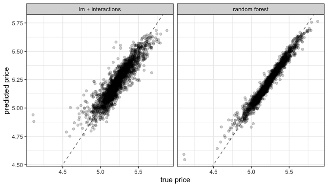
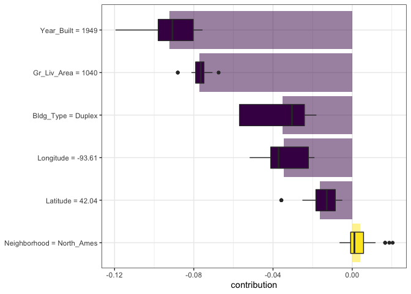
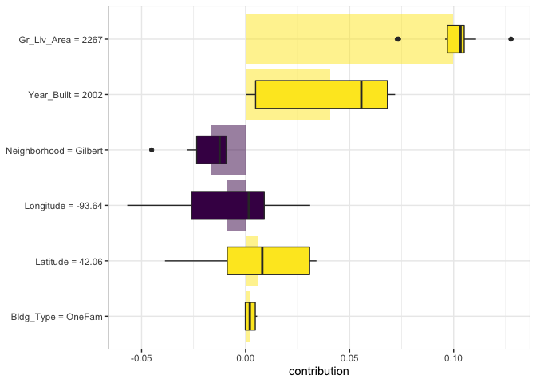
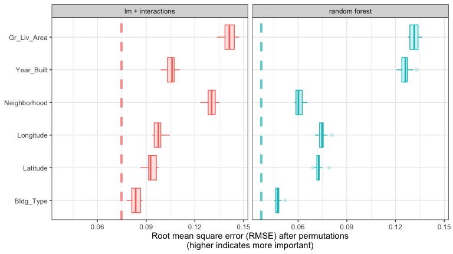
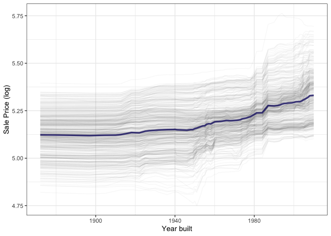
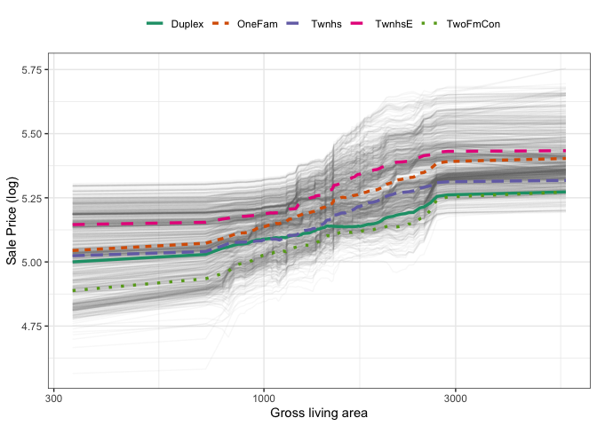
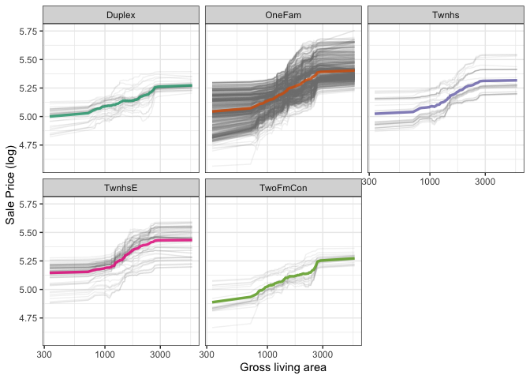
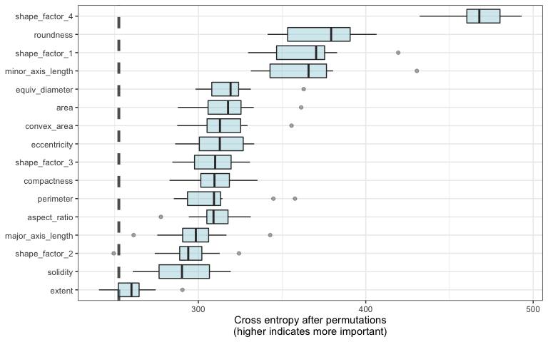

# Explaining Models and Predictions {#explain}

In Chapter \@ref(software-modeling), we outlined a taxonomy of models and suggested that models typically are built as one or more of descriptive, inferential, or predictive. We suggested that model performance, as measured by appropriate metrics (like RMSE for regression or area under the ROC curve for classification), can be important for all applications of modeling. Similarly, model explanations, answering _why_ a model makes the predictions it does, can be important whether the purpose of your model is largely descriptive, to test a hypothesis, or to make a prediction. Answering the question "why?" allows modeling practitioners to understand which features were important in predictions and even how model predictions would change under different values for the features. This chapter covers how to ask a model why it makes the predictions it does.

For some models, like linear regression, it is usually clear how to explain why the model makes the predictions it does. The structure of a linear model contains coefficients for each predictor that are typically straightforward to interpret. For other models, like random forests that can capture non-linear behavior by design, it is less transparent how to explain the model's predictions from only the structure of the model itself. Instead, we can apply model explainer algorithms to generate understanding of predictions.

:::rmdnote
There are two types of model explanations, *global* and *local*. Global model explanations provide an overall understanding aggregated over a whole set of observations; local model explanations provide information about a prediction for a single observation.
:::


## Software for Model Explanations

The tidymodels framework does not itself contain software for model explanations. Instead, models trained and evaluated with tidymodels can be explained with other, supplementary software in R packages such as [<span class="pkg">lime</span>](https://lime.data-imaginist.com/), [<span class="pkg">vip</span>](https://koalaverse.github.io/vip/), and [<span class="pkg">DALEX</span>](https://dalex.drwhy.ai/). We ourselves often choose: 

- <span class="pkg">vip</span> functions when we want to use _model-based_ methods that take advantage of model structure (and are often faster), and 
- <span class="pkg">DALEX</span> functions when we want to use _model-agnostic_ methods that can be applied to any model. 

In Chapters \@ref(resampling) and \@ref(compare), we trained and compared several models to predict the price of homes in Ames, IA, including a linear model with interactions and a random forest model, with results shown in Figure \@ref(fig:explain-obs-pred).

<div class="figure" style="text-align: center">

<p class="caption">(\#fig:explain-obs-pred)Comparing predicted prices for a linear model with interactions and a random forest model.</p>
</div>

Let's build model-agnostic explainers for both of these models to find out why they make the predictions they do. We can use the <span class="pkg">DALEXtra</span> add-on package for <span class="pkg">DALEX</span>, which provides support for tidymodels. @Biecek2021 provide a thorough exploration of how to use <span class="pkg">DALEX</span> for model explanations; this chapter only summarizes some important approaches, specific to tidymodels. To compute any kind of model explanation, global or local, using <span class="pkg">DALEX</span>, we first prepare the appropriate data and then create an _explainer_ for each model:


```r
library(DALEXtra)
vip_features <- c("Neighborhood", "Gr_Liv_Area", "Year_Built", 
                  "Bldg_Type", "Latitude", "Longitude")

vip_train <- 
  ames_train %>% 
  select(all_of(vip_features))

explainer_lm <- 
  explain_tidymodels(
    lm_fit, 
    data = vip_train, 
    y = ames_train$Sale_Price,
    label = "lm + interactions",
    verbose = FALSE
  )

explainer_rf <- 
  explain_tidymodels(
    rf_fit, 
    data = vip_train, 
    y = ames_train$Sale_Price,
    label = "random forest",
    verbose = FALSE
  )
```


:::rmdwarning
A linear model is typically straightforward to interpret and explain; you may not often find yourself using separate model explanation algorithms for a linear model. However, it can sometimes be difficult to understand or explain the predictions of even a linear model once it has splines and interaction terms!
:::

Dealing with significant feature engineering transformations during model explainability highlights some options we have (or sometimes, ambiguity in such analyses). We can quantify global or local model explanations either in terms of:

- *original, basic predictors* as they existed without significant feature engineering transformations, or
- *derived features*, such as those created via dimensionality reduction (Chapter \@ref(dimensionality)) or interactions and spline terms, as in this example.


## Local Explanations

Local model explanations provide information about a prediction for a single observation. For example, let's consider an older duplex in the North Ames neighborhood (Chapter \@ref(ames)).


```r
duplex <- vip_train[120,]
duplex
#> # A tibble: 1 × 6
#>   Neighborhood Gr_Liv_Area Year_Built Bldg_Type Latitude Longitude
#>   <fct>              <dbl>      <dbl> <fct>        <dbl>     <dbl>
#> 1 North_Ames          1040       1949 Duplex        42.0     -93.6
```

There are multiple possible approaches to understanding why a model predicts a given price for this duplex. One is called a "break-down" explanation, implemented with the <span class="pkg">DALEX</span> function `predict_parts()`, and computes how contributions attributed to individual features change the mean model's prediction for a particular observation, like our duplex. For the linear model, the duplex status (`Bldg_Type = 3`),[^dalexlevels] size, longitude, and age all contribute the most to the price being driven down from the intercept:


```r
lm_breakdown <- predict_parts(explainer = explainer_lm, new_observation = duplex)
lm_breakdown
#>                                           contribution
#> lm + interactions: intercept                     5.221
#> lm + interactions: Gr_Liv_Area = 1040           -0.082
#> lm + interactions: Bldg_Type = 3                -0.049
#> lm + interactions: Longitude = -93.608903       -0.043
#> lm + interactions: Year_Built = 1949            -0.039
#> lm + interactions: Latitude = 42.035841         -0.007
#> lm + interactions: Neighborhood = 1              0.001
#> lm + interactions: prediction                    5.002
```

[^dalexlevels]: Notice that this package for model explanations focuses on the *level* of categorical predictors in this type of output, like `Bldg_Type = 3` for duplex and `Neighborhood = 1` for North Ames.

Since this linear model was trained using spline terms for latitude and longitude, the contribution to price for `Longitude` shown here combines the effects of all of its individual spline terms. The contribution here is in terms of the original `Longitude` feature, not the derived spline features.

The most important features are slightly different for the random forest model, with the size, age, and duplex status being most important:


```r
rf_breakdown <- predict_parts(explainer = explainer_rf, new_observation = duplex)
rf_breakdown
#>                                       contribution
#> random forest: intercept                     5.221
#> random forest: Gr_Liv_Area = 1040           -0.076
#> random forest: Year_Built = 1949            -0.075
#> random forest: Bldg_Type = 3                -0.024
#> random forest: Longitude = -93.608903       -0.040
#> random forest: Latitude = 42.035841         -0.029
#> random forest: Neighborhood = 1             -0.006
#> random forest: prediction                    4.969
```

:::rmdwarning
Model break-down explanations like these depend on the _order_ of the features.
:::

If we choose the `order` for the random forest model explanation to be the same as the default for the linear model (chosen via a heuristic), we can change the relative importance of the features:


```r
predict_parts(
  explainer = explainer_rf, 
  new_observation = duplex,
  order = lm_breakdown$variable_name
)
#>                                       contribution
#> random forest: intercept                     5.221
#> random forest: Gr_Liv_Area = 1040           -0.076
#> random forest: Bldg_Type = 3                -0.018
#> random forest: Longitude = -93.608903       -0.021
#> random forest: Year_Built = 1949            -0.100
#> random forest: Latitude = 42.035841         -0.029
#> random forest: Neighborhood = 1             -0.006
#> random forest: prediction                    4.969
```


We can use the fact that these break-down explanations change based on order to compute the most important features over all (or many) possible orderings. This is the idea behind Shapley Additive Explanations [@Lundberg2017], where the average contributions of features are computed under different combinations or "coalitions" of feature orderings. Let's compute SHAP attributions for our duplex, using `B = 20` random orderings:


```r
set.seed(1801)
shap_duplex <- 
  predict_parts(
    explainer = explainer_rf, 
    new_observation = duplex, 
    type = "shap",
    B = 20
  )
```

We could use the default plot method from <span class="pkg">DALEX</span> by calling `plot(shap_duplex)`, or we can access the underlying data and create a custom plot. The box plots in Figure \@ref(fig:duplex-rf-shap) display the distribution of contributions across all the orderings we tried, and the bars display the average attribution for each feature:


```r
library(forcats)
shap_duplex %>%
  group_by(variable) %>%
  mutate(mean_val = mean(contribution)) %>%
  ungroup() %>%
  mutate(variable = fct_reorder(variable, abs(mean_val))) %>%
  ggplot(aes(contribution, variable, fill = mean_val > 0)) +
  geom_col(data = ~distinct(., variable, mean_val), 
           aes(mean_val, variable), 
           alpha = 0.5) +
  geom_boxplot(width = 0.5) +
  theme(legend.position = "none") +
  scale_fill_viridis_d() +
  labs(y = NULL)
```

<div class="figure" style="text-align: center">

<p class="caption">(\#fig:duplex-rf-shap)Shapley additive explanations from the random forest model for a duplex property.</p>
</div>

What about a different observation in our data set? Let's look at a larger, newer one-family home in the Gilbert neighborhood:


```r
big_house <- vip_train[1269,]
big_house
#> # A tibble: 1 × 6
#>   Neighborhood Gr_Liv_Area Year_Built Bldg_Type Latitude Longitude
#>   <fct>              <dbl>      <dbl> <fct>        <dbl>     <dbl>
#> 1 Gilbert             2267       2002 OneFam        42.1     -93.6
```

We can compute SHAP average attributions for this house in the same way:


```r
set.seed(1802)
shap_house <- 
  predict_parts(
    explainer = explainer_rf, 
    new_observation = big_house, 
    type = "shap",
    B = 20
  )
```

The results are shown in Figure \@ref(fig:gilbert-shap).

<div class="figure" style="text-align: center">

<p class="caption">(\#fig:gilbert-shap)Shapley additive explanations from the random forest model for a one-family home in Gilbert.</p>
</div>

Figure \@ref(fig:gilbert-shap) shows that, unlike the duplex, the size and age of this house contribute to its price being higher.


## Global Explanations

Global model explanations, also called global feature importance or variable importance, help us understand which features are most important in driving the predictions of the linear and random forest models overall, aggregated over the whole training set. While the previous section addressed what variables or features are most important in predicting sale price for an individual home, global feature importance addresses what variables are most important for a model in aggregate.

:::rmdnote
One way to compute variable importance is to _permute_ the features [@breiman2001random]. We can permute or shuffle the values of a feature, predict from the model, and then measure how much worse the model fits the data compared to before shuffling.
:::

If shuffling a column causes a large degradation in model performance, it is important; if shuffling a column's values doesn't make much difference to how the model performs, it must not be an important variable. This approach can be applied to any kind of model (it is _model-agnostic_) and the results are straightforward to understand.

Using <span class="pkg">DALEX</span>, we compute this kind of variable importance via the `model_parts()` function.


```r
set.seed(1803)
vip_lm <- model_parts(explainer_lm, loss_function = loss_root_mean_square)
set.seed(1804)
vip_rf <- model_parts(explainer_rf, loss_function = loss_root_mean_square)
```

Again, we could use the default plot method from <span class="pkg">DALEX</span> by calling `plot(vip_lm, vip_rf)` but the underlying data is available for exploration, analysis, and plotting. Let's create a function for plotting:


```r
ggplot_imp <- function(...) {
  obj <- list(...)
  metric_name <- attr(obj[[1]], "loss_name")
  metric_lab <- paste(metric_name, 
                      "after permutations\n(higher indicates more important)")
  
  full_vip <- bind_rows(obj) %>%
    filter(variable != "_baseline_")
  
  perm_vals <- full_vip %>% 
    filter(variable == "_full_model_") %>% 
    group_by(label) %>% 
    summarise(dropout_loss = mean(dropout_loss))
  
  p <- full_vip %>%
    filter(variable != "_full_model_") %>% 
    mutate(variable = fct_reorder(variable, dropout_loss)) %>%
    ggplot(aes(dropout_loss, variable)) 
  if(length(obj) > 1) {
    p <- p + 
      facet_wrap(vars(label)) +
      geom_vline(data = perm_vals, aes(xintercept = dropout_loss, color = label),
                 size = 1.4, lty = 2, alpha = 0.7) +
      geom_boxplot(aes(color = label, fill = label), alpha = 0.2)
  } else {
    p <- p + 
      geom_vline(data = perm_vals, aes(xintercept = dropout_loss),
                 size = 1.4, lty = 2, alpha = 0.7) +
      geom_boxplot(fill = "#91CBD765", alpha = 0.4)
    
  }
  p +
    theme(legend.position = "none") +
    labs(x = metric_lab, 
         y = NULL,  fill = NULL,  color = NULL)
}
```

Using `ggplot_imp(vip_lm, vip_rf)` produces Figure \@ref(fig:global-rf).

<div class="figure" style="text-align: center">

<p class="caption">(\#fig:global-rf)Global explainer for the random forest and linear regression models.</p>
</div>

The dashed line in each panel of Figure \@ref(fig:global-rf) shows the RMSE for the full model, either the linear model or the random forest model. Features further to the right are more important, because permuting them results in higher RMSE. There is quite a lot of interesting information to learn from this plot; for example, neighborhood is quite important in the linear model with interactions/splines but the second least important feature for the random forest model.

## Building Global Explanations from Local Explanations

So far in this chapter, we have focused on local model explanations for a single observation (via Shapley additive explanations) and global model explanations for a data set as a whole (via permuting features). It is also possible to build global model explanations up by aggregating local model explanations, as with _partial dependence profiles_.


:::rmdnote
Partial dependence profiles show how the expected value of a model prediction, like the predicted price of a home in Ames, changes as a function of a feature, like the age or gross living area.
:::

One way to build such a profile is by aggregating or averaging profiles for individual observations. A profile showing how an individual observation's prediction changes as a function of a given feature is called an ICE (individual conditional expectation) profile or a CP (*ceteris paribus*) profile. We can compute such individual profiles (for 500 of the observations in our training set) and then aggregate them using the <span class="pkg">DALEX</span> function `model_profile()`:


```r
set.seed(1805)
pdp_age <- model_profile(explainer_rf, N = 500, variables = "Year_Built")
```

Let's create another function for plotting the underlying data in this object:


```r
ggplot_pdp <- function(obj, x) {
  
  p <- 
    as_tibble(obj$agr_profiles) %>%
    mutate(`_label_` = stringr::str_remove(`_label_`, "^[^_]*_")) %>%
    ggplot(aes(`_x_`, `_yhat_`)) +
    geom_line(data = as_tibble(obj$cp_profiles),
              aes(x = {{ x }}, group = `_ids_`),
              size = 0.5, alpha = 0.05, color = "gray50")
  
  num_colors <- n_distinct(obj$agr_profiles$`_label_`)
  
  if (num_colors > 1) {
    p <- p + geom_line(aes(color = `_label_`, lty = `_label_`), size = 1.2)
  } else {
    p <- p + geom_line(color = "midnightblue", size = 1.2, alpha = 0.8)
  }
  
  p
}
```

Using this function generates Figure \@ref(fig:year-built), where we can see the nonlinear behavior of the random forest model.


```r
ggplot_pdp(pdp_age, Year_Built)  +
  labs(x = "Year built", 
       y = "Sale Price (log)", 
       color = NULL)
```

<div class="figure" style="text-align: center">

<p class="caption">(\#fig:year-built)Partial dependence profiles for the random forest model focusing on the year built predictor.</p>
</div>

Sale price for houses built in different years is mostly flat, with a modest rise after about 1960. Partial dependence profiles can be computed for any other feature in the model, and also for groups in the data, such as `Bldg_Type`. Let's use 1,000 observations for these profiles.


```r
set.seed(1806)
pdp_liv <- model_profile(explainer_rf, N = 1000, 
                         variables = "Gr_Liv_Area", 
                         groups = "Bldg_Type")

ggplot_pdp(pdp_liv, Gr_Liv_Area) +
  scale_x_log10() +
  scale_color_brewer(palette = "Dark2") +
  labs(x = "Gross living area", 
       y = "Sale Price (log)", 
       color = NULL, lty = NULL)
```

This code produces Figure \@ref(fig:building-type-profiles), where we see that sale price increases the most between about 1000 and 3000 square feet of living area, and that different home types (like single family homes or different types of townhouses) mostly exhibit similar increasing trends in price with more living space.

<div class="figure" style="text-align: center">

<p class="caption">(\#fig:building-type-profiles)Partial dependence profiles for the random forest model focusing on building types and gross living area.</p>
</div>

We have the option of using `plot(pdp_liv)` for default <span class="pkg">DALEX</span> plots, but since we are making plots with the underlying data here, we can even facet by one of the features to visualize if the predictions change differently and highlighting the imbalance we have in these subgroups (as shown in Figure \@ref(fig:building-type-facets)).


```r
as_tibble(pdp_liv$agr_profiles) %>%
  mutate(Bldg_Type = stringr::str_remove(`_label_`, "random forest_")) %>%
  ggplot(aes(`_x_`, `_yhat_`, color = Bldg_Type)) +
  geom_line(data = as_tibble(pdp_liv$cp_profiles),
            aes(x = Gr_Liv_Area, group = `_ids_`),
            size = 0.5, alpha = 0.1, color = "gray50") +
  geom_line(size = 1.2, alpha = 0.8, show.legend = FALSE) +
  scale_x_log10() +
  facet_wrap(~Bldg_Type) +
  scale_color_brewer(palette = "Dark2") +
  labs(x = "Gross living area", 
       y = "Sale Price (log)", 
       color = NULL)
```

<div class="figure" style="text-align: center">

<p class="caption">(\#fig:building-type-facets)Partial dependence profiles for the random forest model focusing on building types and gross living area using facets.</p>
</div>

There is not one right approach for building model explanations and the options outlined in this chapter are not exhaustive. In this chapter we have highlighted good options for explanations at both the individual and global level, as well as how to bridge from one to the other, and we point you to @Biecek2021 and @Molnar2021 for further reading

## Back to Beans!

In Chapter \@ref(dimensionality), we discussed how to use dimensionality reduction as a feature engineering or preprocessing step when modeling high dimensional data. For our example data set of dry bean morphology measures predicting bean type, we saw great results from partial least squares (PLS) dimensionality reduction combined with a regularized discriminant analysis model. Which of those morphological characteristics were _most_ important in the bean type predictions? We can use the same approach outlined throughout this chapter to create a model-agnostic explainer and compute, say, global model explanations via `model_parts()`:


```r
set.seed(1807)
vip_beans <- 
  explain_tidymodels(
    rda_wflow_fit, 
    data = bean_train %>% select(-class), 
    y = bean_train$class,
    label = "RDA",
    verbose = FALSE
  ) %>% 
  model_parts() 
```

Using our previously defined importance plotting function, `ggplot_imp(vip_beans)` produces Figure \@ref(fig:bean-explainer).

<div class="figure" style="text-align: center">

<p class="caption">(\#fig:bean-explainer)Global explainer for the regularized discriminant analysis model on the beans data.</p>
</div>


:::rmdwarning
The measures of global feature importance that we see in Figure \@ref(fig:bean-explainer) incorporate the effects of all of the PLS components, but in terms of the original variables. 
:::

Figure \@ref(fig:bean-explainer) shows us that shape factors are among the most important features for predicting bean type, especially shape factor 4, a measure of solidity which takes into account both the area $A$, major axis $L$, and minor axis $l$:

$$\text{SF4} = \frac{A}{\pi(L/2)(l/2)}$$

We can see from Figure \@ref(fig:bean-explainer) that shape factor 1 (the ratio of the major axis to the area), the minor axis length, and roundness are the next most important bean characteristics for predicting bean variety.

## Chapter Summary {#explain-summary}

For some types of models, the answer to "why" a model made a certain prediction is straightforward, but for other types of models, we must use separate explainer algorithms to understand what features are relatively most important for predictions. There are two main kinds of model explanations that you can generate from a trained model. Global explanations provide information aggregated over an entire data set, while local explanations provide understanding about a model's predictions for a single observation. 

Packages such as <span class="pkg">DALEX</span> and its supporting package <span class="pkg">DALEXtra</span>, <span class="pkg">vip</span>, and <span class="pkg">lime</span> can be integrated into a tidymodels analysis to provide these types of model explainers. Model explanations are just one piece of understanding whether your model is appropriate and effective, along with estimates of model performance; Chapter \@ref(trust) further explores the quality of predictions and how trustworthy they are.


