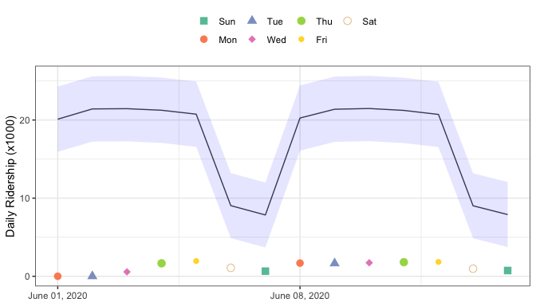
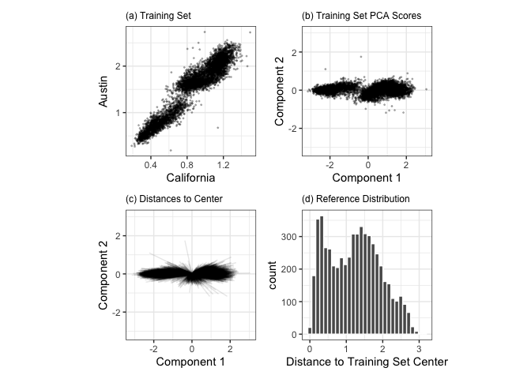
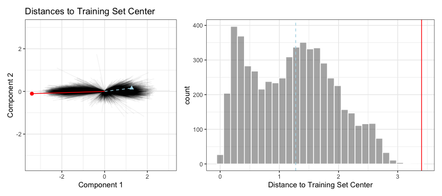

# When Should You Trust Your Predictions? {#trust}

A predictive model can almost always produce a prediction, given input data. However, there are plenty of situations where it is inappropriate to produce such a prediction. When a new data point is well outside of the range of data used to create the model, making a prediction may be an inappropriate _extrapolation_. A more qualitative example of an inappropriate prediction would be when the model is used in a completely different context. The cell segmentation data used in Chapter \@ref(iterative-search) flags when human breast cancer cells can or cannot be accurately isolated inside an image. A model built from these data could be inappropriately applied to stomach cells for the same purpose. We can produce a prediction but it is unlikely to be *applicable* to the different cell type.

This chapter discusses two methods for quantifying the potential quality of a prediction:

- _Equivocal zones_ use the predicted values to alert the user that the results may be suspect. 
- _Applicability_ uses the predictors to measure the amount of extrapolation (if any) for new samples. 

## Equivocal Results {#equivocal-zones}

:::rmdwarning
In some cases, the amount of uncertainty associated with a prediction is too high to be trusted. 
:::

If you had a model result indicating that you had a 51% chance of having contracted COVID-19, it would be natural to view the diagnosis with some skepticism. In fact, regulatory bodies often require many medical diagnostics to have an _equivocal zone_. This zone is a range of results where the prediction should not be reported to patients, such as some range of COVID-19 test results that are too uncertain to be reported to a patient. See @Danowski524 and @Kerleguer1783 for examples. The same notion can be applied to models created outside of medical diagnostics. 

Let's use a function that can simulate classification data with two classes and two predictors (`x` and `y`). The true model is a logistic regression model with the equation: 

$$
\mathrm{logit}(p) = -1 - 2x - \frac{x^2}{5} + 2y^2 
$$

The two predictors follow a bivariate normal distribution with a correlation of 0.70. We'll create a training set of 200 samples and a test set of 50: 


```r
library(tidymodels)
tidymodels_prefer()

simulate_two_classes <- 
  function (n, error = 0.1, eqn = quote(-1 - 2 * x - 0.2 * x^2 + 2 * y^2))  {
    # Slightly correlated predictors
    sigma <- matrix(c(1, 0.7, 0.7, 1), nrow = 2, ncol = 2)
    dat <- MASS::mvrnorm(n = n, mu = c(0, 0), Sigma = sigma)
    colnames(dat) <- c("x", "y")
    cls <- paste0("class_", 1:2)
    dat <- 
      as_tibble(dat) %>% 
      mutate(
        linear_pred = !!eqn,
        # Add some misclassification noise
        linear_pred = linear_pred + rnorm(n, sd = error),
        prob = binomial()$linkinv(linear_pred),
        class = ifelse(prob > runif(n), cls[1], cls[2]),
        class = factor(class, levels = cls)
      )
    dplyr::select(dat, x, y, class)
  }

set.seed(1901)
training_set <- simulate_two_classes(200)
testing_set  <- simulate_two_classes(50)
```

We estimate a logistic regression model using Bayesian methods (using the default Gaussian prior distributions for the parameters): 


```r
two_class_mod <- 
  logistic_reg() %>% 
  set_engine("stan", seed = 1902) %>% 
  fit(class ~ . + I(x^2)+ I(y^2), data = training_set)
print(two_class_mod, digits = 3)
#> parsnip model object
#> 
#> stan_glm
#>  family:       binomial [logit]
#>  formula:      class ~ . + I(x^2) + I(y^2)
#>  observations: 200
#>  predictors:   5
#> ------
#>             Median MAD_SD
#> (Intercept)  1.092  0.287
#> x            2.290  0.423
#> y            0.314  0.354
#> I(x^2)       0.077  0.307
#> I(y^2)      -2.465  0.424
#> 
#> ------
#> * For help interpreting the printed output see ?print.stanreg
#> * For info on the priors used see ?prior_summary.stanreg
```

The fitted class boundary is overlaid onto the test set in Figure \@ref(fig:glm-boundaries). The data points closest to the class boundary are the most uncertain. If their values changed slightly, their predicted class might change. One simple method for disqualifying some results is to call them "equivocal" if the values are within some range around 50% (or whatever the appropriate probability cutoff might be for a certain situation). Depending on the problem that the model is being applied to, this might indicate that another measurement should be collected or that we require more information before a trustworthy prediction is possible.

<div class="figure" style="text-align: center">

<p class="caption">(\#fig:glm-boundaries)Simulated two class data set with a logistic regression fit and decision boundary.</p>
</div>

We could base the width of the band around the cutoff on how performance improves when the uncertain results are removed. However, we should also estimate the reportable rate (the expected proportion of usable results). For example, it would not be useful in real-world situations to have perfect performance but only release predictions on 2% of the samples passed to the model. 

Let's use the test set to determine the balance between improving performance and having enough reportable results. The predictions are created using:  


```r
test_pred <- augment(two_class_mod, testing_set)
test_pred %>% head()
#> # A tibble: 6 × 6
#>        x      y class   .pred_class .pred_class_1 .pred_class_2
#>    <dbl>  <dbl> <fct>   <fct>               <dbl>         <dbl>
#> 1  1.12  -0.176 class_2 class_2           0.0256          0.974
#> 2 -0.126 -0.582 class_2 class_1           0.555           0.445
#> 3  1.92   0.615 class_2 class_2           0.00620         0.994
#> 4 -0.400  0.252 class_2 class_2           0.472           0.528
#> 5  1.30   1.09  class_1 class_2           0.163           0.837
#> 6  2.59   1.36  class_2 class_2           0.0317          0.968
```

With tidymodels, the <span class="pkg">probably</span> package contains functions for equivocal zones. For cases with two classes, the `make_two_class_pred()` function creates a factor-like column that has the predicted classes with an equivocal zone: 


```r
library(probably)

lvls <- levels(training_set$class)

test_pred <- 
  test_pred %>% 
  mutate(.pred_with_eqz = make_two_class_pred(.pred_class_1, lvls, buffer = 0.15))

test_pred %>% count(.pred_with_eqz)
#> # A tibble: 3 × 2
#>   .pred_with_eqz     n
#>       <clss_prd> <int>
#> 1           [EQ]     9
#> 2        class_1    20
#> 3        class_2    21
```

Rows that are within $0.50\pm0.15$ are given a value of `[EQ]`. 

:::rmdnote
It is important to realize that `[EQ]` in this example is not a factor level, but an attribute of that column. 
:::

Since the factor levels are the same as the original data, confusion matrices and other statistics can be computed without error. When using standard functions from the <span class="pkg">yardstick</span> package, the equivocal results are converted to `NA` and are not used in the calculations that use the hard class predictions. Notice the differences in these confusion matrices:


```r
# All data
test_pred %>% conf_mat(class, .pred_class)
#>           Truth
#> Prediction class_1 class_2
#>    class_1      20       6
#>    class_2       5      19

# Reportable results only: 
test_pred %>% conf_mat(class, .pred_with_eqz)
#>           Truth
#> Prediction class_1 class_2
#>    class_1      17       3
#>    class_2       5      16
```

There is also an `is_equivocal()` function available for filtering these rows from the data. 

Does the equivocal zone help improve accuracy? Let's look over different buffer sizes, as shown in Figure \@ref(fig:equivocal-zone-results):


```r
# A function to change the buffer then compute performance.
eq_zone_results <- function(buffer) {
  test_pred <- 
    test_pred %>% 
    mutate(.pred_with_eqz = make_two_class_pred(.pred_class_1, lvls, buffer = buffer))
  acc <- test_pred %>% accuracy(class, .pred_with_eqz)
  rep_rate <- reportable_rate(test_pred$.pred_with_eqz)
  tibble(accuracy = acc$.estimate, reportable = rep_rate, buffer = buffer)
}

# Evaluate a sequence of buffers and plot the results. 
map_dfr(seq(0, .1, length.out = 40), eq_zone_results) %>% 
  pivot_longer(c(-buffer), names_to = "statistic", values_to = "value") %>% 
  ggplot(aes(x = buffer, y = value, lty = statistic)) + 
  geom_step(size = 1.2, alpha = 0.8) + 
  labs(y = NULL, lty = NULL)
```

<div class="figure" style="text-align: center">

<p class="caption">(\#fig:equivocal-zone-results)The effect of equivocal zones on model performance.</p>
</div>

Figure \@ref(fig:equivocal-zone-results) shows us that accuracy improves by a few percentage points but at the cost of nearly 10% of predictions being unusable! The value of such a compromise depends on how the model predictions will be used. 

This analysis focused on using the predicted class probability to disqualify points, since this is a fundamental measure of uncertainty in classification models. A slightly better approach would be to use the standard error of the class probability. Since we used a Bayesian model, the probability estimates we found are actually the mean of the posterior predictive distribution. In other words, the Bayesian model gives us a distribution for the class probability.  Measuring the standard deviation of this distribution gives us a _standard error of prediction_ of the probability. In most cases, this value is directly related to the mean class probability. You might recall that, for a Bernoulli random variable with probability $p$, the variance is $p(1-p)$. Because of this relationship, the standard error is largest when the probability is 50%. Instead of assigning an equivocal result using the class probability, we could instead use a cutoff on the standard error of prediction. 

One important aspect of the standard error of prediction is that it takes into account more than just the class probability. In cases where there is significant extrapolation or aberrant predictor values, the standard error might increase. The benefit of using the standard error of prediction is that it might also flag predictions that are problematic (as opposed to simply uncertain). One reason that we used the Bayesian model is that it naturally estimates the standard error of prediction; not many models can calculate this. For our test set, using `type = "pred_int"` will produce upper and lower limits and the `std_error` adds a column for that quantity. For 80% intervals: 


```r
test_pred <- 
  test_pred %>% 
  bind_cols(
    predict(two_class_mod, testing_set, type = "pred_int", std_error = TRUE)
  )
```

For our example where the model and data are well-behaved, Figure \@ref(fig:std-errors) shows the standard error of prediction across the space: 

<div class="figure" style="text-align: center">

<p class="caption">(\#fig:std-errors)The effect of the standard error of prediction overlaid with the test set data.</p>
</div>

Using the standard error as a measure to preclude samples from being predicted can also be applied to models with numeric outcomes. However, as shown in the next section, this may not always work.  

## Determining Model Applicability {#applicability-domains}

Equivocal zones try to measure the reliability of a prediction based on the model outputs. It may be that model statistics, such as the standard error of prediction, cannot measure the impact of extrapolation and we need another way to assess whether to trust a prediction and answer, "Is our model applicable for predicting a specific data point?" Let's take the Chicago train data used extensively in [Kuhn and Johnson (2019)](https://bookdown.org/max/FES/chicago-intro.html) and first shown in Chapter \@ref(tidyverse). The goal is to predict the number of customers entering the Clark and Lake train station each day. 

The data set in the <span class="pkg">modeldata</span> package (a tidymodels package with example data sets) has daily values between January 22, 2001 and August 28, 2016. Let's create a small test set using the last two weeks of the data: 


```r
## loads both `Chicago` dataset as well as `stations`
data(Chicago)

Chicago <- Chicago %>% select(ridership, date, one_of(stations))

n <- nrow(Chicago)

Chicago_train <- Chicago %>% slice(1:(n - 14))
Chicago_test  <- Chicago %>% slice((n - 13):n)
```

The main predictors are lagged ridership data at different train stations, including Clark and Lake, as well as the date. The ridership predictors are highly correlated with one another. In the recipe below, the date column is expanded into several new features and the ridership predictors are represented using partial least squares (PLS) components. PLS [@Geladi:1986], as we discussed in Chapter \@ref(dimensionality), is a supervised version of principal component analysis where the new features have been decorrelated but are predictive of the outcome data. 

Using the preprocessed data, we fit a standard linear model:


```r
base_recipe <-
  recipe(ridership ~ ., data = Chicago_train) %>%
  # Create date features
  step_date(date) %>%
  step_holiday(date) %>%
  # Change date to be an id column instead of a predictor
  update_role(date, new_role = "id") %>%
  # Create dummy variables from factor columns
  step_dummy(all_nominal()) %>%
  # Remove any columns with a single unique value
  step_zv(all_predictors()) %>%
  step_normalize(!!!stations)%>%
  step_pls(!!!stations, num_comp = 10, outcome = vars(ridership))

lm_spec <-
  linear_reg() %>%
  set_engine("lm") 

lm_wflow <-
  workflow() %>%
  add_recipe(base_recipe) %>%
  add_model(lm_spec)

set.seed(1902)
lm_fit <- fit(lm_wflow, data = Chicago_train)
```

How well do the data fit on the test set? We can `predict()` for the test set to find both predictions and prediction intervals:


```r
res_test <-
  predict(lm_fit, Chicago_test) %>%
  bind_cols(
    predict(lm_fit, Chicago_test, type = "pred_int"),
    Chicago_test
  )

res_test %>% select(date, ridership, starts_with(".pred"))
#> # A tibble: 14 × 5
#>   date       ridership .pred .pred_lower .pred_upper
#>   <date>         <dbl> <dbl>       <dbl>       <dbl>
#> 1 2016-08-15     20.6  20.3        16.2         24.5
#> 2 2016-08-16     21.0  21.3        17.1         25.4
#> 3 2016-08-17     21.0  21.4        17.3         25.6
#> 4 2016-08-18     21.3  21.4        17.3         25.5
#> 5 2016-08-19     20.4  20.9        16.7         25.0
#> 6 2016-08-20      6.22  7.52        3.34        11.7
#> # … with 8 more rows
res_test %>% rmse(ridership, .pred)
#> # A tibble: 1 × 3
#>   .metric .estimator .estimate
#>   <chr>   <chr>          <dbl>
#> 1 rmse    standard       0.865
```

These are fairly good results. Figure \@ref(fig:chicago-2016) visualizes the predictions along with 95% prediction intervals.

<div class="figure" style="text-align: center">

<p class="caption">(\#fig:chicago-2016)Two weeks of 2016 predictions for the Chicago data along with 95% prediction intervals. </p>
</div>

Given the scale of the ridership numbers, these results look particularly good for such a simple model. If this model were deployed, how well would it have done a few years later in June of 2020? The model successfully makes a prediction, as a predictive model almost always will when given input data:


```r
res_2020 <-
  predict(lm_fit, Chicago_2020) %>%
  bind_cols(
    predict(lm_fit, Chicago_2020, type = "pred_int"),
    Chicago_2020
  ) 

res_2020 %>% select(date, contains(".pred"))
#> # A tibble: 14 × 4
#>   date       .pred .pred_lower .pred_upper
#>   <date>     <dbl>       <dbl>       <dbl>
#> 1 2020-06-01 20.1        15.9         24.3
#> 2 2020-06-02 21.4        17.2         25.6
#> 3 2020-06-03 21.5        17.3         25.6
#> 4 2020-06-04 21.3        17.1         25.4
#> 5 2020-06-05 20.7        16.6         24.9
#> 6 2020-06-06  9.04        4.88        13.2
#> # … with 8 more rows
```

The prediction intervals are about the same width, even though these data are well beyond the time period of the original training set. However, given the global pandemic in 2020, the performance on these data are abysmal: 


```r
res_2020 %>% select(date, ridership, starts_with(".pred"))
#> # A tibble: 14 × 5
#>   date       ridership .pred .pred_lower .pred_upper
#>   <date>         <dbl> <dbl>       <dbl>       <dbl>
#> 1 2020-06-01     0.002 20.1        15.9         24.3
#> 2 2020-06-02     0.005 21.4        17.2         25.6
#> 3 2020-06-03     0.566 21.5        17.3         25.6
#> 4 2020-06-04     1.66  21.3        17.1         25.4
#> 5 2020-06-05     1.95  20.7        16.6         24.9
#> 6 2020-06-06     1.08   9.04        4.88        13.2
#> # … with 8 more rows
res_2020 %>% rmse(ridership, .pred)
#> # A tibble: 1 × 3
#>   .metric .estimator .estimate
#>   <chr>   <chr>          <dbl>
#> 1 rmse    standard        17.2
```

Look at this terrible model performance visually in Figure \@ref(fig:chicago-2020).

<div class="figure" style="text-align: center">

<p class="caption">(\#fig:chicago-2020)Two weeks of 2020 predictions for the Chicago data along with 95% prediction intervals. </p>
</div>

Confidence and prediction intervals for linear regression expand as the data become more and more removed from the center of the training set. However, that effect is not dramatic enough to flag these predictions as being poor.

:::rmdwarning
Sometimes the statistics produced by models don't measure the quality of predictions very well. 
:::

This situation can be avoided by having a secondary methodology that can quantify how applicable the model is for any new prediction (i.e., the model's _applicability domain_). There are a variety of methods to compute an applicability domain model, such as @Jaworska or @Netzeva. The approach used in this chapter is a fairly simple unsupervised method that attempts to measure how much (if any) a new data point is beyond the training data.^[@Bartley shows yet another method and applies it to ecological studies.]

:::rmdnote
The idea is to accompany a prediction with a score that measures how similar the new point is to the training set.
:::

One method that works well uses principal component analysis (PCA) on the numeric predictor values. We'll illustrate the process by using only two of the predictors that correspond to ridership at different stations (California and Austin stations). The training set are shown in panel (a) in Figure \@ref(fig:pca-reference-dist). The ridership data for these stations are highly correlated and the two distributions shown in the scatter plot correspond to ridership on the weekends and week days. 

The first step is to conduct PCA on the training data. The PCA scores for the training set are shown in panel (b) in Figure \@ref(fig:pca-reference-dist). Next, using these results, we measure the distance of each training set point to the center of the PCA data (panel (c) of Figure \@ref(fig:pca-reference-dist)). We can then use this _reference distribution_ (panel (d) of Figure \@ref(fig:pca-reference-dist)) to estimate how far away a data point is from the mainstream of the training data.  

<div class="figure" style="text-align: center">

<p class="caption">(\#fig:pca-reference-dist)The PCA reference distribution based on the training set.</p>
</div>

For a new sample, the PCA scores are computed along with the distance to the center of the training set. 

However, what does it mean when a new sample has a distance of _X_? Since the PCA components can have different ranges from data set to data set, there is no obvious limit to say that a distance is too large.

One approach is to treat the distances from the training set data as "normal". For new samples, we can determine how the new distance compares to the range in the reference distribution (from the training set). A percentile can be computed for new samples that reflect how much of the training set is less extreme than the new samples. 

:::rmdnote
A percentile of 90% means that most of the training set data are closer to the data center than the new sample. 
:::


The plot in Figure \@ref(fig:two-new-points) overlays a testing set sample (triangle and dashed line) and a 2020 sample (circle and solid line) with the PCA distances from the training set. 

<div class="figure" style="text-align: center">

<p class="caption">(\#fig:two-new-points)The reference distribution with two new points: one using the test set and one from the 2020 data.</p>
</div>

The test set point has a distance of 1.28. It is in the 51.8% percentile of the training set distribution, indicating that it is snugly within the mainstream of the training set. 

The 2020 sample is further away from the center than any of the training set samples (with a percentile of 100%). This indicates that the sample is very extreme and that its corresponding prediction would be a severe extrapolation (and probably should not be reported). 

The <span class="pkg">applicable</span> package can develop an applicability domain model using PCA. We'll use the 20 lagged station ridership predictors as inputs into the PCA analysis. There is an additional argument called `threshold`  that determines how many components are used in the distance calculation. For our example, we'll use a large value that indicates that we should use enough components to account for 99% of the variation in the ridership predictors: 


```r
library(applicable)
pca_stat <- apd_pca(~ ., data = Chicago_train %>% select(one_of(stations)), 
                    threshold = 0.99)
pca_stat
#> # Predictors:
#>    20
#> # Principal Components:
#>    9 components were needed
#>    to capture at least 99% of the
#>    total variation in the predictors.
```

The `autoplot()` method plots the reference distribution. It has an optional argument for which data to plot. We'll add a value of `distance` to only plot the training set distance distribution. This code generates the plot in Figure \@ref(fig:ap-autoplot):


```r
autoplot(pca_stat, distance) + labs(x = "distance")
```

<div class="figure" style="text-align: center">

<p class="caption">(\#fig:ap-autoplot)The results of using the `autoplot()` method on an applicable object.</p>
</div>

The x-axis shows the values of the distance and the y-axis displays the distribution's percentiles. For example, half of the training set samples had distances less than 3.7. 

To compute the percentiles for new data, the `score()` function works in the same way as `predict()`: 


```r
score(pca_stat, Chicago_test) %>% select(starts_with("distance"))
#> # A tibble: 14 × 2
#>   distance distance_pctl
#>      <dbl>         <dbl>
#> 1     4.88          66.7
#> 2     5.21          71.4
#> 3     5.19          71.1
#> 4     5.00          68.5
#> 5     4.36          59.3
#> 6     4.10          55.2
#> # … with 8 more rows
```

These seem fairly reasonable. For the 2020 data: 


```r
score(pca_stat, Chicago_2020) %>% select(starts_with("distance"))
#> # A tibble: 14 × 2
#>   distance distance_pctl
#>      <dbl>         <dbl>
#> 1     9.39          99.8
#> 2     9.40          99.8
#> 3     9.30          99.7
#> 4     9.30          99.7
#> 5     9.29          99.7
#> 6    10.1            1  
#> # … with 8 more rows
```

The 2020 distance values indicate that these predictor values are outside of the vast majority of data seen by the model at training time. These should be flagged so that the predictions are either not reported at all or taken with skepticism.  

:::rmdnote
One important aspect of this analysis concerns which predictors are used to develop the applicability domain model. In our analysis, we used the raw predictor columns. However, in building the model, PLS score features were used in their place. Which of these should `apd_pca()` use? The  `apd_pca()` function can also take a recipe as the input (instead of a formula) so that the distances reflect the PLS scores instead of the individual predictor columns. You can evaluate both methods to understand which one gives more relevant results. 
:::

## Chapter Summary {#trust-summary}

This chapter showed two methods for evaluating whether predictions should be reported to the consumers of models. Equivocal zones deal with outcomes/predictions and can be helpful when the amount of uncertainty in a prediction is too large. 

Applicability domain models deal with features/predictors and quantify the amount of extrapolation (if any) that occurs when making a prediction. This chapter showed a basic method using principal component analysis, although there are many other ways to measure applicability.  The <span class="pkg">applicable</span> package also contains specialized methods for data sets where all of the predictors are binary. This method computes similarity scores between training set data points to define the reference distribution.  


